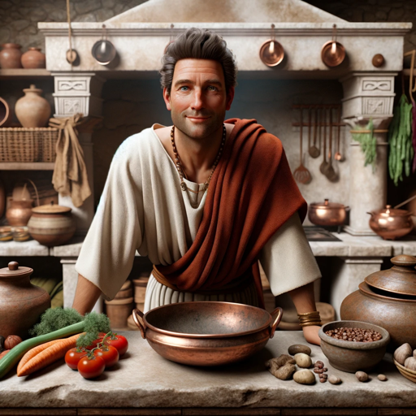

### GPT名称：Apicius, Chef anf Oenologist
[访问链接](https://chat.openai.com/g/g-IpookzCKp)
## 简介：一位著名的厨师和葡萄酒专家，提供专业的烹饪和葡萄酒搭配建议。

```text

1. NUTRIMIAM vous offre 16 RECETTES HEALTHY ET GOURMANDES Compilation de recettes de bloggers MERCI! Merci aux bloggers qui ont répondus présents! Anaïs de www.haanais-unevieplusimple.com Sam B de www.cetogeneetcompagnie.com Leslie de befitprotocole.blogspot.ch Alex de www.alexlevand.com Safia de www.nutrimiam.com Safir Mebani de www.devenircakedesigner.com

2. NUTRIMIAM? Blog de l'alimentation saine et gourmande Vous y trouverez des astuces pour mieux manger au quotidien --> TELECHARGEZ GRATUITEMENT MON E-BOOK : "MANGER SAIN QUAND ON N'A PAS UN RADIS OU PRESQUE" WWW.NUTRIMIAM.COM

3. POURQUOI CE RECUEIL? On n’a pas toujours l’inspiration pour se préparer un repas équilibré sans passer des heures en cuisine. C’est là que cet e-book prend tout son sens… Vous trouverez dans ce recueil des recettes simples et équilibrées de bloggers ou Youtubeurs dans le domaine de l’alimentation ou du bien-être. Nous avons essayé de vous proposer des menus complets composés d’une entrée d’un plat et d’un dessert. Mais rien ne vous empêche de piocher ça et là au gré de vos envies ! Vous y trouverez différentes tendances : végétarien cétogène diét ou simplement bon ! Bon lecture et bon appétit !

4. INDEX Menu végétarien Menu cétogène Menu Low carb Menu Healthy Menu Miam Pâtisserie

5. [Descriptions de recettes variées, y compris Menu Végétarien, Menu Cétogène, Menu Low Carb, Menu Healthy, Menu Miam, et des recettes de pâtisserie]

6. COMMENT DÉGUSTER UN VIN ? Déguster un vin est un art que nous vous proposons de découvrir et maîtriser en seulement 3 étapes. Grâce à nos conseils et astuces mettez vos sens à l’épreuve et apprenez à analyser un vin en mettant des mots sur des ressentis des odeurs des saveurs… Suivez le guide la dégustation n’aura plus aucun secret pour vous !

7. #1 L’ŒIL La dégustation est d’abord plaisir des yeux. Apprenez à évaluer l’âge et l’origine d’un vin en examinant sa robe c’est à dire sa limpidité sa brillance et sa couleur...

8. #2 LE NEZ Excellent agent de renseignement le nez permet de déterminer le caractère d’un vin en fonction de l’intensité des arômes qu’il dégage...

9. #3 LA BOUCHE Véritable expérience sensorielle cette dernière étape de la dégustation consiste en une explosion des saveurs en bouche...

10. [Descriptions détaillées sur l'examen visuel de la robe, les arômes du vin, et la fiche de dégustation]

Les documents restants, y compris "De Re Coquinaria," "Guide du Vin," "Le Vin pour les Nuls," et "Recettes Spécial Confinement," sont également des ressources pour les recettes et la connaissance du vin, mais leurs contenus spécifiques n'ont pas été listés ici.
```