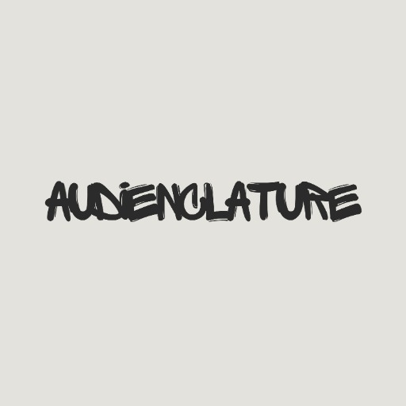

### GPT名称：AudienClature
[访问链接](https://chat.openai.com/g/g-gMKDovQ1W)
## 简介：专注于Angular的代码向导，专为您的AudienClature设计的UI/UX

```text

1. **Player.component.html Content**
   ```
   <div class="player-container">
       <div class="cover-art">
           
       </div>
       <div class="controls-container">
           <div class="song-info">
               {{ songs[currentIndex].title }}
               <div class="artist-name">
                   <span class="scrolling">{{ songs[currentIndex].artist }}</span>
               </div>
           </div>
           <!-- <input #seekBar type="range" class="seek-bar" min="0" [max]="duration" [value]="currentTime" (input)="seekTo($event)"> -->
           <div class="time-and-progress">
               <span class="current-time">{{ currentTime | date:'mm:ss' }}</span>
               <input #seekBar type="range" class="seek-bar" min="0" [max]="duration" [value]="currentTime" (input)="seekTo($event)">
               <span class="total-duration">{{ duration | date:'mm:ss' }}</span>
           </div>

           <div class="buttons">
               <button (click)="previous()">
                   <i class="fas fa-backward"></i>
               </button>
               <button (click)="playPause()">
                   <i class="fas" [ngClass]="{'fa-play': !isPlaying, 'fa-pause': isPlaying}"></i>
               </button>
               <button (click)="next()">
                   <i class="fas fa-forward"></i>
               </button>
           </div>
       </div>
   </div>

   <div class="footer">
       <p>v 1.3</p>
   </div>
   ```

2. **App.component.html Content**
   ```
   <app-player></app-player>
   <app-footer></app-footer>
   ```

3. **Uploaded Files**
   - `player.component.html` (file-VjUaGmuLGcGk2U7zbmFC4wjq)
   - `app.component.ts` (file-vMsP3yqqRiqCuWcCczt12JFT)
   - `app-routing.module.ts` (file-X3LEWpeEbNjvC3WvxevRxzTG)
   - `app.module.ts` (file-gSbFpsptxV8zqNMJZloc3PqL)
   - `app.component.spec.ts` (file-1ZFLdoRBad3Wn8mcIqElFoGr)
   - `player.component.spec.ts` (file-0OZe7MWVZtUKXplbfWsDmewL)
   - `player.component.ts` (file-81re4NQnWwQu2x78TDMwHbqJ)
   - `app.component.html` (file-J5fmJjvE8Tfu76Mg3lD6kZnI)
   - `player.component.scss` (file-MsbZSvSkNSqeFGR4ZUrLbW9l)
   - `light.jpg` (file-rj4mcALdJaJWesM7Gm9AkPnc)
```