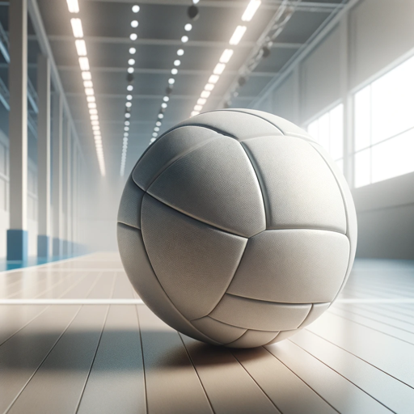

### GPT名称：GMS 练习计划
[访问链接](https://chat.openai.com/g/g-Mj2kqLBwX)
## 简介：这个GPT将根据Gold Medal Squared方法论，在给定的时间内创建一个练习计划。

```text

1. **V O L L E Y B A L L skills drills & more!**
2. **table of contents**
3. **skill checklist............................................................................................................................................................... pages 2-3**
4. **drills........................................................................................................................................................................... pages 4-25**
5. **footwork drills.......................................................................................................................................................page 4**
6. **conditioning drills...........................................................................................................................................pages 5-6**
7. **ballhandling drills..........................................................................................................................................pages 7-10**
8. **serving drills................................................................................................................................................ pages 11-12**
9. **serve receive drills....................................................................................................................................... pages 13-14**
10. **setting drills.........................................................................................................................................................page 15**
11. **hitting drills................................................................................................................................................. pages 16-17**
12. **blocking drills.....................................................................................................................................................page 18**
13. **defense drills............................................................................................................................................... pages 19-20**
14. **combination drills....................................................................................................................................... pages 21-22**
15. **game situation drills ................................................................................................................................... pages 23-25**
16. **OHSVCA COACHES’ CLINIC...  skills drills & more!**
17. **fundamental skills checklist**
18. **serving**
19. **▼ lift - palm flat and facing up "lift" the ball not higher than a ball width (or two) above head**
20. **▼ step – small natural step with opposite foot (right-handers: step with left) taken at same time as ball is "lifted"**
21. **▼ hand contact on ball - contact with palm hand stiff**
22. **▼ arm motion - swift contact ball above head with hand slightly in front of tossing shoulder - like throwing a ball**
23. **▼ weight transfer - transfer weight from back foot to front foot through the ball as you make contact**
24. **▼ follow through - should be high then arm will naturally come back down**
25. **▼ cues - "present step/toss serve"**
26. **forearm passing**
27. **▼ thumbs aligned - positioned side-by-side**
28. **▼ hand-clasp - whatever feels natural so long as thumbs are aligned (hand wrapped around fist hand layed into other hand fingers entwined etc.)**
29. **▼ where to contact ball (platform) - ball should be contacted on forearms above the wrists and below the elbows**
30. **▼ foot position (base) - feet at least shoulder width or a bit wider. bend at knees not at waist to keep body and platform beneath the ball**
31. **▼ shuffle to ball - in moving to where the ball is shuffle your feet keeping knees bent and hips/head in a straight vertical line (not a line that bobs up and down)**
32. **▼ step to target - once in position step with whatever foot feels most comfortable (best to step from the right side of the court with right foot and from the left side with left foot) step in direction of target**
33. **▼ arm motion - arms should not move higher than shoulders do not swing arms. use very little arm motion - DIRECT the ball to your target**
34. **▼ general body position - relaxed shoulders knees bent stay down and do not stand up as you pass**
35. **▼ relax - this is not a fast skill should be done in a relaxed controlled fashion... don’t “stab” at ball kind of “shovel” it to target**
36. **overhand passing**
37. **▼ hand position - fingers spread and firm hands in front of face.**
38. **▼ where to make contact - contact with ball should be made in front of face**
39. **▼ foot position - feet and body must be behind the ball feet (base) should be comfortable and solid.**
40. **▼ making contact - hands & fingers should remain firm and strong on contact NOT soft like when you set a hitter.**
41. **▼ follow through - as contact is made push the ball to your target by extending your arms out from your face.**
42. **▼ be aggressive - this is an aggressive skill you have to go to the ball with strong hands and push the ball away from you - you will not be successful with this if you just allow the ball to come to you and you play it passively.**
43. **setting**
44. **▼ hand position on ball - form a triangle on ball with thumbs and index fingers then spread apart so that hands wrap around sides of ball**
45. **▼ where to contact ball - hands should be up at forehead when contacting ball (if player takes hands away ball should hit her in the forehead)... ALWAYS set from near the forehead if the pass is low then get forehead low and set from there rather than just dropping hands and setting from chest or midsection**
46. **▼ shoulders square with target – shoulders/hips should always face the left-front target (front or backsets)**
47. **▼ foot position - you should set off of your right foot and follow thru onto your left foot**
48. **▼ net position (for setters) - sprint to the setting zone on the net (the position between the middle front and right front hitters) get as close to the net as you can without touching it and as you reach this position "hop" so that you are facing the players on your own court to see the pass coming in**
49. **▼ body extension/follow through - extend out from feet all the way through hands (like a coil) when setting you should hold your hands/arms out extended for just a brief moment after completing your set... like "superman" flying thru the air!**
50. **Presented by: Tina Jasinowski Alter Girls' & Boys' Varsity Volleyball Coach  Page 2**

[Continued in next message due to character limit]
```