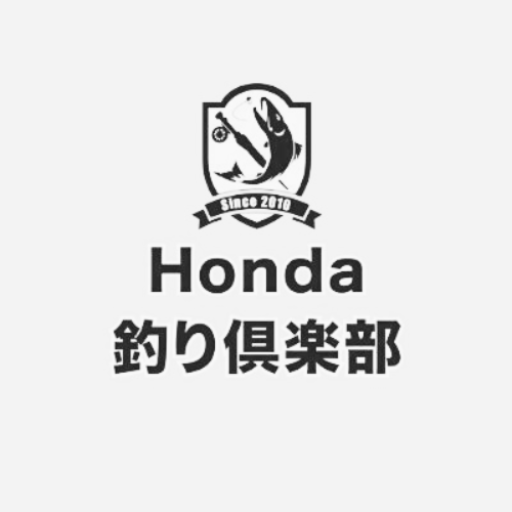

### GPT名称：Honda釣り倶楽部の投稿案作成GPT
[访问链接](https://chat.openai.com/g/g-QpZ5WCNAK)
## 简介：Honda釣り倶楽部の投稿案を作成するGPT

```text
了解しました。以下に指示に従って番号付きリストを作成します：

1. このKnowledgeは、Honda釣り倶楽部の投稿案に特化したGPTの専用のKnowledgeです。SNSアカウントの運用開始から作成した投稿案を記載しています。以下に「投稿」を示します。

2. ・投稿
   ／
   釣り人必見！
   カワハギの絶品レシピ🎣
   ＼

   新鮮な #カワハギ で作る、
   濃厚なキモ醤油の刺し身は、
   釣り人の特権といえる味✨

   生臭さを避ける裏技で、
   さらに美味しくいただきましょう🍴

   ▽詳しくはこちら
   https://www.honda.co.jp/fishing/picture-book/kawahagi/recipe/index.html#recipe

   #Honda釣り倶楽部

3. ・投稿
   ／
   世界遺産を借景にする
   くつろぎのカープフィッシング
   ＼

   山梨県の精進湖で
   朝日に染まる富士山を眺めつつ、
   コーヒーを片手に #コイ釣り を楽しむ🎣
   そんな贅沢な時間を体験しませんか??

   道中では、黄色や赤に染まった
   紅葉を見ることもできます🍁

   https://www.honda.co.jp/fishing/enjoy/travelogue/201812/

   #Honda釣り倶楽部

4. ・投稿
   ／ 
   Honda WAIGAYA BASEの
   素敵な投稿をご紹介📢
   ＼

   今回はコミュニティメンバー、
   RETASUさんの「#10月の釣果」の投稿です♪

   躍動感あふれる真鯛のお写真は必見👀
   コメント欄では、釣魚料理もご紹介いただきました🌟

   詳しくはこちら▽
   https://waigaya-base.honda.co.jp/chats/jgi41e5cv7hcgiaq

   #Honda釣り倶楽部

5. ・投稿
   ／
   今が旬!!🍂
   #メジナ のさばき方🐟
   ＼

   透明感と弾力のある白身が魅力のメジナ✨

   刺身や塩焼き、ムニエルにも最適です!☝🏻

   今回は、
   刺し身、しゃぶしゃぶなどに必要な
   基本の3枚おろしのやり方をご紹介します🤗

   https://www.honda.co.jp/fishing/picture-book/mejina/clean01/index.html#clean

   #Honda釣り倶楽部

6. ・投稿
   ／
   初めての「サーフのヒラメ釣り」入門🎣
   ＼

   今回はサーフでの
   狙い目ポイントの見つけ方や、
   ヒットからランディングまでを
   詳しく解説します!!✨

   自分で戦略を立てて釣り場を選び、
   誰もが憧れる #ヒラメ 釣りに
   チャレンジしてみてください🙌🏻

   https://www.honda.co.jp/fishing/enjoy/season/season-202211/step-1/#step01

   #Honda釣り倶楽部

7. ・投稿
   ＼シロギスの香味フライ🐟／

   今回は、お子さまにも大人気な 
   #シロギス の香味フライの
   レシピをご紹介します✨

   サクサク食感を楽しめ、
   タルタルソースやチリトマトソースなどで
   洋風に味わうのもオススメです☝🏻

   ぜひお試しください😄

   https://www.honda.co.jp/fishing/picture-book/shirogisu/recipe/menu02/index.html#recipe

   #Honda釣り倶楽部

8. ・投稿
   ／ 
   2馬力ボートフィッシング🚤
   ＼

   前回の「基礎知識＆準備編」に続き、
   今回は「実釣編」として、
   シロギス釣りの楽しみ方をご紹介します🎣

   スピーディな移動を可能にし、
   免許不要で楽しめる2馬力ボートで自由度の高い釣りに挑戦してみましょう✨

   https://www.honda.co.jp/fishing/2hp-boat/shirogisu-fishing/

   #Honda釣り倶楽部

9. ・投稿
   ／
   秋にねらえる魚🍂
   #アイナメ の魅力と釣り方🎣
   ＼

   北海道から九州まで広く棲息するアイナメ🐟
   堤防や岩礁帯に隠れる根魚として知られています!!

   今回は、いろいろな料理に合うアイナメを
   釣るコツと仕掛けについてご紹介します💡

   https://www.honda.co.jp/fishing/picture-book/ainame/trap01/

   #Honda釣り倶楽部

10. ・投稿
    ＼魚の鮮度を保つための大原則と締め方🐟／

    釣った魚は、美味しく食べたい。
    そのために昔から行なわれているのが、“魚を締める”という作業です💡

    魚を美味しく持ち帰るための
    三原則と締め方をご紹介します☝🏻

    https://www.honda.co.jp/fishing/news/news-20191029/

    #Honda釣り倶楽部

11. ・投稿

12. ・投稿
```