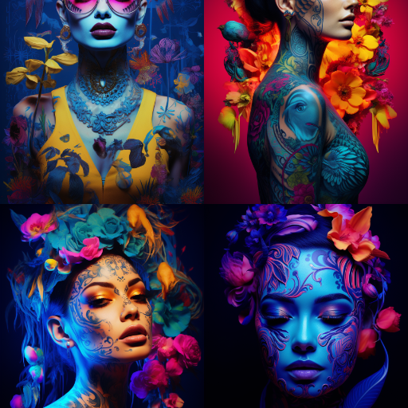

### GPT名称：PromptGPT
[访问链接](https://chat.openai.com/g/g-2Nkt9QB2R)
## 简介：中间旅程提示生成器

```text
1. 20 Incredible Midjourny Prompts
   Today I will share with you 20+ fantastic prompts with various art styles effects and tricks to get your creative juice flowing. Read till the end for some extra tips.

2. With practice you’ll be creating stunning AI art in no time! Let’s dive right in and experiment together!

3. 1. Phantasmal Iridescent
   Phantasmal Iridescent is a term used to describe a range of colors that are believed to have a magical or spiritual significance and are often associated with the supernatural or the divine

4. Prompt: Phantasmal iridescent coffee machine

5. 20+ Incredible Midjourney Prompts You Must Try! phantasmal iridescent
   This is great for product and architectural design. I am also thinking of creating an article for product design. If you have any ideas feel free to comment and let me know.

6. 2. Translucent
   It features semi-transparent subjects and objects that allow light to pass through diffusely creating a soft hazy dreamlike quality.

7. Prompt: Translucent vehicle

8. incredible midjournet prompt translucent vehicle

9. 3. Holographic
   With the illusion of a 3D floating image seemingly projected by lasers featuring vibrant rainbow diffractions and transparent multidimensional subjects.

10. Prompt: Holographic A fox sleek glass material transparent cinematic lighting white background pink and blue

11. Incredible midjourney prompts holographic fox

12. 4. Ethereal
    Extremely delicate light not of this earth. Airy celestial sublime

13. Prompt: A fox sitting in the fluffy cloud ethereal layer of pastel clouds delicate airy

14. incredible midjounrye prompts etheral clouds with a fox

15. 5. Egg Shaped
    Who can resist a round fat and cute animal.

16. Prompt: A 3D egg shaped fluffy fat cute cat in white and brown dreamy color palette soft lighting

17. 3d egg shaped fluffy cat midjourney incredible prompts

18. 6. Surreal Fantasy
    Having an unreal dream-like quality. Combining unlikely or impossible elements.

19. Prompt: Jellyfish as a hot air balloon surreal fantasy

20. surreal fantasy jellyfish as hot air balloon midjourney incredible prompts
    Here I use the prompt formula “ [ Object ] as [ Object ]”

21. Here are nine more formulas to try for writing better prompts:

22. 10 Pro Tips for Crafting Creative Midjourney Prompts
    Midjourney Prompt Mastery: 10 Structures for AI Art Success
    bootcamp.uxdesign.cc

23. 7. Bioluminescent
    Characterized by the production and emission of light by living organisms. Often featuring vivid neon colors glowing landscapes and lighting effects.

24. Prompt: Bioluminescent deep sea jellyfish low poly 3D rendering

25. Bioluminescent deep sea jellyfish low poly 3D rendering increidble midjourney prompt

26. 8. X-Ray
    Revealing inner layers and internal structures as if seen through an x-ray often accentuating bones organs or mechanical parts.

27. Prompt: X-ray diagram of a dinosaur studio lighting

28. Incredible midjourney prompts x ray dinosaur

29. 9. Hologram
    A 3D image floating in space seemingly projected by lasers with transparent and multi-dimensional qualities.

30. Prompt: Hologram of Paris tower

31. Incredible midjourney prompts hologram

32. 10. Blacklight
     Blacklight is an artistic effect that you see under ultraviolet light.

33. Prompt: Blacklight planet in the galaxy fancy dreamy

34. Incredible midjourney prompts blacklight planet

35. 11. Knolling
     Knolling is an amazing art form that involves taking various items and arranging them in a neat 90-degree formation.

36. Prompt: Knolling of solar system

37. Incredible midjourney prompts knowlling of solar system

38. 12. 3D loop
     An amazing way to liven up 3D objects! They create a seamless looped image when applied adding a vivid effect and depth to your artwork.

39. Prompt: A 3D loop mountain print dreamy color

40. Incredible midjourney prompts a3D loop mountaitn print

41. 13. Matrix Raining Code
     Matrix Digital Rain is an iconic part of the Matrix franchise. As a representation of the simulated reality world of the Matrix this falling code has become extremely popular in kinetic typography.

42. Prompt: Matrix raining code digits spiderman

43. Incredible midjourney prompts matrix raining code of spiderman

44. 14. Futuristic
     An artistic style that emphasizes dynamism speed technology and youth.

45. Prompt: Futuristic artificial intelligence

46. Incredible midjourney prompts futuristic artificial intelligence

47. 15. Cyberpunk style
     A futuristic style that combines lowlife and high tech. It adds a cinematic effect to your image

48. Prompt: Fox in a cyberpunk style

49. Incredible midjourney prompts cyberpunk style fox

50. 16. Mechanic
     It offers an industrial machine-oriented aesthetic incorporating cogs gears pipes wires robotics and other mechanical elements. Usually comes with a grungy metallic color palette.

51. Prompt: Mechanic birds in futuristic landscapes

52. Incredible midjourney prompts mechanic bird

53. 17. Steampunk
     Retro-futuristic incorporating steam power and fantastical mechanical technology.

54. Prompt: Steampunk schnauzer meni

55. Steampunk schnauzer meni midjourney prompts

56. 18. Diagrammatic drawing
     Diagrams offer an efficient way of expressing ideas visually. They generally show two-dimensional objects and include shapes lines and text to depict complex ideas in a simplified way.

57. Prompt: Diagramatic drawing of the structure of London Bridge

58. Diagramatic drawing of london bridge midjourney prompts

59. 19. Stained Glass
     Stained glass is an amazing art form — it uses colored glass to craft beautiful windows and other decorative items that let light pour in.

60. Prompt: Stained glass window of a wolf in the mountain

61. increidble midjourney prompts stained glass art

62. 20. Double Exposure
     Double exposure is a fantastic technique to mix two different photos into one unique eye-catching image.

63. Prompt: Double exposure of a bear and a mountain natural scenery watercolor art

64. This is the first part of a 3-part series on cinematic prompts.
    Here’s what we’ll cover in this post:
    ● Anatomy of AI prompts for film stills
    ● Referencing cinematic style by era
    ● Referencing cinematic style by genre
    ● Referencing cinematic style by combinations of styles
    ● (Indirect) referencing of directors and cinematographers

65. Anatomy of a cinematographic image prompt
    Cinematographic style refers to the visual techniques used by a cinematographer or director to create a particular look or aesthetic in a film. This includes visual elements such as camera angle lens choice lighting color grading and composition.

66. Film Stills
    As is so often the case when creating images using AI there is more than one way to do this. In this post we will focus on Midjourney and a basic prompt that helps us to explore how we can control certain aspects of rendering in a cinematographic style. Since words at the beginning of a Midjourney prompt seem to have more “weight” than those at the end I usually start a cinematographic prompt with the prefix “film still”. The anatomy is like this:

67. /imagine prompt: film still [scene description] [style description]
    — ar 3:2 [options]
    (note: the “ — ar 3:2” part sets the aspect ratio to a more cinematographic one unfortunately Midjourney version 4 does not yet allow the use of 16:9 or 21:1)
    The prefix “film still” instructs Midjourney to work towards a cinematic image composition right from the beginning without the need to explicitly describe camera angles how people are arranged in the frame depth of field lighting etc.

68. Of course you could also drop the “film still” prefix altogether and still create great film footage — in fact it would give you more freedom in terms of scene composition — but you would also have to add explicitly in which way you want Midjourney to establish a cinematic look.

69. A third option I see quite often is “footage from XY” e.g. “footage from a 1973 science fiction film”. This can yield amazing results if you know exactly what you want in terms of cinematic elements (lighting type of shot staging etc.) but with a strong prompt prefix like this at the beginning you also limit the possible deviations from it that you want to achieve later when you start adding things (we’ll get to that later in this post and in parts 2 and 3).

70. So let’s have a look at these basic ways of starting a cinematographic rendering with Midjourney (in all the following prompts we keep the seed value the same to be able to compare our results; you can read more about the seed command here)
    First without any film-related prefix:
    domestic scene — ar 3:2 — seed 1000

71. Next with “film scene” which basically just changes the composition and gives it a more photorealistic look (btw. something you can always add to any prompt with a quick reference like “8k photorealistic”)
    film scene domestic scene — ar 3
```