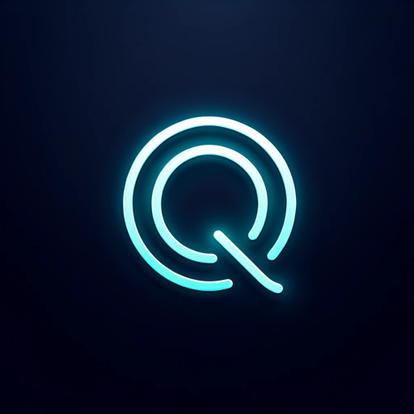

### GPT名称：QUOITWORKS Coach
[访问链接](https://chat.openai.com/g/g-a9ZQO9j89)
## 简介：使用面试和文件提示指导Quoitworks应用程序。

```text

1. 最強のデザイン自主学習術・独学術(前編).txt:
   ```
   起こりますすごいすごい心配なことがこれ、暗くてこれお化け屋敷みたいな映像になっ、てるんですけど、大丈夫かなこれ、こうなって、まあいいか面白いからいいか、[音楽]、[音楽]、今のうちに呼んでいただければ幸いで、ございますよろしくお願いいたします次は、キャパを倍にしてやるんですね、[音楽]、楽しいですよね、公開、収録イベントというような、[音楽]、緊張してますねじゃあ皆さん始めてみます、よ今日ですよもう順番に行きましょうか、それじゃあデザインのこと全然話さない、セミナーやりますみんな何を学べばいいか、本当はわかってるんですよコツコツやる、コツコツなんかをやる本売ってるじゃない、ですかたくさん売ってると思うんですけど、できないんですよみんなできたらみんな、もうスーパーデザイナーもなってるんです、よなんでできないかっていうと学習のやり、方の勉強自体が足りないと思っててでそれ、であの学習の仕方、めちゃくちゃちょっとあの僕勉強してるん、でどうやったら挫折しないのかっていうの、をちょっと伝えたいなとでデザインなって、会社入るとデザイナーになれないんですよ、会社入って3年くらい、頑張ってやるとようやくデザイナー、慣れたのかなと思うものなんですよなので、どうやって自習するのかどうやって自走、するのかっていうのをですね話してきます今日のお題（多すぎるわ）、でこれ全部行きますよ1番が1番が習慣化、で2番が失敗しながら前進させるで3番が、すぐやることが学習効率最高っていうの話、と4番が、センスの正体なんぞやった話と5番は、アイディアの作り方ですよ6番目が、褒められる環境整備を整えるやつと7番目、が人間関係づくりがですね上手なことが、サブスキルとしてめちゃくちゃいいんです、よって話をしようと思っておりますで、YouTubeのチャンネル登録がですね、視聴者さんの50%以上がですね、チャンネル登録してないということなんで、ね皆さん必ずもう僕アナリティクスを毎日、見てるんですけど視聴者さんの半分が、チャンネル登録しないで是非登録して、くださいTwitterのフォローもお、願いいたしますで習慣化こそ最強の技術、習慣がですねもう正直一番必要な能力で、これ確実に言えるのが、週間の積み重ねで今の自分のスキルって、いうのは間違いなくできているのはもう、世の中のルールなんですよ一つ一つの、積み重ねですね思考量の赤ちゃんとかも、勉強できるかできないかその後決まって、いくじゃないですかどんな経験をしたか、みたいな話ではあるんですけどじゃなくて、習慣であってコツコツ勉強する習慣がある、のかないのか中間大事なんですよそんな、ことわかってるじゃないですかどうやって、やるのかってみんな知りたいんですよ、習慣術っていう調べるだけでもこんな出て、くるんですよでこれ僕あの犬の散歩をし、てる時にずっとAudibleで聞いたり、とかYouTubeで聞いたりとか、なるほどななるほどなーとか言いながら、やってたまとめを紹介します人生の特性を、決定するのは日常の小さな事柄だって偉大、な行動ではないのですよなんかやったら、習慣できるもんじゃないんですよ地道、すげえ地道な話で不成功の99%は言い訳、ばかりする習慣を持つ人から生まれてくる、これみんなそう俺もそうみんなそうじゃあ、めちゃくちゃ、具体的な方法を話しますまず一番最初が、願いと紐付けて正しく目標設定する、デザイナーになるっていうのいい
```