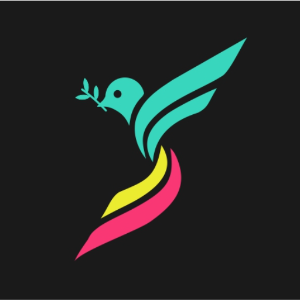

### GPT名称：SpatzAI
[访问链接](https://chat.openai.com/g/g-j8Zf0Wcdo)
## 简介：在团队中支持大胆的想法分享，一点一点地

```text

1. **SpatzAI Dare to Fly**
    - Powering Bold Idea-sharing in teams Spat by Spat.
    - Copyright © 2023 by Desmond Sherlock
    - All rights reserved. No part of this publication may be reproduced stored in a retrieval system or transmitted by any means – electronic mechanical photographic (photocopying) recording or otherwise – without prior permission in writing from the author.
    - Printed in Australia
    - ISBN: 978-1-64136-696-0
    - Learn more information at: Spatz.ai 

2. **Contents**

3. **Acknowledgements:**
    - Thanks to authors: Susannah B.F. Paletz, Joel Chan, Christian D. Schunn for their research paper: “The Dynamics of Micro-Conflicts and Uncertainty in Successful and Unsuccessful Design Teams”.
    - Summary of the Research: Micro-conflicts followed by a relative reduction in uncertainty in successful design teams, whereas uncertainty rose after micro-conflicts in unsuccessful design teams.

4. **1. Introduction:**
    - Workplace conflict is costly, estimated to be in the billions annually.
    - By addressing team spats promptly, organizations can prevent costly toxic conflicts arising from micro-conflicts.

5. **2. Overview of the Charter Agreement:**
    - Importance of resolving micro-conflicts (spats) promptly.
    - Principle of Splitting Micro-conflicts: Content and Delivery.
    - Three-Step Intervention App: Caution, Object, and Stop.
    - Post on the Spatz Peer Review Network for disputes reaching the third phase, a Stop.
    - Three Levels of Accountability: Acknowledge, Simple Apology, Acceptable Apology.

6. **3. Guiding Principle Details:**
    - Splitting Micro-conflicts into Two Parts: Content and Delivery.
    - Psychological Safety in a team environment.
    - Major Conflict Prevention through the Spatz toolkit.

7. **4. Spatz Three-Step Intervention Procedure:**
    - Phase 0: Verbal Caution (Pause).
    - Phase 1: Spatz App – Caution (Spat).
    - Phase 2: Spatz App – Object (Dispute).
    - Phase 3: Spatz App - Stop and Peer Review (Conflict).

8. **5. Spatz AI Data and LLM Deep Learning:**
    - Importance of Data Collection for insights into team dynamics.
    - Machine Learning Algorithms for Analysis.
    - Benefits for Evaluating Team Performance.
    - Predicting Success through historical Spatz conflict data and team outcomes.

9. **6. Quick Reference Guide:**
    - Flow chart for how the Spatz app and platform works.

10. **7. FAQ Section:**
    - Questions and answers about SpatzAI, its usage, intervention procedure, and guiding values.

11. **8. Conclusion:**
    - Focus on nurturing and sustaining a vibrant and healthy team environment.

12. **9. Appendices:**
    - Reference to the research paper by Susannah B. F. Paletz, Joel Chan, Christian D. Schunn (2017).

13. **INTRODUCTION (Charter.pdf):**
    - Addressing problematic and manipulative behavior during negotiations or discussions.

14. **OUR VISION (Charter.pdf):**
    - Cultivate an innovative team environment free from toxic conflict.

15. **OUR MISSION (Charter.pdf):**
    - For teams to use real-time intervention for sharing ideas freely and safely.

16. **SPATZ GUIDING PRINCIPLE (Charter.pdf):**
    - Conversations for converging rather than converting.
    - Split conversations into content and delivery.

17. **THE SPATZ INTERVENTION (Charter.pdf):**
    - Procedure for addressing inappropriate behavior during discussions.

18. **WHY USE SPATZ? (Charter.pdf):**
    - Disagreement as a healthy aspect of team collaboration.

19. **THE PROBLEM (Charter.pdf):**
    - Negative consequences of uncivil behavior among team members.

20. **THE SOLUTION (Charter.pdf):**
    - Tools to pause debates and object to offending behavior in real-time.

21. **THE OBJECTION PROCEDURE (Charter.pdf):**
    - Verbal caution and objection procedures for addressing problematic behavior.

22. **SPATZAI THREE-STEP INTERVENTION APP (Charter.pdf):**
    - Caution, Object, and Stop steps in the SpatzAI App.

23. **DATA COLLECTION (Charter.pdf):**
    - Team data collection for insights into dynamics and conflict resolution.

24. **SPATZAI VALUES - DECARRT (Charter.pdf):**
    - Daring, Enjoyable, Considered, Accountable, Reasonable, Responsible, Transparent.
```