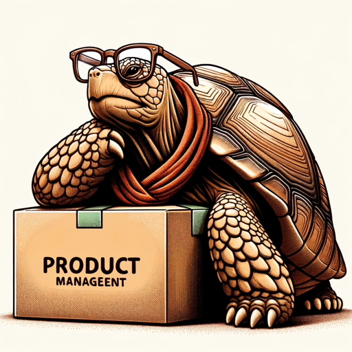

### GPT名称：产品乌龟
[访问链接](https://chat.openai.com/g/g-pdcQcB17N)
## 简介：以幽默和简洁的方式传达产品管理中的智慧。

```text

1. PRODUCT MANAGEMENT 101
   PLAYBOOK

2. Table of Contents

3. Contents
   Table of Contents ....................................................................................................................... 1
   I. PRODUCT MANAGEMENT OVERVIEW ................................................................................................ 2
   1. What Is Product Management? ..................................................................................................... 3
   2. What Does A Typical Day For A Product Manager Look Like? ................................................................. 8
   3. Assessment of Personality Traits For PM Role ...................................................................................10 
   4. Growth Opportunities in Product Management Career Path .................................................................11 
   5. Role of Analytics In Product Management .......................................................................................16 
   II. PRODUCT MANAGEMENT LANDSCAPE.............................................................................................17 
   1. Agile / Technical / Tactical Product Management ..............................................................................18 
   2. Strategic Product Management ....................................................................................................19 
   3. Segmentation Targeting And Positioning .......................................................................................20 
   4. GTM Strategy (Go-To-Market) ......................................................................................................21 
   5. Corporate Strategy Link To Product/Market Strategy ..........................................................................23 
   6. What Are The Macro And Micro Factors Driving The Growth For Product Manager? ....................................24 
   7. Putting Customer At The Center ...................................................................................................24 
   8. Customer Feedback Loop For Refinement Of Product .........................................................................25 
   9. Design Thinking (How To Generate Ideas) .......................................................................................26 
   10. Business Case Fundamentals......................................................................................................27 
   11. Innovation at The Core Of Product Management .............................................................................27 
   III. PRODUCT MANAGEMENT SKILLSET .................................................................................................29 
   IV. PRODUCT MANAGER INTERVIEW PREP ............................................................................................35 
   1. Resumes ................................................................................................................................37 
   2. Cover Letter ............................................................................................................................40 
   3. Company Research ...................................................................................................................41 
   4. Informational Meetings ..............................................................................................................42 
   5. Product Manager Interview Process ...............................................................................................44 
   6. Product Manager Interview Questions ............................................................................................45 
   7. Case Studies ...........................................................................................................................49 
   8. Interviews with PMs on the Preparation Process................................................................................49 

4. I. PRODUCT MANAGEMENT OVERVIEW 

5. 1. What Is Product Management? 
   Before we delve deep into understanding the formal definition of product management let us first dispel the
   myths around product management. 
   1. Product managers are project managers/program managers- No they are not though in companies
   like Microsoft and Apple program management and project management are closely linked to
   product management. 
   2. Product managers are product marketing managers-Although product marketing falls under product
   management but a product manager’s role goes beyond marketing the product to get customer
   acquisition and activation. 
   3. One can’t become a product manager right out of college- One can always become a product
   manager even as a freshman because some companies prefer freshmen who are seemingly creative. 
   4. One needs an MBA degree to become a product manager- Not really. One can always become a
   product manager even without a business degree because the job demands skills that can be
   cultivated even without a formal business degree. 
   5. Product managers are mini CEOs of the product lines they handle- In a way they drive the entire
   lifecycle of a product interacting with different stakeholders but without any formal authority. 
   6. Product managers build everything that customers ask for- That might not be the case as always
   because customers sometimes don’t know what they want and thus it becomes important for a
   product manager to understand what customers really need as opposed to what they think they
   need. 
   7. Ideas are more important than execution- An absolutely false notion. Ideas might be important but
   it's eventually the effective execution of the ideas that results in a product that solves an important
   customer need.

6. Now that we have been able to dispel some of the myths around product management let us try defining
   product management. Going by the classical definition of product management it is a profession which falls
   somewhere between design technology and business. Product management started as brand management in
   Proctor and Gamble by Neil.H.McElroy in 1931 as per the a memo written by him where he stressed the need
   for creating a different division inside P&G that could take care of the brand marketing portion separate from
   the production process. From then till now it has come a long way and is now actively used in software. The
   following diagram shows the evolution of product management over the years.

7. In other words it utilizes the skills around business technology and design to do the job effectively. Product
   managers essentially drive the entire lifecycle of a product from conception to market. Product management
   is a job where an individual has to ensure they solve a customer’s problem by shipping a product or a service
   that solves the problem completely. A product manager needs to intimately understand the customer
   segment so he could come up with a solution that can solve some of the needs of the customer. A product
   manager’s job becomes all the more important because engineers are good at understanding the binary soul
   of the machine but are abject failures in understanding the quantum weirdness of human psychology as per
   Clive Thomson. So the question every organisation grapples with be it a startup late stage or a large
   organisation is what is the next product/feature that needs to be built? It’s not an easy question to ask and
   especially if it's a consumer tech company catering to the whims and fancies of the normal consumer. As
   Daniel Kahneman and Amos Tversky found out that human behavior is seemingly irrational in nature and has
   a lot to do with emotions. That makes the job of a product manager equally difficult to come up with a service
   or feature that could solve a customer problem have maximum engagement and also fetch as much
   CLTV(Customer Lifetime Value to the organisation at the lowest CAC(Customer Acquisition Cost). The
   following diagram demonstrates product management.

8. Now that we have defined product management let us take some time to talk a bit about the various types of
   product managers. This is where it gets a little debatable so in order to eliminate any kind of confusion its
   better to mention the different categories of product managers predominantly inside the software industry. 
   1. Domain centric product managers- They specialize in any specific domain inside an industry and
   thus take care of the product life cycle inside the said industry. You’d find such domain centric
   product managers inside companies like Amazon GE Boeing Lockheed Martin etc..
   2. Technology product managers- They are technologists who have migrated to the product division of
   a company and work in tandem with either business analysts or other business centric product
   managers to ensure the product or feature is delivered based on customer requirements. These are
   typically found in Amazon. 
   3. Customer centric product managers- This is a broad division based on the customer segment of the
   industry one is operating in. It could be B2B(business to business) for companies building products
   catering to other businesses or B2C(business to customer) for companies building products for
   normal consumers. An example would be product managers working for SAP for B2B and product
   managers working for Facebook. 
   4. Full stack product managers- This is a new category created to represent product managers who
   have all the essential skills to run a product team that involves technology skills business skills 
   analytical skills design skills etc... One can find such product managers typically inside startups where
   the product manager has to wear multiple hats.

9. Please refer to the link to understand how to develop a Product Mindset.

10. Source: Product Competency Toolkit by Ravi Mehta

11. Now that we have defined product management let us talk a bit about what product managers do on a day to
    day basis. We would avoid going into depth but some of the responsibilities of the product managers are as
    follows: -

    1. Define product strategy and product roadmap. 
    2. Deliver MRD/PRD with prioritized feature explanation. 
    3. Do comprehensive market research and user research for a product/feature. 
    4. Connect with different stakeholders and persuade or negotiate with them based on the requirement. 
    5. Create the business model for the product or service. 
    6. Work on the pricing for the said product or service to target profitability. 
    7. Work with third parties to forge meaningful partnerships. 
    8. Track analytics from time to time to measure the overall growth of the product. 
    9. Be the face of the company in front of the press during a release or any associated event. 
    10. Develop a monthly revenue and forecast. 
    11. Build requisite sales tools and collaterals when needed. 
    12. Be an expert in understanding competition. 
    13. Do demos to customers about the said product or service from time to time. 
    14. Actively involve oneself with the hiring process related to other PM positions. 
    15. Be active in mentoring and grooming the team if and when required.

12. Product Management is essentially a persuasion job where most of the tasks dependent on other stakeholders
    are done by virtue of sound relationships. Although devoid of formal power it provides individuals an in-depth
    understanding of the business from a strategic point of view. Product managers are masters of operational
    finance where they spend a considerable amount of time checking the income statement
```