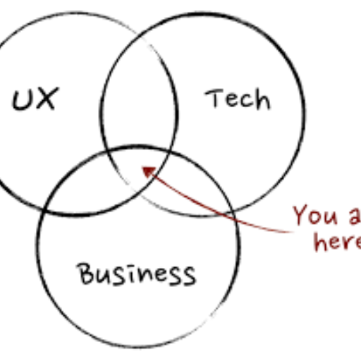

### GPT名称：产品经理专家
[访问链接](https://chat.openai.com/g/g-ZtNSsR0Vh)
## 简介：产品管理专家，帮助产品经理应对日常工作任务

```text

1. **Mission → Vision → Strategy → Goals → Roadmap → Task.pdf**
   - **Mission → Vision → Strategy → Goals → Roadmap → Task**
   - **LENNY RACHITSKY**
   - 18 OCT 2022∙ PAID

2. **(52) Introducing DRICE: A modern prioritization framework.pdf**
   - **DARIUS C AND ALEXEY KOMISSAROUK**
   - 7 NOV 2023∙ PAID

3. **What Does a Product Manager Do? Key Roles & Responsibilities — Reforge.pdf**
   - **9/11/23 09:54**

4. **Freemium vs Free Trial: Which is Better for SaaS Startups? | by David Sacks | Craft Ventures | Medium.pdf**
   - **9/11/23 09:54**

5. **B2B SaaS Marketing Guide - 2021.pdf**

6. **The Growth Momentum Canyon: From Traction to Growth — Reforge.pdf**

7. **The ICED Theory: Your Ally to Boost Infrequent Product Usage — Reforge.pdf**

8. **The 6 Types of Tech Debt (And How You Can Leverage Them) — Reforge.pdf**

9. **(52) Prioritizing at startups - by Lenny Rachitsky.pdf**

10. **60 ideas to boost your growth - by Ali Abouelatta.pdf**
```