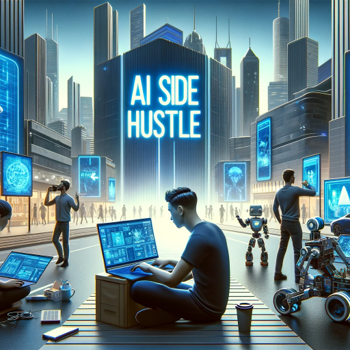

### GPT名称：副业GPT
[访问链接](https://chat.openai.com/g/g-g595xv0rl)
## 简介：发现适合你的副业

```text

1. ai-collection/ai-collection: The Generative AI Landscape - A Collection of Awesome Generative AI Applications
2. VideoDubber: AI Video Translation Text-to-Speech - Try Free
3. Grow Your Personal Brand On LinkedIn
4. Online Book Writing Software now with AI Writing Assistant
5. Your personal AI copywriter | Botowski
6. Zap - Cover Letters
7. Cover Letter AI
8. AIKit | Your WordPress AI Assistant using GPT-3 – Your WordPress AI Assistant
9. FlowCog - Financial Modeling Software for SaaS Companies
10. BeeBee AI | Gathering Insights Crafting Success
11. StockGPT
12. Jinnee for Fintech
13. Stocknews AI - AI picked stock news
14. Eilla AI
15. GooseAI
16. Blimey
17. Texture Lab
18. kaedim3d.com/?utm_medium=github&utm_source=aicollection&utm_campaign=aicollection
19. Plask Motion: AI-powered Mocap Animation Tool
20. Genie a research preview of Luma's generative 3d foundation model
21. Generative Design | Architecture Design Software | Maket
22. Interior AI: Interior Design Ideas Inspiration and Virtual Staging App using Artificial Intelligence
23. Image Computer
24. Dimensions.ink
25. AI Room Planner - Interior Design By AI
26. CoolAIid - Interior design ideas professional tools and virtual staging using AI
27. Creating 2d and 3d floor plans with AI
28. caspa AI | create customised AI product photos
29. Everything you need to create images with AI | getimg.ai
30. Free Icons Clipart Illustrations Photos and Music
31. Pet Booth: AI Pet Photos
32. Generate unique QR codes for your business with AI
33. Designify - Turn any photo into awesome
34. (Free No Sign up) AI Anime Picture Generator - Make AI Images From Your Pics - Anime AI
35. Try Out New Hairstyles With AI | Hairstyle AI
36. Avatar AI™ | Shot with AI
37. Generate Custom AI avatar - avtrs.ai
38. Autoportrait.co
39. Create stunning profile pictures using AI | AIProfilePic.art
40. DreamPic.AI - AI Generated Pictures Starring You
41. AI Profile Picture Generator I Epic Avatar
42. My AskAI — Create your AI customer support assistant
43. Chatbase | Custom ChatGPT for your data
44. Chatsimple's Chatbot Builder Platform
45. SiteSpeakAI - You're spending too much on customer support
46. Humata: ChatGPT for Your Data Files
47. PromptPal: Find the best AI prompts GPTs and bots
48. Welcome to EmbedAI
49. Home - Swimm
50. Meaningful Code Tests for Busy Devs | CodiumAI
51. CodeWP - AI For WordPress Creators
52. Ask great technical questions to a human
53. TLDR – Explain code in plain english.
54. Discover AI-Powered Coding Tools at Dropout Developer – Elevate Your Coding Skills
55. What The Diff – AI powered code review assistant
56. carboncopy.pro
57. Jasper | AI copilot for enterprise marketing teams
58. AI Text Rewriter | WordAi
59. SEO Content Optimization Software - Dashword
60. Unbound – AI Product Photos
61. NeuralText - AI Writing Assistant and tools for SEO
62. LongShot AI | AI Assistant for Content Teams
63. Zust QR - AI-Generated artistic QR codes
64. DamnGood.Tools
65. Create stunning visuals in seconds with AI.
66. Descript | All-in-one video & podcast editing easy as a doc.
67. Cutout.Pro - AI Photo Editing | Visual Content Generation Platform best for image and video design
68. Fermat - AI Toolmaker
69. Lightricks: Award Winning App Developer
70. Webapi.ai - GPT-4 AI Chatbot builder
71. Cobrowsing for Customer Support | Cohere.io
72. Bahasa.ai - Chatbot Which Serves Customers Fully
73. ResolveAI | Create AI Agents for Your Business
74. Eddy AI - Automate Sales and Support With AI Assistant
75. echowin | AI Call Answering Around The Clock With Workflow Automation
76. Poised: AI-Powered Communication Coach
77. Zust - AI Generated product photography
78. Octie - Ecommerce Marketing Assistant
79. Embolden - AI Writing for Ecommerce
80. WiziShop Ecommerce Solution: Create your Online Store
81. Product Photography Simplified | Ecommerce product photography at ease
82. Manifest AI: GPT-Powered AI Chatbot for your Shopify Store
83. Home - Gizzmo Ai
84. AI Course Creator
85. Quizgecko | AI Question Generator | Make a Test
86. askbotta.com/?utm_medium=github&utm_source=aicollection&utm_campaign=aicollection
87. Speaking Club AI
88. Improve your IELTS speaking score - Lorro
89. Write stories for kids using AI - StoryBee
90. Teacherbot - The tool every teacher deserves
91. SmartWriter | Personalised AI Cold Emails
92. WARMER.ai - AI Email Writer
93. ai-collection/ai-collection: The Generative AI Landscape - A Collection of Awesome Generative AI Applications
94. WARMER.ai - AI Email Writer
95. DraftLab: Your AI-powered Gmail copilot to write better emails faster
96. Ellie - Your AI Email Assistant. Sign up today for free!
97. EmailTriager · Email on autopilot.
98. 404 - Page not found
99. superReply | Get started for free | AI for Gmail & Outlook
100. FashionAdvisor.AI - Ask Questions & Get Answer's from FashionAdvisor.AI
101. visualhound.com | 502: Bad gateway
102. swag-ai.com/?utm_medium=github&utm_source=aicollection&utm_campaign=aicollection
103. AI Undress Photo - Nudify Photos for FREE with AI Deepnude
104. Undress any girl for free - Undress AI - Deepnude deepfake AI service
105. Experience adventures with AI girlfriend
106. AI Girlfriend - Best NSFW and dating AI Girlfriend Ever
107. Deepnude On Nudify – Undress AI app – Nudify Online!
108. What would RBG (probably) say?
109. StoriesForKids.ai: Personalized Kid's Books using AI
110. Charisma — Storytelling powered by artificial intelligence
111. Home | Hidden Door
112. Latitude
113. Betafish.js | Chess AI
114. GGPredict.io
115. AssetsAI
116. Scenario - AI-generated game assets
117. Lovelines.xyz - Share your love with custom keepsakes made by AI
118. text2present.com - Creative presents from busy people.
119. Outdone
120. Gift Ideas by Genie | BuildAI.space
121. getgift.help
122. Origin Error
123. Gift Genie AI - Free Personalized Gift Ideas for Christmas Birthdays Holidays etc!
124. Replika
125. Getactyv - AI and Computer Vision Assisted Health and Fitness platform
126. Ubie | Check Symptoms & Find Causes by AI
127. AIApply | AI-Powered Job Search Tools
128. Rezi - The Leading AI Resume Builder trusted by 1833028 users
129. Prodigy Network
130. www.rankode.ai
131. Job search AI | Automate Job Search using AI powered job application automation tool | Job bot
132. Zap - Cover Letters
133. hireyay.com
134. ValidatorAI.com – Instant help and feedback with our startup validator tools for entrepreneurs
135. www.paperade.co
136. Brainstorm Business Ideas
137. Startup Ideas powered by OpenAI
138. VideoMuse | Brainstorm video ideas
139. AI Date Idea Generator | My Spicy Vanilla
140. Business Plan Software for a Startup Business
141. Paralegal AI
142. Expert Compliance Systems and Resources | Compliance Quarter
143. Equally.AI
144. DoNotPay - Your AI Consumer Champion
145. PatentPal
146. CFR Explorer - Ask AI questions about CFRs
147. Spellbook - AI Contract Drafting & Review
148. Logo Design & Brand Identity for Entrepreneurs | Looka
149. Stockimg AI
150. MakeLogoAI: Unique Logos 100% generated by AI.
151. Brandmark Logo Maker - the most advanced AI logo design tool
152. AI Logo Generator : Easily Make Your Own Logo
153. Zarla. The Free Logo Maker | Create a Free Logo Now
154. Fireflies.ai | AI notetaker to transcribe summarize analyze meetings
155. jamie - Summarize Any Meeting.
156. Supernormal - AI That Writes Your Meeting Notes
157. Wudpecker - Your AI Meeting Assistant
158. Avoma - AI Meeting Assistant with Conversation Intelligence
159. Fathom - Never take notes on a video call again
160. Otter.ai - AI Meeting Note Taker & Real-time AI Transcription
161. Emergent Drums by Audialab - Generate infinite royalty-free drum samples with AI
162. Vocal Remover & Instrumental AI Splitter | LALAL.AI
163. Adobe Podcast | AI audio recording and editing all on the web
164. Mic Check from Adobe | Analyze your microphone setup for free
165. World’s #1 Noise Cancelling App | Krisp
166. AIVA the AI Music Generation Assistant
167. 株式会社Amadeus Code | 公式企業サイト
168. Albus - AI Slack Search & Web Assistant
169. AirOps | Create test deploy and scale AI Apps with AirOps Studio.
170. Website Change Detection Monitoring & Archiving | Hexowatch
171. Keploy: Open Source API Test Case and Data Mock Generation using AI for Developers
172. AI meets Automations
173. AutoPredict | MOT Check | Predict How Long Your Car Will Last
174. Hubble | Unmoderated tests and In-Product Surveys
175. ai-collection/ai-collection: The Generative AI Landscape - A Collection of Awesome Generative AI Applications
176. AI meets Automations
177. AutoPredict | MOT Check | Predict How Long Your Car Will Last
178. Hubble | Unmoderated tests and In-Product Surveys
179. AI Headshot Generator Creates Professional Headshots in Minutes
180. Photoshift | Commercial AI Product Photography
181. [OFFICIAL] HitPaw Online AI Photo Enhancer - Free & Fast
182. Face Swapper - AI-Powered Face Swap And Reface Online
183. StableDojo
184. Prisma - Prisma Labs
185. AI Product Photography Suite - Claid.ai
186. AI-Responder for HostAway - AI Duh
187. Home | texti.app
188. Figma Autoname
189. splashai.art/login
190. NSFW JS
191. Merlin AI | 1-click access to ChatGPT GPT-4 Claude2 Llama 2 on all websites
192. Voilà – ChatGPT AI browser assistant | Voilà
193. Podwise | The premier knowledge management app for podcast listeners
194. Dewey: Your new accountability buddy
195. Your baby registry simplified.
196. Double productivity with an AI coworker for your team
197. KinesteX AI: Home Fitness & Physio
198. Further: Automated Skill Suggestion
199. theGist | Unified AI Workspace to supercharge your enterprise
200. Afforai - Powerful AI Research Assistant & Chatbot
201. Elicit: The AI Research Assistant
202. AI Chat for scientific PDFs | SciSpace
203. RTutor 0.98
204. Explainpaper
205. Jenni AI - Your AI Research Assistant
206. Home - Vocads
207. Read This Twice - Books Worth Reading Twice.
208. Respond to reviews with your AI Review Response Generator
209. GeniusReview - 360° AI Performance Reviews
210. 404 - Page not found
211. Art Review Generator
212. Tabula - AI-Powered Marketing Analytics
213. Copy.ai: Write better marketing copy and content with AI
214. Generate ads in seconds with AI
215. Tap AI & CI Powered Sales Battlecards | CueTap
216. User Evaluation - AI-Powered Insights & Analysis Tool
217. GummySearch Audience Research
218. baruaai.com/?utm_medium=github&utm_source=aicollection&utm_campaign=aicollection
219. Lexii.ai | AI Article Writer for SEO
220. SmartyNames.com Business Name Generator with AI
221. AI Art Generator | Create AI Art and Images for Free | OpenArt
222. Your Personalized AI Assistant.
223. Perplexity
224. Andi - Search for the next generation
225. DNS resolution error | www.anypod.ai | Cloudflare
226. ChatBA: Generative AI for Slides
227. Create Presentation Slides With AI in seconds with SlidesAI
228. AI Pitch Deck Generator - PitchGrade
229. MY PITCH DECK - AI-Generated pitch deck templates for startups
230. Tome | Polished & Professional AI Presentations
231. Glimmer - AI-powered presentation magic
232. STORYD - Business presentations leaders love in seconds
233. ROAST - Best Dating Profile Review for Tinder Hinge Bumble - ROAST
234. Viral Post Generator
235. HotConvo
236. AI Social Bio
237. Smart AI Tweet Generator - inspire your tweets in seconds
238. Tweet Hunter | Get More Twitter Followers | Tweets Threads Scheduler Analytics
239. TweetEmote | The AI Powered Tweet Assistant
240. Enhance Speech from Adobe | Free AI filter for cleaning up spoken audio
241. ai-collection/ai-collection: The Generative AI Landscape - A Collection of Awesome Generative AI Applications
242. Lingostar | Real Conversations with Artificial Intelligence
243. Home - PolyAI
244. SmallTalk2Me – AI-powered simulator to improve spoken English
245. Realistic Text to Speech converter & AI Voice generator
246. Free Online Form Builder | Tally
247. Online Summarizing Tool | Flashcard Generator & Summarizer | Scholarcy
248. Jot - AI Ad Copy
249. namewizard.ai -
```