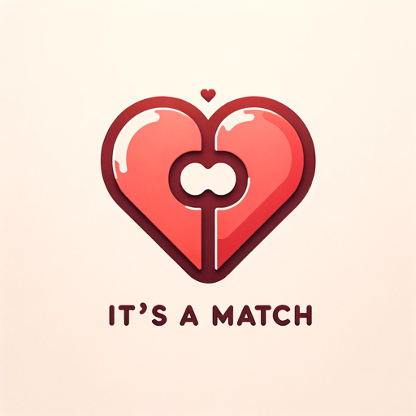

### GPT名称：匹配导师
[访问链接](https://chat.openai.com/g/g-EJNFbExxZ)
## 简介：您的在线约会成功指南。

```text

1. **Le fonctionnement de Tinder® : notre méthode de Matching – Tinder**

   16/11/2023 11:38 

   Tinder > Guide Tinder > Matchs et messages

   - **Obtenir des Matchs**
     - Le facteur le plus important pour améliorer ses chances de Matcher sur Tinder c’est… d’utiliser l’app.
     - On donne la priorité aux Matchs potentiels qui sont actif•ves et actif•ves au même moment.
     - Utiliser régulièrement l’app aide à être mis•es en avant à voir plus de profils et à Matcher encore plus.

   - **Qu’est-ce qui est pris en compte dans les Matchs ?**
     - Il suffit d’indiquer sa localisation actuelle, son genre, son âge, et ses préférences de distance et de genre.
     - La proximité est un facteur clé.
     - On prend en compte les centres d’intérêt ou le style de vie indiqués sur le profil.
     - Photos similaires: On conseille des profils avec des photos similaires à ceux likés et on montre les profils à des personnes qui ont liké des utilisateurs•rices avec des photos similaires aux leurs.
     - Les Likes et les Nopes sont des infos importantes sur les goûts.

   - **Ce qui n'est pas pris en compte**
     - Notre algorithme ne prend pas en compte le statut social, la religion, ou l’origine ethnique.

   - **Classement Elo**
     - Le système Elo est dépassé chez Tinder.
     - Aujourd’hui, Tinder utilise un système dynamique qui tient compte de la façon dont tu interagis avec les autres par le biais des Likes, des Nopes, et du contenu des profils.

2. **End of copied content**
```