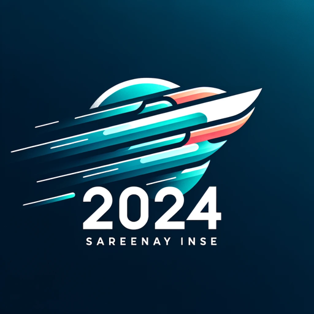

### GPT名称：职业指南 2024
[访问链接](https://chat.openai.com/g/g-yHvjDKjRo)
## 简介：您的就业指南，职业规划，面试准备！

```text
1. BOOKMARKS: College resumes.pdf cover page 2.pdf resume and letter_2021_final.pdf Create a Strong Resume RESUMES AND COVER LETTERS RESUME LANGUAGE SHOULD BE: DON’T: TOP 6 RESUME MISTAKES: DO: PLAN TO WORK INTERNATIONALLY? Action Verbs for your Resume RESUMES AND COVER LETTERS RESUMES AND COVER LETTERS RESUMES AND COVER LETTERS Firstname Lastname Education ORGANIZATION Leadership & Activities RESUMES AND COVER LETTERS Firstname Lastname Education ORGANIZATION Leadership & Activities Write an Effective Cover Letter Sample Cover Letter RESUMES AND COVER LETTERS
2. RESUMES & COVER LETTERS Undergraduate Resource Series Mignone Center for Career Success | 54 Dunster Street Harvard University | Faculty of Arts and Sciences mcs@fas.harvard.edu | careerservices.fas.harvard.edu
3. MIGNONE CENTER ~ R CAREER SUCCESS
4. ROOF & CASA HOME AND DECOR
5. © 2023 President and Fellows of Harvard College All rights reserved. No part of this publication may be reproduced in any way without the express written permission of the Harvard University Faculty of Arts & Sciences Mignone Center for Career Success. 08/23
6. Mignone Center for Career Success Harvard University Faculty of Arts & Sciences Cambridge MA 02138 mcs@fas.harvard.edu careerservices.fas.harvard.edu
7. Create a Strong Resume RESUMES AND COVER LETTERS
8. Aresume is a concise informative summary of your abilities education and experience. It should highlight your strongest assets and skills and diferentiate you from other candidates seeking similar positions. Although it alone won’t get you a job or internship a good resume is an important factor in obtaining an interview.
9. Tailor your resume to the type of position you’re seeking. Tis doesn’t mean that all of your experi- ences must relate directly but your resume should refect the types of skills the employer would value.
10. GETTING STARTED
11. • Draf a resume using one of the templates on the MCS website. • Attend a Resume Workshop to learn the nuts and bolts of getting started. See the MCS events calendar for dates. • View the MCS Recorded Resume Webinar on our website. • Get advice via drop-ins. Monday-Friday 1:00-4:00pm - ask quick career-related questions and have an advisor review your resume. • Look for industry specific resume review clinics listed on our events calendar in employer events.
12. RESUME TIPS TOP 6 RESUME MISTAKES:
13. RESUME LANGUAGE SHOULD BE: • Specific rather than general • Active rather than passive • Written to express not impress • Articulate rather than “flowery” • Fact-based (quantify and qualify) • Written for people who scan quickly
14. - DON’T: • Use personal pronouns (such as I) • Abbreviate • Use a narrative style • Use slang or colloquialisms • Include a picture • Include age or gender • List references • Start each line with a date
15. 1. Spelling and grammar errors 2. Missing email and phone information 3. Using passive language instead of “action” words 4. Not well organized, concise, or easy to skim 5. Not demonstrating results 6. Too long
16. DO: • Be consistent in format and content • Make it easy to read and follow, balancing white space • Use consistent spacing, underlining, italics, bold, and capitalization for emphasis • List headings (such as Experience) in order of importance • Within headings, list information in reverse chronological order (most recent first) • Avoid information gaps such as a missing summer • Be sure that your formatting will translate properly if converted to a .pdf
17. PLAN TO WORK INTERNATIONALLY? Resume guidelines can vary from country to country. See our international resources at the MCS website.
18. RESUMES AND COVER LETTERS
19. Action Verbs for your Resume
20. LEADERSHIP Accomplished Achieved Contracted Coordinated Handled Headed Organized Oversaw Regulated Reorganized
21. Administered Delegated Impacted Planned Reviewed
22. Analyzed Developed Improved Predicted Scheduled
23. Assigned Directed Increased Prioritized Spearheaded
24. Attained Earned Led Produced Strengthened
25. Chaired Evaluated Mastered Proved Supervised
26. Consolidated Executed Orchestrated Recommended Surpassed
27. COMMUNICATION Addressed Arbitrated Developed Directed Influenced Interpreted Presented Promoted Suggested Synthesized
28. Arranged Documented Lectured Publicized Translated
29. Authored Drafted Liaised Reconciled Verbalized
30. Collaborated Edited Mediated Recruited Wrote
31. Convinced Energized Moderated Reported
32. Corresponded Enlisted Negotiated Rewrote
33. Delivered Formulated Persuaded Spoke
34. RESEARCH Clarified Diagnosed Interpreted Surveyed
35. Collected Discovered Interviewed Systematized
36. Concluded Evaluated Investigated Tested
37. Conducted Examined Modeled
38. Constructed Extracted Organized
39. Critiqued Formed Resolved
40. Derived Identified Reviewed
41. Determined Inspected Summarized
42. TECHNICAL Assembled Installed Solved
43. Built Maintained Standardized
44. Calculated Operated Streamlined
45. Computed Optimized Upgraded
46. Designed Overhauled Devised Engineered Programmed Remodeled Fabricated Repaired
47. TEACHING Adapted Enabled Persuaded
48. Advised Encouraged Set Goals
49. Clarified Evaluated Stimulated
50. Coached Explained Studied
51. Communicated Facilitated Taught
52. Coordinated Guided Trained
53. Demystified Informed Developed Instructed
54. QUANTITATIVE Administered Allocated Computed Developed Projected Researched
55. Analyzed Forecasted Appraised Managed Audited Marketed Balanced Maximized Budgeted Minimized Calculated Planned
56. CREATIVE Acted Directed Introduced Revitalized
57. Composed Established Invented Shaped
58. Conceived Fashioned Originated Visualized
59. Conceptualized Founded Performed
60. Created Illustrated Planned
61. Customized Initiated Published
62. Designed Instituted Redesigned
63. Developed Integrated Revised
64. HELPING Assessed Enhanced Provided
65. Assisted Expedited Referred
66. Clarified Facilitated Rehabilitated
67. Coached Familiarized Represented
68. Counseled Guided Served
69. Demonstrated Motivated Supported
70. Diagnosed Participated Educated Proposed
71. ORGANIZATIONAL Approved Accelerated Classified Collected Expanded Gained Operated Organized Retrieved Screened Systematized Tabulated
72. Added Compiled Gathered Prepared Selected Unified
73. Arranged Completed Generated Processed Simplified Updated
74. Broadened Controlled Implemented Purchased Sold Utilized
75. Cataloged Defined Inspected Recorded Specified Validated
76. Centralized Dispatched Launched Reduced Steered Verified
77. Changed Executed Monitored Reinforced Structured
78. Always use your @college email account and check it frequently, even if you have enabled forwarding.
79. RESUMES AND COVER LETTERS
80. Resume Sample Firstname Lastname
81. If an employer asks for your SAT/ ACT scores or GPA, include in your Education section.
82. 17 Main Street • Los Angeles, CA 92720 • youremail@college.harvard.edu • (714) 558-9857
83. Education Harvard University A.B. Honors degree in History. GPA 3.73. Relevant Coursework: International Political Economics and the European Community. Commit 25 hours per week to Harvard Varsity Field Hockey Program.
84. Cambridge, MA May 2023
85. University of London Study abroad coursework in European History and Econometrics.
86. Los Angeles High School Graduated with high honors. SAT I: M:780 V:760. National Honor Society. Member of Varsity Field Hockey Team.
87. London, UK May - August 2021
88. If including coursework, be sure it’s relevant to the position to which you’re applying.
89. Los Angeles, CA June 2019
90. Pepsi-Cola North America Beverages Experience Use different verbs.
91. Remote Marketing Analyst Intern May - August 2022 Examined profitability of foreign market for new fruit drink using analysis of comparable brands. Managed focus groups and consumer surveys, gathering over 500 data points. Created ideas for niche marketing campaigns including use of social networks and viral marketing. Presented findings to senior managers using quantitative analysis and creative visuals in combined PowerPoint presentation.
92. Thomas Wilck Associates London, UK Assistant Account Executive May - August 2021 Researched and assembled requests for proposals for medium-sized public relations and communications firm. Actively participated in staff meetings and brainstorming sessions. Generated correspondence with top executive officers.
93. Tech Hills Technology Intern
94. Note that relevant interests and skills can be demonstrated through campus and volunteer activities as well as through previous employment.
95. Laguna Hills, CA May - August 2020 Implemented new web site, including back end database storage system and dynamic web pages.
96. Leadership Harvard Undergraduate Women in Business (WIB) Cambridge, MA Executive Committee Member February 2020 - Present Organized marketing and advertising campaign to increase membership. Coordinated business conference and networking reception for 50 business professionals and 500 students.
97. Harvard College Marathon Challenge Cambridge, MA Training Program Director January - May 2020 Developed training program for 25 charity runners. Raised over $25,000 to support Phillips Brooks House Association and The Cambridge Food Project.
98. Skills & Interests Technical: Microsoft Excel and Access, Stata, SQL, Java, and HTML. Language: Fluent French and Conversational Spanish. Interests: Ultimate Frisbee, Bhangra dance, and European films.
99. Be consistent presenting data. Use either numerals or words, but not both.
100. RESUMES AND COVER LETTERS Optional category examples You may wish to adopt these categories if relevant to your experience or the opportunity you are applying for. If you have significant experience in a specialized category, consider using that as your primary “Experience” section. Both paragraph and bulleted formats are options, but be consistent with the formatting within your resume. Students in creative and performing arts can develop resumes, portfolios, and websites to support their specific job search. MCS advisors can help!
101. Leadership Experience Harvard Society of Black Scientists & Engineers Cambridge, MA President September 2022 - May 2023 Provided strategic direction and developed annual goals for this 90-member student group. Organized board and general meetings. Oversaw existing activities, programs, and collaborations with other student organizations. Represented group in Black Community Leaders Organization.
102. Harvard Computer Society Cambridge, MA Membership Coordinator / Board Member January - May 2022 Organized marketing and advertising campaign resulting in 20% increase in membership. Coordinated tech conference and networking reception for 30 professionals and 75 students. Upgraded and enhanced website.
103. Public Service Experience Cambridge Department of Social Services Cambridge, MA Intern September 2022 – Present • Conduct site visits to local social service agencies to assist in evaluating effectiveness of service delivery. Observe experienced counselors and social workers in private settings with clients. • Analyze data to determine trends in service usage.
104. Phillips Brooks House Association Dorchester, MA Summer Urban Program Senior Counselor June – August 2022 • Organized activities at summer camp encouraging academic achievement among inner city and under-resourced children. Managed $500 activities budget. • Produced and implemented curriculum for girls ages 11-12, exposing campers to female leaders in community, community service, and health education.
105. Technical Skills Programming: C, C++, C#, SQL, R, Perl, Python, MATLAB, JavaScript, OCaml. Operating Systems: Windows, MAC OS, and Linux. Web Design: Designed www.abc.com, www.xyz.com
106. For tech (computer science) resumes, include Technical Skills after the Education section.
107. Research Experience Stanford Nanotech Research Center Palo Alto, CA Research Intern June – August 2021 Project: Microfabrication of Thin-film Heaters to Simulate Hotspots. • Fabricated devices for testing effectiveness of nanoscale patch used to cool down hotspots on microprocessors. • Utilized cleanroom facilities to create devices with hotspot heater and temperature sensors to simulate heat generation.
108. Performing Arts Experience Mainly Jazz Dance Company Cambridge, MA Dancer / Choreographer October 2020 – Present Perform traditional jazz, lyrical, hip hop, funk, and modern dance at performances open to public throughout the year. Teach dance routines weekly to 20+ students at local elementary school.
109. Activities Lowell House Committee Member. Collaborate on social and community service activities.
110. Cambridge, MA September 2020 – Present
111. Massachusetts General Hospital Hospital Volunteer. Commit 5 hours per week greeting patients.
112. Boston, MA January – May 2021
113. RESUMES AND COVER LETTERS Resume Template I (with bullet points)
114. Firstname Lastname
115. Home or Campus Street Address • City, State, Zip • youremail@college.harvard.edu • phone number
116. Education Harvard University Degree Concentration. GPA [Note: GPA is Optional] Thesis [Note: Optional] Relevant Coursework: [Note: Optional. Awards and honors can also be listed here.]
117. Cambridge, MA Graduation Date
118. Study Abroad [Note: If Applicable] Study abroad coursework in _____. City, Country Month Year – Month Year
119. High School Name [Note: May include GPA, SAT/ACT scores, or academic honors an employer may want to know] City, State Graduation Date
120. Experience Organization City, State (or Remote) Position Title Month Year – Month Year • Beginning with your most recent position, describe your experience, skills, and resulting outcomes in bullet or paragraph form. • Begin each line with an action verb and include details that will help the reader understand your accomplishments, skills, knowledge, abilities, or achievements. • Quantify where possible. • Do not use personal pronouns; each line should be a phrase rather than a full sentence.
121. Organization City, State Position Title Month Year – Month Year • With your next-most recent position, describe your experience, skills, and resulting outcomes in bullet or paragraph form. • Begin each line with an action verb and include details that will help the reader
```