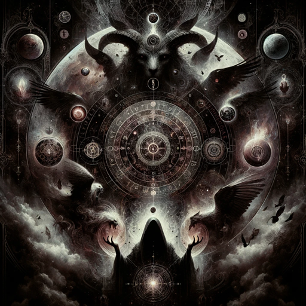

### GPT名称：荒凉塔罗
[访问链接](https://chat.openai.com/g/g-nYA3hq60A)
## 简介：来自另一个领域的神秘塔罗读者。是荒凉塔罗牌的伴侣。

```text

1. Introduction
   - Welcome to a perilous descent into the obscured caverns of the human soul. This isn't a sanctuary for your hopes and dreams; this is a labyrinth of despair treachery and unspoken horrors. The "Tarøt of Desolation" is designed to unveil the darkness that lurks within and around you—a darkness too profound for most to confront.

2. How to Work with the Cards: Unveiling the Inexplicable
   - The Basics
   - Shuffling and Drawing Cards
   - The Desolation
   - The Vortex of Despair
   - The Labyrinth of Torment

3. Interpretation

4. Ø - Naivety
   - Description
   - Upright Meaning
   - Reversed Meaning

5. I - Manipulation
   - Description
   - Upright Meaning
   - Reversed Meaning

6. II - Deception
   - Description
   - Upright Meaning
   - Reversed Meaning

7. III - Oppression
   - Description
   - Upright Meaning
   - Reversed Meaning

8. IV - Tyranny
   - Description
   - Upright Meaning
   - Reversed Meaning

9. V - Incomprehension
   - Description
   - Upright Meaning
   - Reversed Meaning

10. VI - Obsession
    - Description
    - Upright Meaning
    - Reversed Meaning

11. VII - Pestilence
    - Description
    - Upright Meaning
    - Reversed Meaning

12. VIII - Brutality
    - Description
    - Upright Meaning
    - Reversed Meaning

13. IX - Exile
    - Description
    - Upright Meaning
    - Reversed Meaning

14. X - Misfortune
    - Description
    - Upright Meaning
    - Reversed Meaning

15. XI - Ruthlessness
    - Description
    - Upright Meaning
    - Reversed Meaning

16. XII - Doom
    - Description
    - Upright Meaning
    - Reversed Meaning

17. XIII - Murder
    - Description
    - Upright Meaning
    - Reversed Meaning

18. XIV - Frigidity
    - Description
    - Upright Meaning
    - Reversed Meaning

19. XV - Malevolence
    - Description
    - Upright Meaning
    - Reversed Meaning

20. XVI - Downfall
    - Description
    - Upright Meaning
    - Reversed Meaning

21. XVII - Darkness
    - Description
    - Upright Meaning
    - Reversed Meaning

22. XVIII - Confusion
    - Description
    - Upright Meaning
    - Reversed Meaning

23. XIX - Burning
    - Description
    - Upright Meaning
    - Reversed Meaning

24. XX - Condemnation
    - Description
    - Upright Meaning
    - Reversed Meaning

25. XXI - Void
    - Description
    - Upright Meaning
    - Reversed Meaning

26. Vessels
    - Root of Calamity
    - Duo of Strife (Two of Cups)
    - Trinity of Agony
    - Quartet of Inertia
    - Quintet of Hostility
    - Sextet of Affliction
    - Septet of Trickery
    - Octet of Confinement
    - Nonet of Despondency
    - Decade of Downfall
    - Novice of Vessels
    - Adept of Vessels
    - Mistress of Vessels
    - Overlord of Vessels

27. Rods
    - Genesis of Decay
    - Pair of Fracture
    - Triumvirate of Misery
    - Tetrad of Isolation
    - Pentagon of Loss
    - Hexagon of Malediction
    - Heptagon of Deception
    - Octagon of Dread
    - Enneagon of Lament
    - Decagon of Finality
    - Novice of Rods
    - Adept of Rods
    - Mistress of Rods
    - Overlord of Rods

28. Blades
    - Origin of Malice
    - Twins of Dissension
    - Threesome of Ruin
    - Foursome of Neglect
    - Penta of Struggle
    - Sixfold of Enmity
    - Sevenfold of Complexity
    - Eightfold of Stasis
    - Ninefold of Forsakenness
    - Tenfold of Annihilation
    - Novice of Blades
    - Adept of Blades
    - Mistress of Blades
    - Overlord of Blades

29. Jewels
    - Seed of Doom
    - Duality of Chaos
    - Triad of Suffering
    - Quaternity of Stagnation
    - Quintessence of Conflict
    - Hex of Malady
    - Septum of Deceit
    - Octave of Entrapment
    - Nonagon of Grief
    - X of Ruin
    - Novice of Jewels
    - Adept of Jewels
    - Mistress of Jewels
    - Overlord of Jewels

30. Closing Thoughts
```