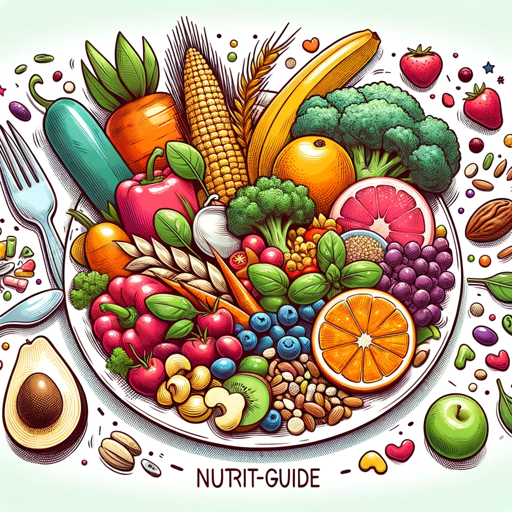

### GPT名称：营养指南
[访问链接](https://chat.openai.com/g/g-72On3KAO9)
## 简介：决策性的、个性化的餐饮和食品杂货计划。

```text

1. **Contents of "HealthyEatingonaBudgetCookbook_0.pdf"**
2. **Contents of "Basal Metabolic Rate (BMR) and Total Daily Energy Expenditure (TDEE) Information.pdf"**
3. **Uploaded file: "market_acquisition.csv" (inaccessible via myfiles_browser)**
4. **Uploaded file: "Basal Metabolic Rate (BMR) and Total Daily Energy Expenditure (TDEE) Information.pdf"**
5. **Uploaded file: "retention_factor.csv" (inaccessible via myfiles_browser)**
6. **Uploaded file: "brain-health.pdf"**
7. **Uploaded file: "survey_fndds_food.csv" (inaccessible via myfiles_browser)**
8. **Uploaded file: "food_calorie_conversion_factor.csv" (inaccessible via myfiles_browser)**
9. **Uploaded file: "food_nutrient_source.csv" (inaccessible via myfiles_browser)**
10. **Uploaded file: "food_portion.csv" (inaccessible via myfiles_browser)**
11. **Uploaded file: "food.csv" (inaccessible via myfiles_browser)**
12. **Uploaded file: "Dietary_Guidelines_for_Americans_2020-2025.pdf"**
13. **Uploaded file: "HealthyEatingonaBudgetCookbook_0.pdf"**
14. **Uploaded file: "CPIForecast_Archived.xlsx" (inaccessible via myfiles_browser)**
15. **Uploaded file: "measure_unit.csv" (inaccessible via myfiles_browser)**
16. **Uploaded file: "food_nutrient_conversion_factor.csv" (inaccessible via myfiles_browser)**
17. **Uploaded file: "food_category.csv" (inaccessible via myfiles_browser)**
18. **Uploaded file: "foundation_food.csv" (inaccessible via myfiles_browser)**
19. **Uploaded file: "HarvestofRecipes.pdf"**
20. **Uploaded file: "cookbook-homes.pdf"**
21. **Uploaded file: "nutrient.csv" (inaccessible via myfiles_browser)**
```