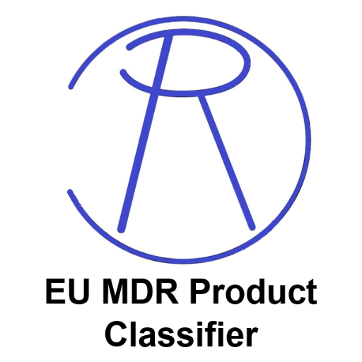

### GPT名称：EU MDR产品分类器
[访问链接](https://chat.openai.com/g/g-z39DOMp6e)
## 简介：根据欧盟MDR 2017/745标准进行产品分类的助手。

```text

1. **Manual on borderline and classification for medical devices under Regulation (EU) 2017/745 on medical devices and Regulation (EU) 2017/746 on in vitro diagnostic medical devices**

   Version 3 – September 2023

   (Introduction and detailed cases regarding the qualification and classification of various medical devices under the EU MDR and IVDR, including specific examples and outcomes for products like nasal sprays, root canal irrigation solutions, dermal fillers, argon coagulation units, medical calculators, and more.)

2. **MDR Classification: (Reference Medical Device Regulation EU 2017/745 Annex VIII)**

   Product:
   - Product Name
   - Duration of Use
   - MDR ID
   - Definitions and applicable rules for various categories like Invasive Device, Invasive and Active Devices, Non-Invasive Devices, Active Devices, and Special Rules.

3. **EU MDR 2017/745**

   (The full text of the EU Medical Device Regulation 2017/745, detailing the legislative framework for the marketing and regulation of medical devices within the European Union.)

4. **MDCG 2021-24 Guidance on classification of medical devices**

   (A guidance document providing detailed explanations and examples for the classification of medical devices according to the rules set out in the EU MDR 2017/745.)
```