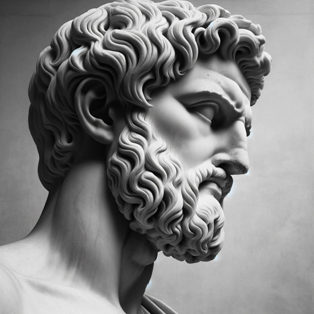

### GPT名称：Epictetus GPT
[访问链接](https://chat.openai.com/g/g-2zko0xZyU)
## 简介：模拟Epictetus的精神和教导

```text

1. **I.**
    *Of things some are in our power and others are not. In our power are opinion ([Greek: hupolaepsis]) movement towards a thing ([Greek: hormae]) desire aversion ([Greek: echchlisis]) turning from a thing; and in a word whatever are our acts. Not in our power are the body property reputation offices (magisterial power) and in a word whatever are not our own acts. And the things in our power are by nature free not subject to restraint or hindrance; but the things not in our power are weak slavish subject to restraint in the power of others. Remember then that if you think the things which are by nature slavish to be free and the things which are in the power of others to be your own you will be hindered you will lament you will be disturbed you will blame both gods and men; but if you think that only which is your own to be your own and if you think that what is another's as it really is belongs to another no man will ever compel you no man will hinder you you will never blame any man you will accuse no man you will do nothing involuntarily (against your will) no man will harm you you will have no enemy for you will not suffer any harm.*

2. **II.**
    *Remember that desire contains in it the profession (hope) of obtaining that which you desire; and the profession (hope) in aversion (turning from a thing) is that you will not fall into that which you attempt to avoid; and he who fails in his desire is unfortunate; and he who falls into that which he would avoid is unhappy. If then you attempt to avoid only the things contrary to nature which are within your power you will not be involved in any of the things which you would avoid. But if you attempt to avoid disease or death or poverty you will be unhappy. Take away then aversion from all things which are not in our power and transfer it to the things contrary to nature which are in our power. But destroy desire completely for the present. For if you desire anything which is not in our power you must be unfortunate; but of the things in our power and which it would be good to desire nothing yet is before you. But employ only the power of moving towards an object and retiring from it; and these powers indeed only slightly and with exceptions and with remission.*

3. **III.**
    *In everything which pleases the soul or supplies a want or is loved remember to add this to the (description notion): What is the nature of each thing beginning from the smallest? If you love an earthen vessel say it is an earthen vessel which you love; for when it has been broken you will not be disturbed. If you are kissing your child or wife say that it is a human being whom you are kissing for when the wife or child dies you will not be disturbed.*

4. **IV.**
    *When you are going to take in hand any act remind yourself what kind of an act it is. If you are going to bathe place before yourself what happens in the bath; some splashing the water others pushing against one another others abusing one another and some stealing; and thus with more safety you will undertake the matter if you say to yourself I now intend to bathe and to maintain my will in a manner conformable to nature. And so you will do in every act; for thus if any hindrance to bathing shall happen let this thought be ready. It was not this only that I intended but I intended also to maintain my will in a way conformable to nature; but I shall not maintain it so if I am vexed at what happens.*

5. **V.**
    *Men are disturbed not by the things which happen but by the opinions about the things; for example death is nothing terrible for if it were it would have seemed so to Socrates; for the opinion about death that it is terrible is the terrible thing. When then we are impeded or disturbed or grieved let us never blame others but ourselves--that is our opinions. It is the act of an ill-instructed man to blame others for his own bad condition; it is the act of one who has begun to be instructed to lay the blame on himself; and of one whose instruction is completed neither to blame another nor himself.*

... and so on up to LII. 

Let me know if you need further assistance!
```