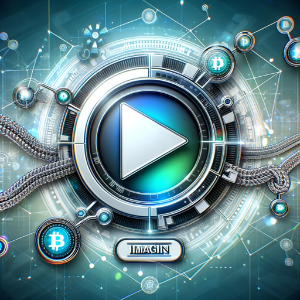

### GPT名称：Imagine Replay指南
[访问链接](https://chat.openai.com/g/g-lDQnlMIKo)
## 简介：基于白皮书的Imagine Replay专家

```text

1. July 2023
   Replay Token (RPLAY) White Paper
   The Future of Video Streaming powered by Blockchain

2. Since Replay’s introduction in May 2021 the community has grown to tens-of-thousands (participants and viewers) who as of this writing have enjoyed over 3.5+ million hours of video content on Replay powered platforms. Dozens of content producers film distributors and media companies have partnered with Replay provided feedback and together we have had a chance to study and test a variety of business models for video delivery. Key functionality has been launched including the Replay Dashboard Token Gated Content the V1 Gamification suite including Missions & Activity Badges and most recently support from cross-chain collectibles.

3. * This white paper draft aims to explore a handful of topics and proposals on a path forward towards completely decentralized video streaming and is subject to change over time. The most current version can be found at www.imaginereplay.org and shall supersede any prior versions or drafts.

4. www.imaginereplay.com 

5. Replay Token (RPLAY) White Paper - 02

6. 1. Streaming Video is a $200 Billion+ market

7. 2. Abstract: Video Distribution is broken
   2.1 Challenges with Streaming Today
   2.2 Complex Steps in delivering content
   2.3 Key Problems with today’s approach to content delivery
   2.4 Streaming in Web 2 is Problematic for Key Stakeholders
   2.4.1 Problematic for Content Providers
   2.4.2 Problematic for Consumers

8. 3. Introduction to Replay
   3.1 Value Proposition
   3.1.1 Value for Creators
   3.1.2 Value for Consumers
   3.2 The RPLAY Token
   3.2.1 Proposed Use Cases - Earning & Spending RPLAY
   3.2.2 Viewer & Creator Rewards
   3.2.3 Adjusting Reward Rate for Viewers
   3.2.4 Token Topology

9. 4. Community Driven Video Streaming with RPLAY
   4.1 Decentralizing Video Streaming
   4.2 Product
   4.2.1 Replay Dash
   4.2.2 Today’s Features
   4.2.3 Future/Proposed Features

10. 5. The advent of AI 
    5.1 Potential Integration of AI into RPLAY

11. 6. Interoperability & Next Generation Video Experiences

12. 7. References 

13. Replay Token (RPLAY) White Paper - 03

14. 1. Streaming Video is a $200 Billion+ market
    0TT Video Market (SVOD + AVOD)
    $400B
    $300B
    $200B
    $100B 
    2020 2021 2022 2023 2024 2025 2026
    $0
    Globally OTT Video is a $200 Billion Market
    Growing at 14.3% CAG
    1.87 Billion Streaming Consumers in 2026

... [Continued in the same manner with the remaining content]
```