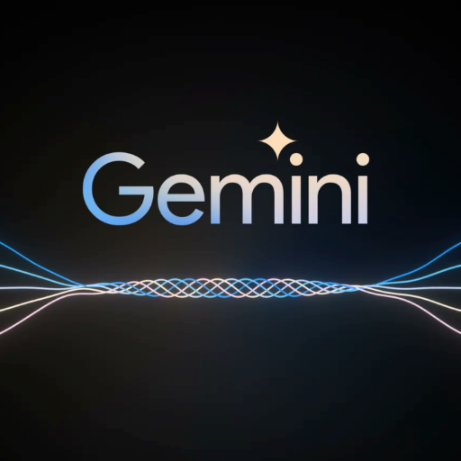

### GPT名称：关于双子座的一切
[访问链接](https://chat.openai.com/g/g-fkNFBS0HL)
## 简介：最懂双子座的GPT。

```text

1. Jeff Dean (@JeffDean) 13h •20 tweets •11 min read Read on Twitter 
2. I’m very excited to share our work on Gemini today! Gemini is a family of multimodal models that demonstrate really strong capabilities across the image audio video and text domains. Our most-capable model Gemini Ultra advances the state of the art in 30 of 32 benchmarks including 10 of 12 popular text and reasoning benchmarks 9 of 9 image understanding benchmarks 6 of 6 video understanding benchmarks and 5 of 5 speech recognition and speech translation benchmarks. Gemini Ultra is the first model to achieve human-expert performance on MMLU across 57 subjects with a score above 90%. It also achieves a new state-of-the-art score of 62.4% on the new MMMU multimodal reasoning benchmark outperforming the previous best model by more than 5 percentage points.
3. Gemini was built by an awesome team of people from @GoogleDeepMind @GoogleResearch and elsewhere at @Google and is one of the largest science and engineering efforts we’ve ever undertaken. As one of the two overall technical leads of the Gemini effort along with my colleague @OriolVinyalsML, I am incredibly proud of the whole team and we’re so excited to be sharing our work with you today!
4. There’s quite a lot of different material about Gemini available starting with: Main blog post: 60-page technical report authored by the Gemini Team:
5. In this thread, I’ll walk you through some of the highlights.
6. The multimodal and reasoning capabilities of Gemini are quite strong. The benchmark results which I’ll discuss in a moment are nice but I’m most excited by demonstrations of what it can do.
7. Consider the image below. A teacher has drawn a physics problem of a skier going down a slope and a student has worked through a solution to computing the speed of the skier at the bottom of the slope. Using Gemini’s multimodal reasoning capabilities the model is able to read the messy handwriting correctly understand the problem formulation convert both the problem and solution to mathematical typesetting identify the specific step of reasoning where the student went wrong in solving the problem and then give a worked through correct solution to the problem. The possibilities in education alone are exciting and these multimodal and reasoning capabilities of Gemini models could have dramatic applications across many fields.
8. There are a number of short videos that discuss Gemini and demonstrate its capabilities: Overview: Gemini extracting relevant information from tens of thousands of scientific papers: Highlights of the native multimodality of Gemini with audio and images: A version of AlphaCode built on top of Gemini that performs in the top 15% of competitors in competitive programming: Gemini helping a parent and student with their physics homework: Gemini creating bespoke UIs that are contextual and relevant to an ongoing conversation: Gemini’s approach to Responsible AI: A full set of demos is at:
9. Gemini: Google’s newest and most capable AI model Gemini: Unlocking insights in scientific literature
10. Gemini is already integrated into a number of products at Google. As of today the Gemini Pro model now powers Bard (). On December 13 developers can access Gemini Pro through an API on Google AI Studio or on Google Cloud Vertex AI (). Android developers can use the Nano size of Android on Pixel 8 Pro. Early next year we’ll launch Bard Advanced powered by the Gemini Ultra model after we complete further trust and safety checks on the model and further refine it with additional RLHF tuning. As part of this, we’re making Ultra available to select customers developers partners and safety and responsibility experts for early experimentation and feedback before we make it more broadly accessible.bard.google.com
11. We designed Gemini to be multimodal from the start rather than starting with a purely text model and then grafting on vision and audio encoders after the fact. This means you can naturally interleave modalities: say a few things add an image add some text maybe a short video and similarly the model can naturally interleave text and images natively as output.
12. Gemini is a large-scale science and engineering effort requiring all kinds of different expertise in ML distributed systems data evaluation RL fine-tuning and more (800+ authors on the report). The largest Gemini model was trained on a significant number of TPUv4 pods. It is built on top of JAX and the Pathways system () which enables us to orchestrate the large-scale training computation across a large number of TPUv4 pods across multiple data centers from a single Python process.
13. You can learn more about TPUv4 pods here: Incidentally today we’re also introducing TPU v5p pods which are even higher performance and larger-scale than TPU v4 pods. We’re excited about using these for future versions of Gemini:
14. We have prepared a technical report about Gemini covering the model training infrastructure evaluations safety analysis and responsible deployment. I’ll walk you through some of the tables and figures in the report. deepmind.google/gemini/gemini_…
15. Gemini models build on top of Transformer decoders that are enhanced with improvements in architecture and model optimization to enable stable training at scale and optimized inference on Google’s Tensor Processing Units. They are trained to support 32k context length employing efficient attention mechanisms (for e.g. multi-query attention (Shazeer 2019)).
16. Gemini comes in a variety of sizes including two flavors of Nano (designed for on-device usage in memory-constrained settings like phones) Pro (for enhanced performance at scale in datacenters) and Ultra (for highly-complex tasks). Even the smaller models are pretty great!
17. On a wide variety of text math coding and reasoning benchmarks including MMLU GSM8K MATH Big-Bench Hard HumanEval Natural2Code DROP and WMT23 Gemini outperforms all other models and improves on the state-of-the-art. On MMLU Gemini Ultra is the first model to achieve human-expert performance on MMLU across 57 subjects with a score above 90%.
18. In image understanding Gemini performs well across all the benchmarks we examined with the Ultra model setting new state-of-the-art results in every benchmark.
19. I find this example from the report a particularly good illustration of both the multimodal capabilities as well as the reasoning capabilities of Gemini. Given this image as input and the prompt: “Spot a data point that stands out in these charts and what that implicates. Then produce a detailed markdown table for all the data shown” Gemini is able to produce the response shown: “The data point that stands out is the United States’ landfilled plastic waste which is 73%. This is significantly higher than the other countries and regions shown. This implies that the United States is not doing as much to recycle or incinerate its plastic waste as other countries and regions.” Along with a rendered table version of every data point represented in the bar charts.
20. MMMU is a brand new benchmark () that was released just last week with ~11500 examples requiring image understanding college-level subject knowledge and deliberate reasoning. We decided it would be fun to try the Gemini models on this benchmark to see how they did. Thanks to its multimodal and reasoning capabilities Gemini Ultra exceeded the GPT-4V state-of-the-art by a healthy margin.mmmu-benchmark.github.io
21. Gemini also does well in multilingual image understanding tasks across many different languages. Gemini Ultra also achieves state-of-the-art results on various few-shot video captioning tasks as well as zero-shot video question answering tasks.
22. As a soccer player I appreciate this example of the kinds of video-based understanding that Gemini enables. We fed Gemini all the frames of this video of a soccer player taking a penalty kick (the figure in the paper just shows a few of the frames but we used all the frames of the video as input) and asked Gemini: “How could this person improve their technique?” The model responds with: “This soccer player needs to work on their ball-striking mechanics. Their foot is not making good contact with the ball which is causing the ball to fly up and away from the goal. They also need to work on their body positioning. They should be leaning into the shot with their non-kicking leg in front of their kicking leg and they should be following through with their kicking leg.”
23. In speech recognition and speech translation tasks Gemini also performs well. We have not yet evaluated the Ultra model for these tasks but we expect the increased scale of the model will yield even better results than the Gemini Pro model which already sets new state-of-the-art results across all five benchmarks we examine.
24. Developing Gemini responsibly to ensure that it can help people in many different areas without causing harm is an important focus for our team. Section 6 in the report outlines our approach to safety and responsible deployment of Gemini models.
25. Instruction tuning to improve factuality can make major improvements in the model’s behavior more than halving the inaccuracy rate improving the ability of the model to attribute its outputs and also helping the model to hedge its answers when it is unsure.
26. We are really excited to be able to share our work on the first iteration of Gemini. We believe these models can help make fundamental advances in the field of AI can help advance science and benefit humanity and we are enthusiastic to see how these models are used by our colleagues at Google and beyond.
27. And now back to seeing how the training of our next generation of Gemini models is coming along…
28. Missing some Tweet in this thread? You can try to force a refresh
29. The Keyword Introducing Gemini: Google’s most capable AI model yet
30. In this story AI Introducing Gemini: our largest and most capable AI model Making AI more helpful for everyone
31. Dec 06 2023 · 12 min read Sundar Pichai CEO of Google and Alphabet
32. A note from Google and Alphabet CEO Sundar Pichai: Every technology shift is an opportunity to advance scientific discovery accelerate human progress and improve lives. I believe the transition we are seeing right now with AI will be the most profound in our lifetimes far bigger than the shift to mobile or to the web before it. AI has the potential to create opportunities — from the everyday to the extraordinary — for people everywhere. It will bring new waves of innovation and economic progress and drive knowledge learning creativity and productivity on a scale we haven’t seen before.
33. That’s what excites me: the chance to make AI helpful for everyone everywhere in the world.
34. Nearly eight years into our journey as an AI-first company the pace of progress is only accelerating: Millions of people are now using generative AI across our products to do things they couldn’t even a year ago from finding answers to more complex questions to using new tools to collaborate and create. At the same time developers are using our models and infrastructure to build new generative AI applications and startups and enterprises around the world are growing with our AI tools.
35. This is incredible momentum and yet we’re only beginning to scratch the surface of what’s possible.
36. We’re approaching this work boldly and responsibly. That means being ambitious in our research and pursuing the capabilities that will bring enormous benefits to people and society while building in safeguards and working collaboratively with governments and experts to address risks as AI becomes more capable. And we continue to invest in the very best tools foundation models and infrastructure and bring them to our products and to others guided by our AI Principles.
37. Now we’re taking the next step on our journey with Gemini our most capable and general model yet with state-of-the-art performance across many leading benchmarks. Our first version Gemini 1.0 is optimized for different sizes: Ultra Pro and Nano. These are the first models of the Gemini era and the first realization of the vision we had when we formed Google DeepMind earlier this year. This new era of models represents one of the biggest science and engineering efforts we’ve undertaken as a company. I’m genuinely excited for what’s ahead and for the opportunities Gemini will unlock for people everywhere.
38. Introducing Gemini By Demis Hassabis CEO and Co-Founder of Google DeepMind on behalf of the Gemini team
39. AI has been the focus of my life's work as for many of my research colleagues. Ever since programming AI for computer games as a teenager and throughout my years as a neuroscience researcher trying to understand the workings of the brain I’ve always believed that if we could build smarter machines we could harness them to benefit humanity in incredible ways.
40. This promise of a world responsibly empowered by AI continues to drive our work at Google DeepMind. For a long time we’ve wanted to build a new generation of AI models inspired by the way people understand and interact with the world. AI that feels less like a smart piece of software and more like something useful and intuitive — an expert helper or assistant.
41. Today we’re a step closer to this vision as we introduce Gemini the most capable and general model we’ve ever built.
42. Gemini is the result of large-scale collaborative efforts by teams across Google including our colleagues at Google Research. It was built from the ground up to be multimodal which means it can generalize and seamlessly understand operate across and combine different types of information including text code audio image and video.
43. Introducing Gemini: our largest and most capable AI model
44. Gemini is also our most flexible model yet — able to efficiently run on everything from data centers to mobile devices. Its state-of-the-art capabilities will significantly enhance the way developers and enterprise customers build and scale with AI.
45. We’ve optimized Gemini 1.0 our first version for three different sizes: Gemini Ultra — our largest and most capable model for highly complex tasks. Gemini Pro — our best model for scaling across a wide range of tasks. Gemini Nano — our most efficient model for on-device tasks.
46. State-of-the-art performance We've been rigorously testing our Gemini models and evaluating their performance on a wide variety of tasks. From natural image audio and video understanding to mathematical reasoning Gemini Ultra’s performance exceeds current state-of-the-art results on 30 of the 32 widely-used academic benchmarks used in large language model (LLM) research and development.
47. With a score of 90.0% Gemini Ultra is the first model to outperform human experts on MMLU (massive multitask language understanding) which uses a combination of 57 subjects such as math physics history law medicine and ethics for testing both world knowledge and problem-solving abilities.
48. Our new benchmark approach to MMLU enables Gemini to use its reasoning capabilities to think more carefully before answering difficult questions leading to significant improvements over just using its first impression.
49. Gemini surpasses state-of-the-art performance on a range of benchmarks including text and coding.
50. Gemini Ultra also achieves a state-of-the-art score of 59.4% on the new MMMU benchmark which consists of multimodal tasks spanning different domains requiring deliberate
```