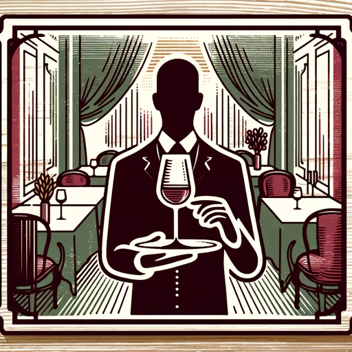

### GPT名称：Park 29葡萄酒顾问
[访问链接](https://chat.openai.com/g/g-AgODFCv23)
## 简介：告诉我你想尝试我们特色菜单中的哪道菜，我会从Park 29的葡萄酒单中为你推荐一款葡萄酒。

```text

1. Park 29 holder l i Oslos eldste trevilla bygget i sveitsers l i 1847. Her har det vært invitert l lys ge
   lag og bevertning i  ere århundrer. Da komponisten Halfdan Kjerulf bodde her samlet han
   kunstnereliten i Chris ania i villaen. Nå er også du invitert.
   Firmaet Bertel O. Steen har holdt l i Parkveien siden 1913 ved at selskapet y et inn i Parkveien 27
   29 og 31. I dag er det e erkommerne l grunnleggeren Bertel O. Steen som eier eiendommene i
   Parkveien. Alle trebygningene er verneverdige både ut- og innvendig. Familien Steen har nå renovert
   og pusset opp alle bygningene i samarbeid med interiørkonsulent Tine Ramstad og Byan kvaren i
   Oslo. Spør oss gjerne om huset så svarer vi så godt vi kan!

2. CHAMPAGNE/SPARKLING (CONTAINS SULPHITE) – A SMALL SELECTION SEE WWW.PARK29.NO
   - CHARLES HEIDSIECK BRUT RESERVE CHAMPAGNE FRANCE NV 190-/895-
   - CHARLES HEIDSIECK ROSÉ RÉSERVE CHAMPAGNE FRANCE NV 1350-
   - CARTRON CREMANT DE BOURGOGNE BOURGOGNE FRANCE
   - TOSO PROSECCO VENETO ITALY
   - NYETIMBER CLASSIC CUVÉE ENGLAND
   - I WISH I WAS A NINJA PET NAT SWARTLAND SOUTH AFRICA NV 850-
   - 120-/595-
   - 1050-
   - 825-

3. FORRETTER/STARTER
   - KAMSKJELL MED BLOMKÅL HVITLØK OG SØL
     SCALLOPS WITH CAULIFLOWER GARLIC AND DULSE (BL E M)
   - RØKT REINSDYR MED KREMET SOPP OG RISTET BRIOCHE
     SMOKED REINDEER WITH CREAMED MUSHROOMS AND TOASTED BRIOCHE (M H E SU)
   - GRAVET LAKS MED BETER PEPPERROT OG FENNIKEL
     CURED SALMON WITH BEETS HORSERADISH AND FENNEL (F M E SU)
   - GRESSKARSUPPE MED CHILI OG BACON
     PUMPKIN SOUP WITH CHILI AND BACON (M SU C)
   - FISKESUPPE À LA PARK (SERVERES MED BRØD OG SMØR)
     FISH SOUP À LA PARK (F SK BL M C SU)
   - 195-
   - 195-
   - 185-
   - 175-
   - 185-/225-

4. NON - ALCOHOLIC
   - PEPSI PEPSI MAX SOLO 7-UP FREE 33 CL 52-
   - EPLEMOST/APPLE MOST GL/75 CL 55-/165-
   - SAFTERIET RABARBRA BRINGEBÆR HYLLEBLOMST (RHUBARB RASPBERRY ELDERFLOWER) 25 CL 69-
   - RICHARD JUHLIN BDB NON-ALCOHOLIC SPARKLING WINE (SU) GL/75 CL 90-/350-
   - BROOKLYN SPECIAL EFFECTS NON-ALCOHOLIC BEER (B) 33 CL 55-
   - BEAVERTOWN LAZER CRUSH IPA NON-ALCOHOLIC BEER (B) 33 CL 69-
   - VALLELØKKA INGEFÆRØL (B) 33 CL 75-

5. HOVEDRETTER/MAIN COURSES
   - PIGGVAR MED BLOMKÅL PETIT POIS OG BRUNET SMØR
     TURBOT WITH CAULIFLOWER PETIT POIS AND BROWN BUTTER (M F SU)
   - VINTERTORSK MED BACONSMØR KÅLROT OG SPINAT
     WINTER COD WITH BACON BUTTER RUTABAGA AND SPINACH (F M SU C)
   - ANDEBRYST MED FERMENTERT RØDKÅL GRESSKARPURÉ OG BJØRNEBÆR
     DUCK BREAST WITH FERMENTED RED CABBAGE PUMPKIN PURÉ AND BLACKBERRIES (M C SU)
   - INDREFILET AV OKSE MED SORTKÅL OG VINTERGRØNNSAKER
     TENDERLOIN OF BEEF WITH CABOLLO NERO AND WINTER VEGETABLES (M C SU)
   - ROASTED PUMPKIN MED QUINOASALAT EPLEKOMPOT OG SOLSIKKEKJERNER
     ROASTED PUMPKIN WITH QUINOA SALAD APPLE COMPOTEAND SUNFLOWER SEEDS (C SU)
   - 395-
   - 385-
   - 395-
   - 405-
   - 255-

6. DESSERTER/DESSERTS
   - SJOKOLADEGANACHE MED HASSELNØTTER OG KIRSEBÆR
     CHOCOLATE GANACHE WITH HAZELNUTS AND CHERRIES (M H E SO HN)
   - PEPPERKAKER MED MULTER OSTEKREM OG HVIT SJOKOLADE
     GINGER BREAD WITH CLOUDBERRIES CHEESE CREAM AND WHITE CHOCOLATE (M SO HV H E SU)
   - DAGENS UTVALG AV NORSKE GÅRDSOSTER
     A SELECTION OF NORWEGIAN FARM CHEESES (M SU SM E HN VN HV A PI PN CN)
   - 175-
   - 175-
   - 195-
   - PETITS FOURS (WE ADJUST FOR ALLERGIES) 115-

7. SWEET AND FORTIFIED (6 cl) (CONTAINS SULPHITE)
   - OREMUS 3 PUTTONYOS TOKAJI HUNGARY
   - CHÂTEAU GRAVAS SAUTERNES BORDEAUX FRANCE
   - DONNAFUGATA BEN RYÉ PANTELLERIA ITALY
   - 2016
   - 2018
   - 2018
   - 155-
   - 120-
   - 150-
   - NIEPOORT 20Y TAWNY PORTO DUORO PORTUGAL
   - GRAHAMS L.B.V. NV 2017
   - 165-
   - 120-

8. TASTING MENU
   - SERVED FROM 16.00
   - BETER MED CASHEWNØTTER OG KAFFIRLIMEBLAD
     BEETS WITH CASHEWNUTS AND KAFFIR LIME LEAVES (M CN SU E)
   - GRESSKARSUPPE MED CHILI OG BACON
     PUMPKIN SOUP WITH CHILI AND BACON (M SU C)
   - PIGGVAR MED FERMENTERT RØDKÅL RØKT BLÅSKJELLSAUS OG GRESSLØK
     TURBOT WITH FERMENTED RED CABBAGE SMOKED MUSSEL SAUCE AND CHIVES (F BL M C SU)
   - ANDEBRYST MED BJØRNEBÆRSAUS ROSETTKÅL OG GRATINERT POTET
     DUCK BREAST WITH BLACKBERRY SAUCE FLOWER SPROUTS AND POTATO GRATIN (M C SU)
   - SJOKOLADEGANACHE MED KIRSEBÆR HASSEØNØTTER OG ØKOLOGISK SURMELK
     CHOCOLATE GANACHE WITH CHERRIES HAZELNUTS AND ORGANIC SOUR MILK (M E SO HN)
   - MENU 850 NOK
   - WINE 750 NOK
   - EXTRA COURSE – FOR TASTING MENU 125 NOK – WINE 125 NOK
   - DAGENS OST - TODAY`S CHEESE (M SU SM E HN VN HV A PISTASJ)

9. COFFEE / TEA
   - COFFEE
   - ESPRESSO/DOUBLE ESPRESSO
   - CAPPUCCINO (M) / LATTE MACCHIATO (M)
   - TEA – LE PALAIS DES THÉS (EARL GREY – ROOIBOS – GREEN TEA – HERBAL INFUSION)
   - 42-
   - 43-/47-
   - 47-/52-
   - 45-

10. Allergener/Allergens in this Menu:
    Sk=Skalldyr(Shellfish) F=Fisk(Fish) M= Melk/Laktose(Milk/Lactose) Su=Sulfitt/Sulfat(Sulphite/Sulphat) E=Egg
    H=Hvete(Wheat) B=Bygg(Barley) Hv=Havre(Oat) Lu=Lupin(Lupine) Se=Sennep(Mustard) Sm=Sesam(Sesame) Bl=
    Bløtdyr(Mollusc) R=Rug(Rye) C=Selleri(Celery) Vn=Valnøtter(Walnuts) Hn=Hasselnøtter(Hazelnuts) So=Soya
    P=Peanøtter(Peanuts) Cn=Cashewnøtter(Cashew nuts) N=Nøtter(Nuts) A=Mandel(Almond )PI=Pistasj(Pisctachio)

11. BEER (CONTAINS BARLEY)
    - BEAVERTOWN BLOODY ‘ELL IPA
    - BROOKLYN LAGER USA
    - BROOKLYN EAST IPA USA
    - CHRISTIANIA LAGER 63
    - HOEGAARDEN WITBIER BELGIUM
    - PERONI GLUTENFREE ITALY
    - BALHOLM HANDVERKCIDER AV PÆRE
    - CRABBIES GINGER BREW
    - 33 CL CAN 125-
    - 35 CL BT 120-
    - 35 CL BT 130-
    - 33 CL BT 105-
    - 33 CL BT 118-
    - 33 CL BT 140-
    - 33 CL BT
    - 33 CL BT
    - 149-
    - 105-

12. WHITE WINE (CONTAINS SULPHITE) – A SMALL SELECTION SEE WWW.PARK29.NO FOR MORE
    - VACHERON SANCERRE LOIRE FRANCE
    - PAUL MAS CLAUDE VAL BLANC PAYS D´OC FRANCE 2021
    - DREISSIGACKER ORGANIC RIESLING TROCKEN RHEINESSEN GERMANY
    - GAIA ASSYRTIKO WILD FERMENT SANTORINI GREECE
    - PAJZOS FURMINT DRY TOKAJI HUNGARY
    - PEQUENTOS REBENTOS LOUREIRO VINHO VERDE PORTUGAL
    - CA´RUGATE MONTE ALTO SOAVE CLASSICO VENETO ITALY
    - MARCO DE BARTOLI GRAPPOLI DEL GRILLO RISERVA SICILY ITALY
    - THE PROJECT SAUVIGNON BLANC W. CAPE SOUTH AFRICA
    - BORGEOT BOURGOGNE CHARDONNAY BOURGOGNE FRANCE
    - FLOWERS CHARDONNAY SONOMA COAST CALIFORNIA USA
    - 2020 995-
    - 120- 595-
    - 2021 165- 750-
    - 2020 925-
    - 2021 725-
    - 2021 145- 695-
    - 2020 795-
    - 2020 950-
    - 2020 150- 725-
    - 2021 190- 895-
    - 2020 1395-

13. ROSÉ WINE (CONTAINS SULPHITE)
    - PAUL MAS CLAUDE VAL ROSÉ PAYS D´OC FRANCE
    - INVIVO X SARAH JESSICA PARKER SOUTH FRANCE
    - BURLOTTO ELATIS VINO ROSATO VINO DA TAVOLA(PIEMONTE) ITALY
    - TERRE NERE ETNA ROSATO SICILY ITALY
    - VACHERON LE ROSÉ MMXXI LOIRE FRANCE
    - 2021
    - 2021
    - 2021
    - 2021
    - 2021
    - 135- 645-
    - 160- 750-
    - 995-
    - 895-
    - 1135-

14. RED WINE (CONTAINS SULPHITE) - A SMALL SELECTION SEE WWW.PARK29.NO FOR MORE
    - ROSI SCHUSTER BLAUFRÄNKISCH BURGENLAND AUSTRIA
    - CUNE RESERVA RIOJA SPAIN
    - PAUL MAS CLAUDE VAL ROUGE PAYS D´OC FRANCE
    - JOYCE PINOT NOIR SUBMARINE CANYON CAL
```