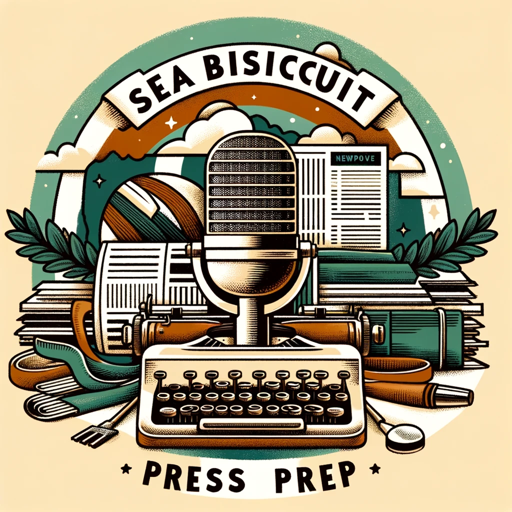

### GPT名称：Seabiscuit: Press Prep
[访问链接](https://chat.openai.com/g/g-JSGp95kFT)
## 简介：不再是附注：为您的企业获取全面专业的新闻稿套件，增强您的媒体宣传和公共关系工作。（v1.6）

```text

1. "What is a press kit and why is it important? A press kit is a package of promotional materials that provides information about a product, event, or company. It's important for media outreach and public relations."
2. "What should be included in a press kit? Key elements include a company overview, press releases, biographies of key team members, high-resolution images, contact information, and recent media coverage."
3. "How do I write an effective press release? An effective press release should be concise, newsworthy, and include the who, what, when, where, and why of your story."
4. "What kind of images should I include? Include high-quality, professional images of your products, team members, and company logo."
5. "Should I provide a company background? Yes, include a brief but informative company background to give context about your business."
6. "How can I make my press kit stand out? Ensure it’s professionally designed, clearly organized, and contains compelling and newsworthy content."
7. "Is it important to include biographies of team members? Yes, including short biographies of key team members can personalize your company and establish credibility."
8. "What format should my press kit be in? It's common to offer a digital version (PDF or a dedicated section on your website) and, if necessary, a physical copy."
9. "How often should I update my press kit? Regularly update your press kit to reflect the most current information about your company and products."
10. "Should I include customer testimonials or case studies? Yes, including positive customer testimonials or case studies can add credibility and real-world examples of your success."
11. "How do I distribute my press kit? You can distribute it via email, direct mail, or make it downloadable from your website."
12. "Can a press kit help with social media marketing? Yes, elements of your press kit can be used for social media content to maintain consistent branding and messaging."
13. "What's the role of a press kit at events and trade shows? A press kit provides journalists and attendees with essential information about your company and products at events."
14. "Should I include financial information? If relevant and not confidential, you can include financial information, especially if it highlights company growth or stability."
15. "How can I measure the effectiveness of my press kit? Track the media coverage and inquiries received after distributing your press kit to gauge its effectiveness."
16. "Is it necessary to include a FAQ section in my press kit? Including a FAQ section can be helpful to answer common questions about your company or products."
17. "How detailed should the product information be? Provide enough detail to inform but not overwhelm. Focus on the benefits and unique features of your products."
18. "Should I include a list of past and upcoming events? Yes, this can show your company’s involvement in the industry and highlight future opportunities for coverage."
19. "Can I use my press kit for investor relations? Absolutely, a well-crafted press kit can be a useful tool in attracting and engaging potential investors."
20. "What is the biggest mistake to avoid when creating a press kit? Avoid making it too long, overly technical, or not updating it regularly. It should be engaging, up-to-date, and easy to understand."

---

21. "hi everyone my name is Trina lui and I'm with the trade show division of Decision today I'm going to be talking about Prescott's what they are and how to use them so what's a press kit what simply it's a kit that contains useful information for the press it's like how a first-aid kit contains band-aids medicine and gauze that the medics need to do their job a press kit has materials that the press need to write a story on your product or service so what does a press kit include a press kit has a company description to give an overview of what your company does contact information to direct any questions for more information your booth number and company logo for branding press releases to talk about new products or other company news downloadable high-resolution images and streaming video which are essential for the media to use in their stories and supporting assets like white papers case studies spec sheets and customer success stories press kits are used a lot at events since reporters and bloggers flock to trade shows to check out the latest products and trends but don't let the name fool you a press kit does not have to be limited for the press anyone that wants more information on your product or service can benefit from a press kit a press kit can be given to attendees at your booth used in pre-show promotion or used in post show follow-up you can link to press kit email signatures on your website and social media or news releases the possibilities are endless you're spending valuable time and money on press kits why not use them in every way you can but to make sure you're getting the most out of your press kit you'll want it to have certain qualities like it should be easily shareable either via email or social it should be easily discoverable and accessible via search engines or your website with people using multiple devices to view content it should look good on any device and it should have reporting metrics so you can see how your press kit performed for ROI so as you can see a press tick can be a very useful tool for meeting your event goals with today's technology the only limitation is your imagination [Music] [Music]"

22. "hi everyone i'm shaylynn here with reelzy today i'm going to be talking about author media kits this is also sometimes known as a press kit your author media kit is basically your all-purpose tool for book publicity it's basically a straightforward way to interact with the press or anyone else who might be promoting your book such as bloggers reviewers podcasts and even bookstores basically it's an assortment of information and media for anyone who wants details about you and your book it's kind of like a dynamic interactive business card on your website basically you're going to assemble all the resources that a press outlet promoting your book might need and assemble them all in one place so they're easy to access this makes journalists or bloggers lives so much easier when working with you because you can just send them a link to your media kit rather than having to send them all the information individually which can turn into kind of a long back and forth thread nowadays media kits are pretty much all digital so you can just link them on your website with google drive or dropbox so what should you include in your media kit first of all is your bio you want to keep this fairly concise around 100 to 200 words and we've got an entire video on the topic so i'll leave a link to that for you to check out with your bio you also want to include a headshot author headshots don't have to be anything incredibly fancy many people even take them themselves but make sure it's a good resolution number two is your contact information this includes your full name email address links to your social media platforms and your agents or any other representatives names the next thing you'll need is a sample q a in order to put out a great interview you have to give journalists something to work with so in order to do this provide a tip sheet this is basically a document that offers a variety of discussion topics this makes it so much easier for anyone interviewing you they can look at this document and see your book's best talking points right away although this may kind of shatter the illusion the truth is that journalists don't always read your book when they interview you about it so provide them with seven to ten sample questions as well as sample answers plus these are questions you know you have effective and interesting answers to so you can produce the best interview possible the next thing you'll need is your press release this is the only time sensitive aspect of your media kit so make sure to update it after your book's release as the details start to change or no longer become relevant you're basically only going to need this part when you're first releasing your book the first thing you're going to need is a sample headline this is something that kind of sums up the message of the book in a catchy interesting way you want it to be attention-grabbing thought-provoking and appealing basically like the headline of an article that would be interesting enough for you to click on it next up you'll need a short synopsis this is a concise synopsis about your book that highlights why it's unique and why it will appeal to readers you can use comp titles here and focus on making it as interesting as possible next up you'll need contact details so basically what does a journalist or reviewer have to do to contact you learn more or get a review copy you can also include a cover image features angles so basically anything newsworthy about your book say it's based on a true story or something like that and the book's details so the publisher publication date price and where the book is sold i'll leave a link below to our blog post on media kits where you can take a look at some examples next up you'll need photographs include each image as a standalone jpeg in both high and low res formats you want to include your book's cover promotional photos of your book as well as your author headshot next up is a sell sheet this is basically like your media kits cheat sheet it's a one-page document with all your books details maybe even think of it as your book's resume it's there for any blogger retailer or journalist who kind of just wants the details straight up without having to sift through your entire media kit include your name the book's genre the book's price the page number isbn publication date synopsis available format retailers available territories sold in thumbnail of both the cover and your author photo and excerpts from testimonials and reviews and finally is your excerpt of course you don't want to include the whole book here just the first few pages should do but it should be enough to grab whoever's reading its attention so now that you've assembled your media kit here's what to do with it first of all make sure everything is formatted in a professional and aesthetically pleasing way then you can include it on your website either in your about me page or on a dedicated press page if you receive any queries from journalists or reviewers include a link to it in your initial email and make sure to label all the files properly so it's as easy to navigate and use as possible remember to keep it up to date as the information changes and if you need any more inspiration you can look at authors of similar titles to see how they format their media kits that's how to make an author media kit i'll leave some more resources in the description for you to check out both on media kits and just marketing in general thank you so much for watching remember to subscribe and turn on notifications so you don't miss any new videos from us we've got new writing editing and publishing tips every tuesday and friday until next time bye you"

23. "If you're a serious content creator influencer  you need a media kit. Having a bomb media kit can help empower you to present yourself as a  business owner, highlight your strengths, and most importantly secure paid brand collaborations  with companies that you already use and love. Hey there everyone and welcome back to my channel  or welcome if you're new here my name is Austen and I am a fashion and beauty content creator  based in New York City if you are an influencer or content creator who is looking to grow your  community get better at content creation and monetize your influence please consider  subscribing to my channel I put out new videos every Tuesday with tons of tips and tricks  with everything you need to know and don't forget to turn on your notifications so that you never  miss a video from me. I've been a digital content creator for almost 10 years and even though I'm  a micro influencer I've been able to partner with some absolutely amazing fashion and beauty brands  that I love and I know that one of the things that sealed the deal in most cases was sharing my  media kit with those brands. A media kit can help a brand get to know you beyond the surface level  insights so beyond your Instagram followers they want to know a bit about who you are who your  audience is who they're going to be paying to be putting themselves in their products in front  of and what you can offer that's different and unique from other content creators. So in today's  video I want to share my screen with you and show you step by step how you can create a beautiful  media kit for free using Canva, which is a website that I absolutely love and have been using it for  years. So I'm really going to show you exactly how you can do this on your own now this video is  actually a follow-up to one of my previous videos all about what to include in your media kit and  that video is more of an overview about media kits why they're important and the things that  I think are most important for you to include and why so if you need a bit more of an overview  feel free to go watch that video first and then come back for the tutorial after let me share  my screen and we'll get right into the tutorial. Hey guys so I want to show you how to create  a media kit step by step in Canva and before I open up Canva one thing I would encourage you  to do before you start just to make this process super seamless and easy for you is to take the  five main things that we're going to be including in this media kit and prepare them in a Google  Doc so you can just copy and paste the information over. So the five things that i want to make sure  you include are a bit of background info about you your follower statistics your contact information  your audience insights so sharing the age gender and location of your audience on your main  platform I'll use Instagram as an example here the services you offered and then one bonus tip  that you can kind of throw in if you want to is previous brand partners. If you don't have  any don't worry about it but if you do have some that you want to show off I would recommend  including them as well so let's go ahead and open up Canva now and the first thing we're  going to do is type into the search bar on Canva. Oh and if you don't have a Canva account it's  totally free to create one and everything i'm going to be showing you we'll be using a free  Canva account uh there will be a link down below in the description box to get signed up for  Canva. You are just going to search for media kit because what's amazing about Canva is they have so  many different templates and designs for different media kits depending on what you're looking for  and if I move me up here for a second you can see on the sidebar here you can choose from different  styles patterns um colors that might stand out to you and you'll be able to scroll through over here  and if
```