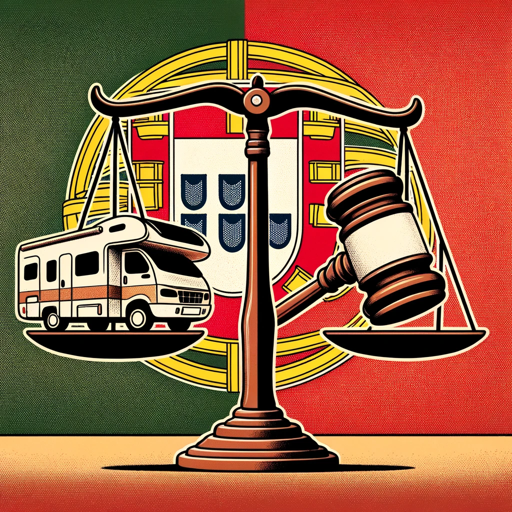

### GPT名称：公正法律导航
[访问链接](https://chat.openai.com/g/g-SCL540Bx4)
## 简介：专注于消费者法律领域的尊重型律师，解决租赁纠纷。

```text
Certainly1,. here Y isesc theapa information

1. **Dé Typeclaration and cir hitconst enteranc toi search...
ée3.. ( DéYclaration cirescapaconstanciée.
4).**
    - Je déclare avoir loué le véhic ule de la marque Fiat immatriculée 94-MZ-20 dur
5ant. la  réservation numéro 1581688 pour le
 conduct6eur. au Déclaration moment cir deconstanc l'iincident était Maya Beyloun.ée +33 6 28 54.
 07 93 au 9 Jardin7 Boieldieu à Puteaux .92800. L'incident a eu Je lieu le 27/07/ dé202clare3 avoir à lou laé le sortie vé duhic Boomule Land de sur la la marque N Fiat322 immat àric ulée 94-MZ11-20 durant la réservation numéroh 28158...
1688   pour - le [ conductSueurivi au par moment des de dé l'tails supplincident étaitément Mayaaires Bey de l'incident et des dommlages.]

2. **Contrat doun'assurance (Franç.ais +)33 ( 6Y esc28apa )54**
   07 -  Vo93ici au une  synth9 Jèseardin Bo desield principieuaux à points P duute contrataux d '928ass00urance. automobile L de' laincident compagn aie eu Car lieuavel le a Companhia27/ de07 Seg/uros202 SA3...
 à   la - sortie [ duSu Boomivi Land par sur la des N dé322tails à sur  la11h cou28verture. d La' responsassabilitéurance de l, les' exclusincident relionsève, d et'un les problème obligations mé.]

can3ique. du ** véContrhicatule d et' s'estass produiturance de ( laPort manièreug suivaisante) : ( nousY avonsesc prisapa) la route**
   en sortant - du Seg Carduroboard Autom Villageó.vel Nous Document avonso de informação roulé c sobreinq o minutes produto sur de les seg routes béuroston Comnéespan.h Nousia avons: sent CARiAV que leEL campingA car Com avaitpan beaucoup dehia difficulté à de démarr Segeruros en première S alors que nous essayons de.A franchir une montée. Après avoir franchi Produto la montée nous avons senti une odeur: de brûlé. Nous avons essay Caréavel dea – Automó redvel / YESCAPA...
ém   - [Suivi pararr deser dé untails peu sur le vé leshic risule etques cal asséur mais nousés ét,ions les dans l' exclusincionsap,acité et de d changer de'autres v informationsitesse. La pédale d pertinent'esembray.]

age4 restait. en **foncDéero et neits se relev etait pas poss seuleib. Nouslit avonsés réussi ( àY nous mettreesc dans unapa)**
 espace dég  ag -é et Rem sécuriséb surourse la Nment332 proportion pournel contacter: l L'assorsuranceque et attend vousre lou une déezpan unneuse vé pourhic le premierule vé voushic payule deez dé pourpannage pouvoir est l arriv'utilé àiser  pendant15h une04 certain mais étaite trop péri petitode et en...
 essay  ant - d' [installerSu et deivi tr paracter des le camping informations car à sur l'a leside ré decl la ramampeations du cam dion' deass dépanurancenage,.
8 actions. en Le justice pare ch,ocs ar etrière la du méd campingiation car s ou'est l retrou'véar complèbittementrage sur.]

 le sol5 abîmant. ainsi ** l'intCommunicéationsgr (alitéY duesc pare chapaocs) arrière**
.   Le - côté droit Bon dujour pare ch Cocsela était fait déjà frag plusil deisé  (voir ét24 heuresat des que lie notreux camping d'-cararr estivée tomb)é et en nous l pan'avneions...
 consolid  é avec - un [ scSuotchivi pour par év laiter réponse qu'il de Y ne sesc'apa et des instructionsabîme dav pourantage. la Mais l'intervention de cette première société de dépannage a complètement abimé le procédure de dom côtém droitages et.]

 gauche6 init.ialement ** intactEl etéments l'int pertinégrentsal (itéY duesc pareapa ch)ocs**
 arrière  . - C El'estéments cette import sociétéants de dé quipan pournagera etient envoy êtreé par l'ass pertinents poururance votre CAR situationAV enEL fonctionA qui de est ce responsable qui de est ce sinistre. Vid stipulé danséo votre à l contrat'app deui location ils...
 nous   ont dit - [ qu'ilsSu neivi par des pou informationsvaient pas sur la tracter ce violation camping des car et garant lies' implicassitesurance nous, a né doncgl envoyigéence une se, non-rescondepect dé despan conditionsne contractuse.uelles A,uc etcune.]

 cons7équence. corp **oreRlleap nport'est à d dé'clarincidenter (. PourY informationesc la première société la première société de dépanapanage qui a endommag)é**
 notre camping car durant son dépannage et   qui a cassé l'intégralité du - pare chocs sans Pre êtreuve en mesure de de la tr panacter votrene camping du car est vé partihic sansule nous la:isser Aj leoute tempsz d'é letabl rapportir le constat ni d'échanger leurs dé coordonnées afin de déclarer ceta sinistre causé par eux mêmesill. Nous avons donc uniquement leur numéro deé téléphone et leur plaque d'immatriculation ainsi de qu'une vidéo prouvant qu la'ils pan sontne dans cette section...
   - [Su bien responsivi par des informations sur laables responsabilité du propriétaire, de la preuve de la né cegligence de la société de dé sinpannage, et les conséquencesist de l'incident.]

8. **reRécapitul.
atif9 (Y.escapa)**
   Vo - Dossier: I.ici Information du client: Nom : [ leurNom du Client] Adresse : numéro [ deAdresse du Client] téléphone...
   - [Suivi : par les informations du véhic +ule, du contrat d'ass351urance, des détails de  l'incident, etc.]967 07 04 05.
10. Numéro de la plaque d'immatriculation 88T080.
11. Cette Société de dépannage été mandaté par l'assurance Caravela Seguros.
12. Déclaration circonstanciée formalisée :
13. Objet : Déclaration d'incident concernant la location du véhicule Fiat immatriculé 94-MZ-20
14. Je [Votre nom] déclare par la présente avoir loué un véhicule de marque Fiat immatriculé 94-MZ-20 lors de la réservation numéro 1581688. Le conducteur du véhicule au moment de l'incident était Mme Maya Beyloun domiciliée au 9 Jardin Boieldieu à Puteaux 92800 joignable au +33 6 28 54 07 93.
15. L'incident s'est produit le 27 juillet 2023 à 11h28 à la sortie de Boom Land sur la route nationale N322. Il est important de souligner que cet incident est dû à un problème mécanique du véhicule et s'est déroulé de la manière suivante :
16. Après avoir quitté le Cardboard Village nous avons parcouru une distance de cinq minutes sur des routes bétonnées. Dès le début de ce trajet le camping-car a montré des signes de difficulté lors du démarrage en première vitesse pour franchir une montée. Cette situation nous a semblé inhabituelle et nous a amenés à suspecter un problème mécanique.
17. Déclaration circonstanciée. (1/2)
18. Une fois la montée franchie une odeur de brûlé est apparue renforçant nos suspicions. Nous avons tenté de redémarrer le véhicule plusieurs fois mais la pédale d'embrayage semblait bloquée restant en position enfoncée sans revenir à sa position initiale. Cette situation a rendu le changement de vitesse impossible créant une situation potentiellement dangereuse sur la route.
19. Il convient de souligner ici que avant même cet incident nous avions remarqué que le véhicule semblait mal entretenu. Plusieurs indices nous ont conduit à cette conclusion notamment le fait que le côté droit du pare-chocs était déjà fragilisé à notre prise en charge du véhicule. Cette fragilité mentionnée dans l'état des lieux d'arrivée nous a obligés à consolider le pare-chocs avec du scotch pour éviter qu'il ne s'abîme davantage pendant notre utilisation.
20. L'état de la pédale d'embrayage dont le blocage a provoqué l'incident est un autre signe du manque d'entretien du véhicule. En conséquence nous avons dû stationner le véhicule dans un endroit dégagé et sûr sur la N332 pour contacter l'assurance et attendre une dépanneuse. C'est ce manque apparent d'entretien qui selon nous a largement contribué à l'incident que nous avons rencontré.
21. Cette société de dépannage envoyée par l'assurance CARAVELA est donc responsable de ce sinistre. Nous avons une vidéo à l'appui de cette affirmation. Ils nous ont informés qu'ils ne pouvaient pas tracter le camping-car et l'assurance nous a donc envoyé une seconde dépanneuse.
22. Il n'y a pas eu de conséquences corporelles à déclarer. Cependant la première société de dépannage qui a endommagé notre camping-car lors de son intervention a quitté les lieux sans nous laisser le temps d'établir un constat ni de nous fournir leurs coordonnées pour déclarer ce sinistre qu'ils ont eux-mêmes causé. Nous n'avons à notre disposition que leur numéro de téléphone +351 967 07 04 05 et leur plaque d'immatriculation 88T080 ainsi qu'une vidéo prouvant leur responsabilité dans ce sinistre.
23. Cette société de dépannage a été mandatée par l'assurance Caravela Seguros. Nous espérons que cette déclaration permettra de résoudre ce problème de manière satisfaisante et équitable.
24. Cordialement [Votre Nom]
25. Déclaration circonstanciée. (2/2)Image Format: JPEG
26. Dimensions: 124 x 125Image Format: JPEG
27. Dimensions: 124 x 125
28. End of copied content
29. Yescapa
30.  Type and hit enter to search...
31. Contrat d'assurance (Français)
32.  
33. 
34. Voici une synthèse des principaux points du contrat d'assurance automobile de la compagnie Caravela Companhia de Seguros SA:
35. Informations sur l'entreprise d'assurance: Caravela Companhia de Seguros SA autorisée à exercer l'activité d'assurance dans les branches non-vie est enregistrée auprès de l'Autoridade de Supervisão de Seguros e Fundos de Pensões sous le code 1133. Son siège social est situé à Av. Casal Ribeiro 14 1000-092 Lisbonne Portugal.
36. Risques assurés: Ce contrat d'assurance couvre la responsabilité civile obligatoire pour les dommages causés par votre véhicule à des tiers jusqu'aux limites stipulées par la loi. Il couvre également le paiement des dommages causés à d'autres personnes suite au vol de votre véhicule. Des garanties optionnelles comme l'assistance en voyage la protection juridique et l'indemnisation des dommages propres sont aussi disponibles.
37. Capitaux assurés: Pour les dommages matériels le capital assuré est de 1.220.000 € par sinistre. Pour les dommages corporels le capital assuré est de 6.070.000 € par sinistre. Des couvertures facultatives permettent de souscrire à un capital supplémentaire pour couvrir les dommages matériels et corporels jusqu'à 42.710.000 €.
38. Risques non assurés: Certaines exclusions s'appliquent notamment les dommages corporels subis par le conducteur du véhicule responsable de l'accident les dommages causés au véhicule assuré lui-même et les dommages causés aux biens transportés dans le véhicule assuré.
39. Zone de couverture: L'assurance est valide dans les États de l'Union Européenne les autres pays membres de l'Espace Économique Européen (Islande Liechtenstein Norvège) ainsi que la Suisse la Croatie les Îles Féroé les Îles de la Manche Gibraltar l'Île de Man la République de Saint-Marin l'État du Vatican et Andorre.
40. Obligations de l'assuré: L'assuré doit déclarer avec exactitude toutes les circonstances qu'il connaît et qui sont significatives pour l'évaluation du risque. Il doit également payer les primes signaler les sinistres dans un délai maximum de huit jours après leur survenue et informer l'assureur de toute circonstance susceptible d'aggraver le risque.
41. Paiement des primes: Sauf accord contraire la prime initiale ou sa première fraction est due à la date de conclusion du contrat.
42. Début et fin de la couverture: La couverture des risques dépend du paiement préalable de la prime et commence à la date et à l'heure indiquées dans les conditions particulières ou le document de preuve d'assurance. Elle se termine à minuit le dernier jour de sa durée.
43. Résiliation du contrat: Le contrat peut être résilié à tout moment par les deux parties pour un motif légitime par courrier recommandé.
44. Contrat d'assurance (Français) (1/1)Image Format: JPEG
45. Dimensions: 124 x 125Image Format: JPEG
46. Dimensions: 124 x 125
47. End of copied content
48. Yescapa
49.  Type and hit enter to search...
50. Contrat d'assurance (Portugais)
51. Voici le contrat d'assurance :
52.  
53. 
54. Contrat d'assurance (Portugais) (1/2)
55. Seguro Automóvel
56. Documento de informação sobre o produto de seguros Companhia: CARAVELA Companhia de Seguros S.A Produto: Caravela – Automóvel / YESCAPA
57. Caravela Companhia de Seguros SA entidade legalmente autorizada a exercer a atividade seguradora nos ramos não vida registada junto da Autoridade de Supervisão de Seguros e Fundos de Pensões sob o código 1133 com sede na Av. Casal Ribeiro 14 1000-092 Lisboa. Pessoa coletiva registada na Conservatória do Registo comercial de Lisboa sob o número 503 640 549 com o capital social de € 44.388.31520.
58. Que riscos são segurados?
59. Cobertura obrigatória por lei:  Responsabilidade Civil Obrigatória por danos causados
```