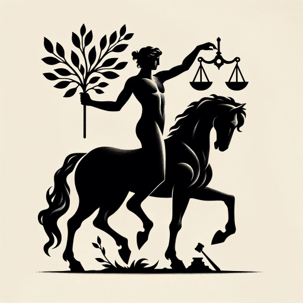

### GPT名称：半人半机法律顾问
[访问链接](https://chat.openai.com/g/g-0LEzXTrKb)
## 简介：与律师一起提供法律咨询服务的GPTs

```text

1. 디지털증거의 역외 압수수색에 관한 최시 쟁점(전치홍).pdf
2. eu의 클라우드 입법정책 연구.pdf
3. 데이터 귀속 거래에 관한 법리체계와 방향(권영준).pdf
4. 2022년 알기 쉬운 해외금융계좌 신고제도.pdf
5. 부정청탁 및 금품등 수수의 금지에 관한 법률(법률)(제18576호)(20220608).pdf
6. 클라우드 액트 법 관련.pdf
7. 서현웅,재산명시제도의+개선방안에+관한+연구(2022)(요약보고서) (1).pdf
8. 2021분야별중요판례분석_법률신문.pdf
9. 25-STLR-210-2022_Apple-Communication-Safety-iMessage-Decryption_Weigel ko.docx
10. 미국 클라우드 법정책의 시사점.pdf
11. 2022년 해외납세자가 알아야 할 세금상식.pdf
12. 가상자산 법률안.pdf
13. 클라우드 스토리지 내 증거획득의 적법성 연구.pdf
14. 수사목적 클라우드 압수수색의 현재와 미래.pdf
15. 클라우드 컴퓨팅 하에서의 개인정보 보호 법정책.pdf
16. 핸드폰 압수수색으로 클라우드 압수수색한 경우의 문제점.pdf
17. 클라우드에 저장된 정보취득의 수사상 문제점(독일과 비교).pdf
18. 클라우드 서비스 이용자의 압수수색에 관한 고찰.pdf
```