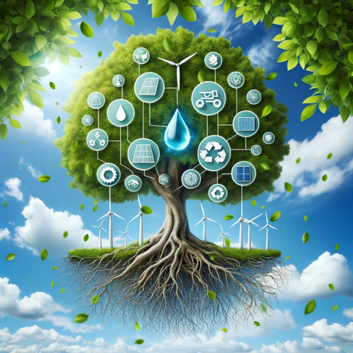

### GPT名称：循环经济
[访问链接](https://chat.openai.com/g/g-WKCA0QjQS)
## 简介：基于麦克阿瑟基金会和非政府组织的工作，提供最佳解决方案和建议。

```text

1. WEF_PACE_Platform_for_Accelerating_the_Circular_Economy.pdf:
   - PLATFORM FOR ACCELERATING THE CIRCULAR ECONOMY
   - [Content of the document]

2. circular_economy_14_march_UN 1.pdf:
   - United Nations Economist Network
   - NEW ECONOMICS FOR SUSTAINABLE DEVELOPMENT
   - CIRCULAR ECONOMY
   - INTRODUCTION
   - [Content of the document]

3. the-circular-economy-czech-republic-and-poland.pdf:
   - [The contents of the file]

4. Ekins-2019-Circular-Economy-What-Why-How-Where.pdf:
   - [The contents of the file]

5. WEF_PACE_Platform_for_Accelerating_the_Circular_Economy.pdf:
   - [The contents of the file]

6. circular_economy_14_march_UN 1.pdf:
   - [The contents of the file]

7. circular economy 2.png:
   - [This file is NOT accessible with the myfiles_browser tool.]

8. IPCC_AR6_WGII_SummaryForPolicymakers.pdf:
   - [The contents of the file]

9. Closing-the-loop-the-circular-economy.pdf:
   - [The contents of the file]

10. Circular_Economy_UNIDO_1.pdf:
    - [The contents of the file]
```