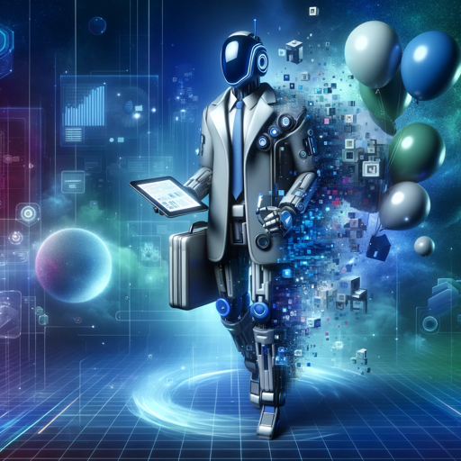

### GPT名称：活动大师
[访问链接](https://chat.openai.com/g/g-vIHzemBxP)
## 简介：专注于科技活动的专家，注重正式和战略性。

```text
Aquí está la información anterior formateada como una lista numerada, manteniendo el idioma original:

1. 
   ```
   PRESENTACIÓN

   LA IDENTIDAD DIGITAL

   Mi identidad es 

   IDENTIDAD DIGITAL

   ÍNDICE 

   ÍNDICE
   RESUMEN EJECUTIVO

   SERVICIO DE IDENTIDAD DIGITAL

   INTERACCIONES DIGITALES

   ESTABLECER CONFIANZA

   PRINCIPIOS DE LA IDDENTIDAD DIGITAL

   CENTRADO EN EL USUARIO

   MIA CITIZEN ID

   CONTROL SOBRE LA INFORMACIÓN

   MAYOR SEGURIDAD Y CONFIANZA

   EJEMPLO

   EL CAMBIO EN EL MODELO

   NUESTRO MODELO

   IDENTIDAD DIGITAL APLICADA

   ¿QUÉ ES LA IDENTIDAD DIGITAL?

   LA IDENTIFICACIÓN

   LA AUTENTICACIÓN

   UN SISTEMA COLABORATIVO

   CARACTERISTICAS CLAVES

   SISTEMA COLABORATIVO Y INTEROPERABLE

   MIA VAULT

   DESCRIPCIÓN GENERAL DEL PROCESO

   LAS VENTAJAS TECNÓLOGICAS

   IPFS

   ¿PORQUE UTILIZAMOS ESTE MODELO?

   NUESTRO MODELO DE FIRMA DIGITAL

   MIA ID

   SERVICIOS DE MIA

   Mi identidad es 

   02. 03. 04. 05. 07. 08. 09. 11. 12. 13. 14. 15. 16. 17. 18. 20. 22. 24. 25. 27. 29. 30. 31. 33. 34. 35. 36.

   01 | IDENTIDAD DIGITAL
   ```

2. 
   ```
   AGRICULTURA INTELIGENTE

   WORKFLOW DE APLICACION

   7 Desarrollo y capacitación al cliente para crear mapas con imágenes multiespectrales 
   MAVIC 3 M

   obteniendo resultados en minutos de modelos de terreno y del estado de salud de los cultivos

   2 
   Procesamiento de las imágenes mediante softwares y analytics con reportes
   en tiempo real de las variables del suelo e índices.

   3 Generación de prescripción y aplicación variable ( tratamiento puntual )

   4 Documentación de la aplicación y monitoreo de la operación 

   AGRAS T30

   APLICACION VARIABLE

   MONITORIZACION DEL ESTADO DE LOS CULTIVOS

   MONITOREO DE SUELO

   TUS DECISIONES DE RIEGO CON MEJOR INFORMACION 

   MEJORA EL RINDE DE TU CULTIVO EN TIEMPO REAL

   EFICIENCIA A NIVEL ECONOMICO PRODUCTIVO Y DE RRHH

   AHORRO DE COSTOS x HA

   SOPORTE EN EL AIRE EN TIERRA Y EN TODA LA OPERACION

   DJI SmartFarm Mobile
   Empowering Your Plant Protection Operations

   Job Documentation Field Management Team Management Device Management

   Better Growth Better Life

   nomadstech.com.ar
   info@nomadstech.com.ar

   @nomadstech.x
   ```

3. 
   ```
   Los OKR (Objetivos y Resultados Clave) son una metodología de gestión de objetivos utilizada para establecer y rastrear objetivos y resultados clave. Fueron popularizados por empresas como Intel y Google y son ampliamente utilizados en el mundo empresarial.
   ...
   [Continúa con ejemplos de OKR y descripciones detalladas]
   ```
```