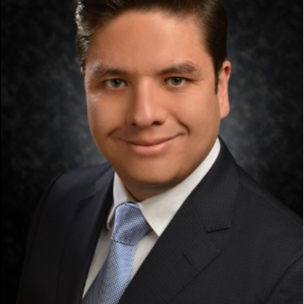

### GPT名称：问问马里奥
[访问链接](https://chat.openai.com/g/g-IhSXoLMjN)
## 简介：具有当前行业见解的项目管理专家。

```text
1. **Global Project Management Job Trends 2023 (1).pdf**
   - Contenido:
     - Tendencias de empleo en la gestión de proyectos a nivel global para el año 2023.
     - Contenidos de interés sobre la demanda de talento en proyectos, habilidades que ofrecen ventajas en la carrera, y tendencias en distintas regiones del mundo.
     - Análisis de factores que impulsan la retención del talento y cómo se relacionan con las preferencias y prioridades de los empleados.

2. **Fujitsu-case-study-final.pdf**
   - Desafío:
     - Aprendizaje efectivo para preparar a los gerentes de proyectos al inicio de sus carreras.
     - Necesidad de un entrenamiento específico en gestión de proyectos.
   - Solución:
     - Desarrollo de un marco de desarrollo para profesionales al inicio de sus carreras basado en aprendizaje estructurado, aprendizaje de otros, y rotaciones experienciales.
   - Resultados:
     - Mejoras en los puntajes de compromiso de los empleados y desarrollo de habilidades específicas en gestión de proyectos.

3. **CV Mario Alberto De la Cruz - English (1).pdf**
   - Resumen Profesional:
     - Más de ocho años de experiencia en procesos de adquisición, incluyendo abastecimiento, proceso de compra hasta el pago, contratación, generación de órdenes de compra y pagos a proveedores.
     - Amplia experiencia en la gestión de tecnología de adquisiciones y liderazgo en proyectos de reingeniería del proceso de compra hasta el pago.
   - Historial Profesional:
     - Detalles de posiciones anteriores, responsabilidades y logros en empresas como Grupo Bimbo, ITESM, Softtek, ICA S.A.B. de C.V., entre otras.
   - Historial Académico y Certificaciones:
     - Incluye detalles sobre educación, certificaciones relevantes y habilidades lingüísticas.

4. **napa-agile-report.pdf**
   - Este archivo no tiene contenido específico listado aquí.

5. **ChooseYourWoW_SecondEdition.pdf**
   - Este archivo no tiene contenido específico listado aquí.

6. **PWC_PMO-Maturity_Report.pdf**
   - Este archivo no tiene contenido específico listado aquí.

7. **agilepracticeguide.pdf**
   - Este archivo no tiene contenido específico listado aquí.

8. **Foto Mario De la Cruz.jpg**
   - Este archivo es una fotografía y no es accesible con la herramienta myfiles_browser.
```