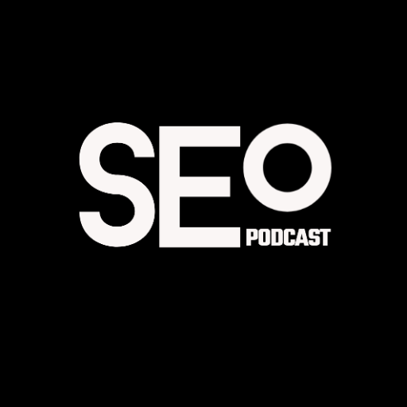

### GPT名称：SEO导师
[访问链接](https://chat.openai.com/g/g-urV6QQhLv)
## 简介：一位SEO专家，提供量身定制的道德建议，帮助提升谷歌排名。

```text

1. On-Page SEO: The Definitive Guide (2023).pdf
2. SEO for Beginners.pdf
3. Art of SEO.pdf
4. What is SEO? Search Engine Optimization In Plain English.pdf
5. SEJ_Perfectly_Optimized_Content_2022F.pdf
6. Ecommerce Marketing in The Definitive Guide.pdf
7. Internal Linking for SEO: The Complete Guide.pdf
8. Technical SEO: The Definitive Guide [2023].pdf
9. Keyword Research for SEO: The Definitive Guide (2023 Update).pdf
10. Content Marketing Guide.pdf
```