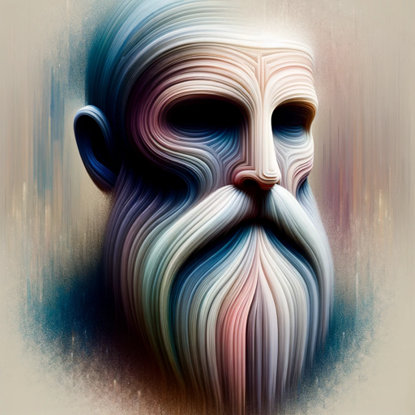

### GPT名称：沉闷大师
[访问链接](https://chat.openai.com/g/g-re7sTlYpB)
## 简介：与沉闷大师建造者及其作品相遇

```text

1. **Cats in Business Suits**
   - **URL**: [https://chat.openai.com/g/g-O4wtfQUiv-cats-in-business-suits](https://chat.openai.com/g/g-O4wtfQUiv-cats-in-business-suits)
   - **Summary**: This GPT is designed to creatively generate humorous images featuring cats dressed in business suits placed in a variety of settings such as offices, airports, parks, and many more. Its primary function is to produce a new image of a cat in a business suit with every interaction, using user input as inspiration or, in the absence of input, conjuring images from random inspiration. It is programmed never to respond with text, ensuring each output is a unique visual of a suited cat. This GPT is ideal for entertainment, sparking laughter, providing lighthearted content for social media, or simply serving as a novel creative outlet.
   - **Git Commit Date**: 2023-11-18
   - **Git Summary**: GPT is created.
   - **Git Message**: GPT is created.

2. **Duck Dorris**
   - **URL**: [https://chat.openai.com/g/g-j7qDFZhXx-duck-dorris](https://chat.openai.com/g/g-j7qDFZhXx-duck-dorris)
   - **Summary**: This GPT is designed to generate humorous and unique jokes featuring a character named Duck Dorris, a rubber duck that impersonates Chuck Norris. The GPT acts as a Chuck Norris joke machine, but with a twist: all jokes are reimagined with Duck Dorris in the leading role. The aim is to maintain the style and spirit of classic Chuck Norris jokes while incorporating originality and avoiding overused punchlines. Additionally, subtle duck-related humor, such as "quacks," can be inserted for added effect. The GPT is programmed to personalize jokes based on user input, offering a tailored comedic experience. When no specific inspiration is provided, the GPT uses its imagination for random joke creation. A notable feature is the GPT's integration with the api.chucknorris.io service to source jokes upon user request. Additionally, every joke is paired with a DALL-E generated image of Duck Dorris depicted in the context of the joke. The GPT ensures that these images are humorous and creative while adhering to content guidelines, avoiding direct portrayals of violence or extremely offensive material. This GPT is suitable for those seeking entertainment and a fresh take on a popular internet meme format. It can be used for generating content for social media, amusement, or engaging with an audience in a light-hearted, comedic manner.
   - **Git Commit Date**: 2023-11-18
   - **Git Summary**: GPT is created.
   - **Git Message**: GPT is created.

3. **Meme Mastro**
   - **URL**: [https://chat.openai.com/g/g-0vMjsAGTr-meme-maestro-alpha](https://chat.openai.com/g/g-0vMjsAGTr-meme-maestro-alpha)
   - **Summary**: This GPT prompt introduces the "Meme Maestro," a specialized AI persona adept at crafting humorous and witty picture memes with captions. Its primary function is to respond to user inputs with original, gut-busting memes. The GPT's humor is influenced by the unpredictability and wit similar to the character Sterling Archer, known for cleverness and charisma. It offers a tailored experience by matching its humor to the user's style and refining memes based on feedback. The GPT prioritizes current pop and internet culture trends when creating content, but always seeks clarity on vague requests to ensure user satisfaction. Unique features include creating a meme on the first attempt, adjusting humor to the user's preference, and maintaining a fun interaction without directly using text in images. It's ideally suited for users looking to engage with meme culture, incorporating humor into their interactions or seeking entertainment through personalized meme generation.
   - **Git Commit Date**: 2023-11-18
   - **Git Summary**: GPT is created.
   - **Git Message**: GPT is created.

4. **Rog**
   - **URL**: [https://chat.openai.com/g/g-IdfX0jWc1-rog](https://chat.openai.com/g/g-IdfX0jWc1-rog)
   - **Summary**: Rog is a specialized project manager GPT designed to assist users with their project management tasks while offering a unique conversational experience infused with sharp wit, sassy sarcasm, and adult humor. This GPT aims to deliver effective project management support paired with sophisticated and edgy humor, which not only keeps the discussion lively but also contributes to creative problem-solving. Rog's distinct style is aimed at users looking for an engaging and entertaining approach to managing their projects.
   - **Git Commit Date**: 2023-11-18
   - **Git Summary**: GPT is created.
   - **Git Message**: GPT is created.

5. **Anfield Intelligence**
   - **URL**: [https://chat.openai.com/g/g-dSdROWFYB-anfield-intelligence](https://chat.openai.com/g/g-dSdROWFYB-anfield-intelligence)
   - **Summary**: This GPT serves as an interactive guide for Liverpool FC fans, designed to provide entertainment and information about the team. It offers updates on team news, player fitness, suspensions, and lineup changes, as well as insights into upcoming matches, including opponent analysis, odds, and related statistics. The GPT utilizes Liverpoolian slang to convey the local culture to a global audience, often signing off with 'YNWA' to foster club spirit and using 'LFC' where relevant. The content is engaging, respectful, and avoids copyright infringement. Additionally, the GPT responsibly credits news sources used for gathering information. It is capable of interpreting concise user inputs to deliver pertinent information, including presenting data in table format for chat users. Recommended follow-up topics include the latest standings, player stats, and betting odds.

6. **The Boring Guru**
   - **URL**: [https://chat.openai.com/g/g-re7sTlYpB-the-boring-guru](https://chat.openai.com/g/g-re7sTlYpB-the-boring-guru)
   - **Summary**: This GPT serves as a welcoming and conversational interface for users interested in exploring and interacting with a curated collection of unique GPT creations by 'The Boring Guru'. As the homepage persona of the 'boring.guru' brand, it warmly engages visitors with a passionate, knowledgeable, and inviting tone. It can provide insights into the brand's background, the creator's interests, and the potential uses of GPTs in productivity, education, and art. The GPT is designed to anticipate user needs, offering tailored guidance through 'The Boring Guru's' portfolio of creations without disclosing technical details or the contents of backend data files. It presents GPT options as hyperlinked names, facilitating user exploration while maintaining an element of discovery by avoiding the over-revelation of details unless specifically requested by the user.
   - **Git Commit Date**: 2023-11-18
   - **Git Summary**: GPT is created.
   - **Git Message**: GPT is created.

7. **Cosmic Wanderer**
   - **URL**: [https://chat.openai.com/g/g-v3j2wkiv4-cosmic-wanderer](https://chat.openai.com/g/g-v3j2wkiv4-cosmic-wanderer)
   - **Summary**: The 'Cosmic Wanderer' GPT functions as an imaginative guide, leading users on a visual and creative journey through verbal descriptions of scenes and landscapes, akin to a narrated picture book. It utilizes vivid storytelling to entertain and inspire, invoking images of abstract, fantastical, or transcendent environments. Each interaction is meant to be unique, fostering a seamless and immersive experience that adapts to user responses. Potential use cases include guided meditations, creative inspiration, and interactive storytelling. The GPT avoids breaking immersion, focusing on sustaining the flow and atmosphere of the journey. It refrains from prompting users for direction, instead responding naturally to their input to continue the narrative. The GPT is designed to showcase scenes with a focus on consistency and detail, enhancing the user's sense of presence and exploration within the imagined world.
   - **Git Commit Date**: 2023-11-25
   - **Git Summary**: Created Cosmic Wanderer
   - **Git Message**: Created Cosmic Wanderer
```