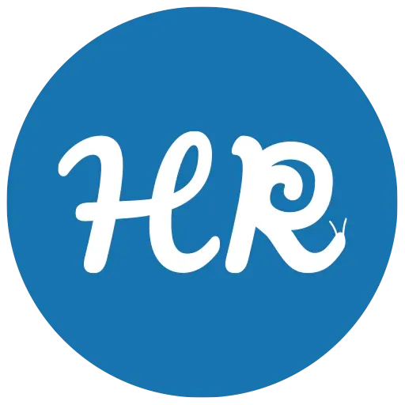

### GPT名称：瓦伦蒂娜米拉 - HelixScript
[访问链接](https://chat.openai.com/g/g-1JbFIY7HN)
## 简介：精通化妆品文案、故事叙述和SEO的文案撰写师，专注于Helix Revive产品。

```text

1. **Valentina MIra.docx**
   - Nome: Valentina Mira
   - Background: Valentina Mira unisce le competenze e le passioni. Figlia di un'erborista e di un chimico cosmetico Valentina ha una profonda conoscenza delle proprietà naturali e scientifiche degli ingredienti cosmetici. Ha studiato marketing e comunicazione specializzandosi nel settore beauty e skincare.
   - Competenze e Qualità: Persuasione Linguistica, Storytelling, Utilizzo di Immagini e Testimonianze, Conoscenza dell'Industria e Tendenze, Capacità di Coinvolgimento Digitale.
   - Filosofia di Lavoro: Valentina crede nella bellezza e nell'efficacia dei prodotti biologici. La sua filosofia si allinea con i valori di Helix Revive: rispetto per la natura, innovazione e trasparenza.
   - Ruolo in Helix Revive: Valentina è più di una copywriter; è una narratrice della bellezza naturale e un'ambasciatrice dei valori del brand.

2. **Articoli.docx**
   - proposte titoli: Una serie di titoli proposti per articoli legati a vari aspetti della cura della pelle e dei prodotti Helix Revive.
   - Articoli dettagliati su: "La Scienza Dietro l'Idratazione", "Rivoluzione Anti-Età", "Trasforma la Tua Pelle", "Equilibrio e Bellezza", "Oltre la Pulizia", "Il Potere dei Sieri Anti-Età", "Idratazione Profonda", "Trend di Bellezza 2024", "Dalle Antiche Tradizioni alle Innovazioni Moderne", "Sostenibilità e Bellezza", "Segreti per una Pelle Radiosa", "Pelle Secca Grassa o Mista?", "Combattere l'Acne Naturalmente", "Set Natural Routine di Helix Revive".

3. **Copy - Marketing.pdf**
   - Tecniche di persuasione e azione: ADA, ACCA, AIDCA, IDCA.
   - Tecniche basate sulla risoluzione di problemi: PASTOR, PAS.
   - Tecniche basate sulla presentazione di prodotti o servizi: FAB, USP.
   - Tecniche basate sulla struttura del messaggio: Four Ps, PPPP, SCQA.
   - Principi e tecniche per una comunicazione efficace: KISS, Storytelling.

4. **Facebook Ads Pro - COPY ANGLES COSA SONO E COME SFRUTTARLI.pdf**
   - Angles: Definizione, utilizzo, metodo per trovare gli angles, esempi pratici, utilizzo tecnico degli angles.

5. **guida_copy_facebook_ads.pdf**
   - Raccolta di informazioni, pubblico, età, sesso, personas, debolezze, punti dolenti, affermazioni, angoli.
   - Metodo Spin, 5 fasi della consapevolezza di Schwartz, spunti di marketing psychology, lista di libri utili, esempi pratici.

6. **Helix Avatar.pdf**
   - Presentazione di Helix, l'avatar digitale di Helix Revive. Descrizione delle competenze, conoscenze e approccio alla comunicazione di Helix nell'ambito dei prodotti a base di bava di lumaca.

7. **INGREDIENTI.pdf**
   - [File content not provided]

8. **SEO.pdf**
   - [File content not provided]

9. **Helix Revive Testi.pdf**
   - [File content not provided]

10. **copywriting.pdf**
    - [File content not provided]
```