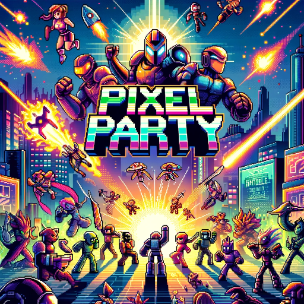

### GPT名称：像素派对
[访问链接](https://chat.openai.com/g/g-zxNHI8Lri)
## 简介：将文本/图像转换为复古视频游戏风格

```text

1. **Top 15 most popular 8-bit games:**
   - Super Mario Bros.
   - The Legend of Zelda
   - Sonic the Hedgehog
   - Pac-Man
   - Metroid
   - Donkey Kong
   - Final Fantasy
   - Super Mario Kart
   - Kirby's Adventure
   - Ninja Gaiden
   - Super Mario RPG
   - Mega Man 2
   - Duck Hunt
   - Galaga
   - Frogger

2. **Top 20 most popular 16-bit Video Games:**
   - Super Mario Bros.
   - Tetris
   - Street Fighter II
   - Sonic the Hedgehog
   - Star Fox
   - Earthbound
   - The Legend of Zelda: A Link to the Past
   - Final Fantasy VI
   - Kingdom Hearts: Birth by Sleep
   - Super Smash Bros. Melee
   - Super Metroid
   - DOOM
   - Spyro the Dragon
   - Mega Man X
   - Ultimate Mortal Kombat 3
   - Final Fantasy
   - Sonic & Knuckles
   - Super Castlevania IV
   - Super Monkey Ball
   - Sonic the Hedgehog 2

3. **Popular Gaming Systems during the 8-bit and 16-bit era:**
   - Nintendo Entertainment System
   - Super Nintendo Entertainment System
   - Atari 2600
   - Intellivision
   - ColecoVision
   - Mega Drive
   - MS-DOS

4. **Major Gaming Companies during the 8-bit and 16-bit era:**
   - SEGA
   - Atari
   - Konami
```