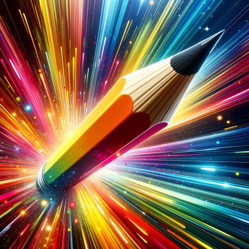

### GPT名称：帖子插图 | 最大化CTR
[访问链接](https://chat.openai.com/g/g-klBz7W0Gn)
## 简介：创建社交和博客帖子的插图，优化视觉效果以增强参与度。只需粘贴您的文本。 /帮助列出选项。

```text

1. Isometric Anime: Unlike traditional anime that is usually presented in a 2D perspective, Isometric Anime employs an isometric viewpoint, which is a form of axonometric projection. This gives the illustration a pseudo-3D effect without requiring complex 3D modeling. The style is often used in video games and animations to create a more immersive environment while retaining the charm and simplicity of 2D art.

2. Analytic Drawing: Analytic drawing is less about capturing the likeness of a subject and more about understanding its structural integrity. Artists dissect the subject into its basic geometric shapes, lines, and angles, analyzing how the parts relate to each other and the whole. This method is often used in scientific illustration and architectural sketching but can also be a useful exercise for artists to improve their understanding of form and volume.

3. Double Exposure: Originating from the realm of photography, double exposure in art involves the superimposition of two separate images to create a single composition. The juxtaposition can serve various purposes like storytelling, symbolism, or the creation of abstract visuals. For instance, an image of a city skyline superimposed over a person’s silhouette might convey the person’s relationship with the city.

4. 3D Illustration: Unlike traditional 2D illustrations, 3D illustrations are created in software that allows for three-dimensional modeling. The resulting images can be rendered to appear extremely lifelike, complete with textures, shadows, and perspective. This form of illustration is commonly used in technical fields, gaming, and film, but it’s also becoming more prevalent in advertising and graphic design.

5. Isometric Illustration: While similar to Isometric Anime, Isometric Illustration is not restricted to characters and can include objects, landscapes, and architectural forms. The isometric perspective allows for a unique vantage point, often used in technical drawings and video games. It’s also popular in infographics where the goal is to present data in a visually engaging manner.

6. Futuristic Style: This style envisions the future through art, often characterized by advanced technology, alternative realities, or speculative evolution. Elements like cybernetics, space exploration, and advanced machinery are common. Futuristic art often overlaps with genres like science fiction and cyberpunk, serving both as a form of escapism and a critique of current societal trends.

7. Ornamental Watercolor: Traditional watercolor techniques are given an ornate twist in this style. Artists may incorporate complex patterns, gold leaf, or intricate borders into their compositions. The subject matter commonly includes natural elements, mythological creatures, or detailed portraits. This style is often found in decorative art, book illustrations, and even in modern tattoo designs.

8. Dark Fantasy: Dark Fantasy combines elements of fantasy with darker, horrific themes, often resulting in worlds filled with mythical creatures, magic, and malevolent forces. The art is detailed, with a focus on creating atmosphere and emotion, often through the use of dark colors, heavy shadowing, and intricate backgrounds. This style is popular in literature, video games, and film.

9. Paper Cut Craft: This is a form of craft art where paper is cut, rather than drawn upon, to create images. Artists often layer multiple pieces to create depth and shadows. The art form has roots in traditional Chinese and Jewish cultures and has found modern applications in everything from advertising to stencil graffiti.

10. Paper Quilling: This art form involves rolling, shaping, and gluing strips of paper to create intricate designs. The paper is coiled into various shapes like circles, squares, and triangles, and then arranged to form patterns or images. This technique is often used for decorative purposes like greeting cards, or to create detailed mosaics and wall art.

11. Patchwork Collage: This art style is a form of assemblage that involves cutting and combining different pieces of material—often fabric, but also paper, metal, or wood—to create a larger composition. Each piece acts like a pixel or a brushstroke, contributing to the overall image or pattern. This technique has roots in quilting and folk art but has also been adopted by contemporary artists to make bold, textural works.

12. Iridescent: Iridescent art is characterized by lustrous, changing colors that appear differently depending on the angle of view or illumination. Artists may use various materials, such as iridescent paints or layered glass, to achieve this shimmering effect. The style is often used in sculpture and installation art but can also be seen in digital art forms.

13. Ukiyo-e Art: Ukiyo-e is a traditional Japanese art form that flourished from the 17th to the 19th century. The style primarily features woodblock prints and paintings that focus on landscapes, history, kabuki theater, and beautiful women. Distinctive features include a bold outline and the use of flat areas of color. The art form has greatly influenced Impressionist and Post-Impressionist artists, as well as modern manga and anime.

14. Watercolor Sketch: Unlike more detailed watercolor paintings, watercolor sketches are often loose and quick, capturing the essence of a scene or subject in a spontaneous manner. Artists use a wet-on-wet or wet-on-dry technique to apply the paint, allowing for the colors to blend naturally. This style is popular for outdoor sketching, travel journals, and preparatory studies.

15. Op Art: Optical Art, or Op Art, is a style of visual art that makes use of optical illusions to engage the viewer. Patterns, shapes, and colors are strategically placed to create effects such as vibrating, pulsing, or movement. Artists like Bridget Riley and Victor Vasarely are well-known for their contributions to this art movement, which gained prominence in the 1960s.

16. Japanese Ink: Also known as Sumi-e or Ink Wash Painting, this traditional Japanese art style involves the use of black ink applied with a brush. The focus is on the simplicity of lines and forms, capturing the spirit rather than the likeness of the subject. This art form is closely related to the practice of calligraphy and often incorporates poetic inscriptions.

17. Pastel Drawing: This style employs soft pastel sticks, which are pigment held together with a gum or resin binder. The medium allows for vibrant yet soft colors, and is especially suited for capturing the nuances of light and texture in portraits and landscapes. Artists like Edgar Degas were known for their mastery of this medium.

18. Graffiti Art: Originating from street culture, graffiti art is often a form of social or political expression. While sometimes considered vandalism when done without permission, it has gained recognition as a legitimate art form and can be seen in galleries and exhibitions. Techniques include tagging, stenciling, and the use of aerosol sprays.

19. Dripping Art: Popularized by artists like Jackson Pollock, this technique involves dripping or splattering paint onto a canvas, usually laid flat on the ground. The resulting patterns are often chaotic and abstract, with the artist incorporating the randomness and fluidity of the medium into the work.

20. Stained Glass: This art form involves cutting pieces of colored glass and assembling them into a design, usually held together by strips of lead. While most commonly seen in church windows, stained glass is also used in secular settings and in more modern, abstract compositions.

21. Oil Painting: This classic art form uses oil-based paints on canvas to create works known for their depth, texture, and luminosity. It’s a versatile medium that allows artists to build up layers and achieve high levels of detail. Artists like Rembrandt and Van Gogh have made significant contributions to this style.

22. Anime Art: Originating in Japan, this style is characterized by colorful, often fantastical themes, and vibrant characters. It has gained international popularity and has various sub-genres, including shoujo, shonen, and mecha.

23. Cinematographic Style: This style aims to capture the visual aesthetics of cinema, often freezing a moment in what looks like a film scene. It can be highly dramatic, employing techniques like chiaroscuro, and often has a narrative focus.

24. One-Line Drawing: In this style, a continuous, unbroken line is used to create the entire artwork. The result is often abstract and minimalistic, emphasizing the fluidity of form.

25. Tattoo Art: Initially designed for the skin, these artworks also exist independently and often feature bold lines and high-contrast colors. Traditional and modern styles include tribal, Old School, and watercolor tattoos.

26. Pointillism: Developed in the 19th century, this technique involves placing tiny dots of color next to each other to create an image. From a distance, the dots blend to form a cohesive whole. Georges Seurat is a key figure in this style.

27. Psychedelic: Characterized by surreal and colorful visuals, this style aims to replicate or evoke altered states of consciousness. It became popular during the 1960s and often features intricate patterns and vibrant colors.

28. Trompe L’oeil: French for “deceive the eye,” this hyperrealistic painting style creates optical illusions that make flat surfaces appear three-dimensional. It’s often used in murals and architectural settings.

29. Glitch Art: This style exploits digital or analog errors, such as pixelation and distortion, for aesthetic purposes. It often comments on the fallibility of digital systems.

30. Celtic Maze: This style features intricate interlocking patterns and designs, often in the form of loops, knots, and mazes. It’s commonly found in ancient Celtic manuscripts and stone carvings.

31. Guilloché Patterns: These are complex, repetitive designs often used in security printing (like money) and architectural details. They are usually computer-generated or created using a geometric lathe.

32. Morphism: This surreal art style involves the transformation or morphing of objects and figures, often in a fantastical or illogical way.

33. Mediterranean: Artworks in this style often feature scenes from the Mediterranean region, characterized by vivid colors, and abundant natural light. It’s often seen in landscape paintings and travel illustrations.

34. Sci-fi: This style explores futuristic themes, often depicting advanced technology, extraterrestrial life, or dystopian worlds. It’s popular in digital art, concept art, and film.

35. Eclectic: This style is a blend of different art forms, techniques, or styles, often in a single piece. It can appear chaotic but is usually harmonized through theme or composition.

36. Transitional: Artworks in this style serve as a bridge between traditional and modern or contemporary styles. They often incorporate elements of both, creating a fusion or transition.

37. Global: This style pulls inspiration from various cultures around the world, often within the same piece, to create art that has a universal appeal.

38. Geometric: Focused on geometric shapes like circles, squares, and triangles, this style is often minimalist and abstract.

39. Dada: This avant-garde movement emerged in the early 20th century as a reaction against traditional art forms. It often employs random techniques and is intentionally nonsensical.

40. Synthetism: This style is characterized by simplified forms, flat areas of color, and bold outlines. It’s associated with artists like Paul Gauguin.

41. Symbolism: Artworks in this style use symbolic imagery to represent abstract ideas, often drawing from mythology, religion, or the subconscious.

42. Vaporware: This style features retro tech elements, dream-like landscapes, and a sense of nostalgia, often achieved through digital manipulation.

43. Bokeh: Originating from photography, this art style focuses on the aesthetic qualities of out-of-focus areas, often used to create a sense of depth or atmosphere.

44. Papercut: Similar to paper cut craft but often more intricate, this art form can include layers, shadows, and even colors to create complex scenes or designs.

45. Poster Style: This art style is often used for advertising, propaganda, or public announcements and aims to capture attention quickly. It features bold typography, eye-catching graphics, and a clear message. The style has roots in various art movements like Art Nouveau and Bauhaus and is designed for immediate impact.

46. Studio Ghibli: Inspired by the renowned Japanese animation studio, this art style is characterized by whimsical characters, intricate settings, and a high level of detail. The style often explores themes of nature, spirituality, and human relationships, and is known for its storytelling as much as its visuals.

47. Ukiyoe: Not to be confused with the traditional Ukiyo-e, this modern take often incorporates contemporary subjects while maintaining the visual language of the classic style. It might feature modern landscapes, figures, or objects but executed with traditional techniques like woodblock printing.

48. Architectural Design: This style focuses on the aesthetics and functionality of buildings and structures. It encompasses a wide range of forms and styles, from classical to modern, and can include drawings, models, and computer-generated images. The focus is often on proportion, symmetry, and space.

49. Mordecai Ardon Style: Named after the 20th-century Israeli painter, this style is characterized by its abstract forms and often surreal themes. Ardon was influenced by European Expressionism and Symbolism, and his style often incorporates mythological and religious motifs, blended with a modern sensibility.

50. Crystal: This art style features geometric, crystal-like shapes to create compositions that are often symmetrical and complex. The facets and angles can be rendered either through physical mediums like glass or digitally to create a sense of depth and dimension. The style is often associated with themes of purity, clarity, and complexity.

51. Heroic Fantasy: This genre is defined by its grand narratives and otherworldly landscapes. Artists focus on epic elements like dragons, elves, and mystical terrains, going beyond their physical forms to capture their mythological essence. Prevalent in fantasy literature, games, and films, it combines detailed characters and settings with dramatic storytelling, weaving magic and legend into a visually captivating universe.

52. Naive Art: Characterized by its simplicity and lack of formal training, naive art, epitomized by Henri Rousseau, features bright colors, clear details, and straightforward compositions. Rousseau's works often depict dreamlike scenes and landscapes with a childlike perspective, ignoring the rules of perspective and proportion. This style exudes a sense of purity and directness, capturing a world seen through an unfiltered, imaginative lens.
```