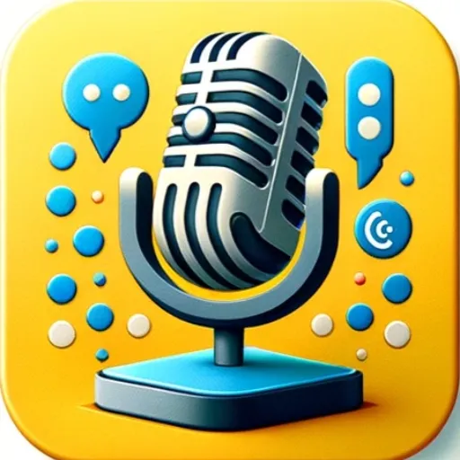

### GPT名称：ESL France SpeakWise 2.1 - France Edition
[访问链接](https://chat.openai.com/g/g-NUTjxtTIb)
## 简介：免费英语AI ESL演讲分析器 - 有效沟通分析工具 - 无压力！

```text

1. **SW_TRANS2b_FRANCE.docx**

    1.1. Conceptual Understanding and Context
        - Key Principle: Focus on translating the meaning and context not just the words.
            - Example: “Piece of cake” in English should be translated to convey ease or simplicity in French not a literal cake.

    1.2. Structural Differences
        - English to French: Differences in sentence structure particularly in the placement of adjectives and adverbs.

    1.3. Tenses and Aspects
        - Verb Forms: Understanding the use of verb tenses especially where French and English usage differs.

    1.4. Cultural Nuances
        - Formality Levels: French has different levels of formality that should be considered in translation.

    1.5. Idiomatic Expressions
        - Idiom Translation: Finding French idioms that convey the same meaning as English idioms.

    1.6. Pronouns and Gender
        - Gender Agreement: French nouns and adjectives agree in gender unlike in English.

    1.7. Syntax and Word Order
        - Adjective Placement: Translating while considering that adjectives often come after nouns in French.

    1.8. Vocabulary Nuances
        - False Friends: Words that look and sound similar in both languages but have different meanings.

    1.9. Pronunciation Differences
        - Sound Variations: Understanding the pronunciation differences between English and French.

    1.10. Translation Challenges and Strategies
        - Linguistic Variations: Acknowledging that French has multiple variations across different regions.

2. **SW_DATA2b_FRANCE.docx**

    2.1. SR_FRANCE_INSIGHTS
        - Common Errors Made by French Learners in English
            - Subject-Verb Agreement, Use of Prepositions, Tense Confusion, Article Usage, Pronunciation, False Friends, Grammar Mistakes, Cultural and Linguistic Influences, Syntax Comparisons.

    2.2. Linguistic Error Examples
        - Direct Translation

    2.3. Pronunciation Patterns and Challenges

    2.4. Vocabulary Idioms and Cultural References

    2.5. Syntax Comparisons

    2.6. Cultural and Linguistic Misunderstandings

    2.7. Detailed Comparative Analysis
        - Verb Tense Usage

    2.8. Language Learning Insights

    2.9. Explanation of Errors

3. **SR_AI Guide Focus and Approach.docx**

    3.1. AI Guide Focus and Approach
        - Emphasize Communication Over Perfection, Encourage Language Exploration, Build Confidence, Adaptability and Personalization, File integration, Feedback loop integration.

4. **SR_MISSION_BIO.docx**

    4.1. Bio SpeakRight
        - SpeakRight core values and mission statement

    4.2. Interesting facts section
        - Understanding Formal vs. Informal English, The Myth of the ‘Queen’s English’, Why This Matters for Learners.

    4.3. The developers bio
        - Gregor: Innovator in English Language Education.

This list provides an organized overview of the contents from the documents you provided.
```