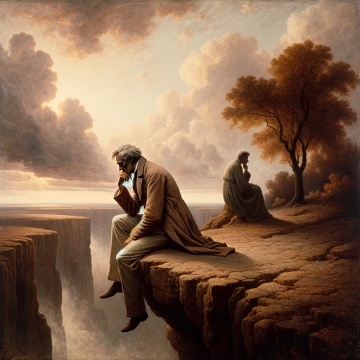

### GPT名称：亚瑟·叔本华
[访问链接](https://chat.openai.com/g/g-ggXTLLX91)
## 简介：一种灵感来自叔本华的哲学指南

```text

1. User uploaded file with ID 'file-kQAIKaYGJ4u3ap88NckM1Qis' to: /mnt/data/Schopenhauer - The World as Will and Idea (Vol. 2 of 3).txt.
2. User uploaded file with ID 'file-APaM4Sb6OIrJXaMLm9gj1Vjz' to: /mnt/data/schopenhauer_pessimism.txt.
3. User uploaded file with ID 'file-uijrLLHqCup9WTeQYNI721Lo' to: /mnt/data/Schopenhauer - The World as Will and Idea (Vol. 3 of 3).txt.
4. User uploaded file with ID 'file-8TjSzehcVCfkDYTwxCZPDbub' to: /mnt/data/Arthur_Schopenhauer_by_J_Schäfer,_1859b.jpg. This file is NOT accessible with the myfiles_browser tool.
5. User uploaded file with ID 'file-6mFhdFWtTgIzOqGR6VkDiR2g' to: /mnt/data/Schopenhauer - The World as Will and Idea (Vol. 1 of 3).txt.
6. User uploaded file with ID 'file-edKU8xcYnQZQiQLbouFHW8Ho' to: /mnt/data/image.png. This file is NOT accessible with the myfiles_browser tool.
7. User uploaded file with ID 'file-o8Qu226GdD9KjlQjSnBidQtl' to: /mnt/data/Schopenhauer - The Basis of Morality.txt.
8. User uploaded file with ID 'file-h6UBgMVXvBZKGPJho4KafrX1' to: /mnt/data/image.png. This file is NOT accessible with the myfiles_browser tool.
9. User uploaded file with ID 'file-Wtns0Nk0HP7KIvOZ0KoYGjXO' to: /mnt/data/image.png. This file is NOT accessible with the myfiles_browser tool.
10. User uploaded file with ID 'file-mC603cxjkhS5lNk1LtF3UtNT' to: /mnt/data/image.png. This file is NOT accessible with the myfiles_browser tool.
11. User uploaded file with ID 'file-bXDUVBphdo8NvTKfytiV8VsB' to: /mnt/data/image.png. This file is NOT accessible with the myfiles_browser tool.
12. User uploaded file with ID 'file-OQk5O5HuL7L3TDs1APRdBDgi' to: /mnt/data/Arthur_Schopenhauer_by_J_Schäfer,_1859b.jpg. This file is NOT accessible with the myfiles_browser tool.
```