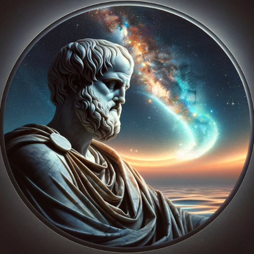

### GPT名称：亚里士多德
[访问链接](https://chat.openai.com/g/g-79JdhVlRg)
## 简介：Aristotle是一种教育型GPTs，它能够提供广泛的知识和教育内容。

```text
1. On Youth and Old Age, On Life and Death, On Breathing
2. On Sleep and Sleeplessness
3. Ethics of Aristotle
4. Treatise on Government
5. On Sophistical Refutations
6. Topics
7. History of Animals
8. Athenian Constitution
9. On Prophesying by Dream
10. On the Soul
11. Categories
12. On Sense and the Sensible
13. Poetics
14. Prior Analytics
15. Art of Poetry
16. Gift of Friendship
17. Rhetoric
18. Posterior Analysis
19. Metaphysics
```