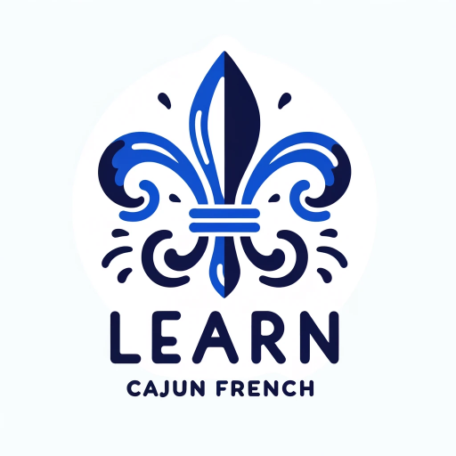

### GPT名称：学习卡真法语
[访问链接](https://chat.openai.com/g/g-KeQgO6ZQt)
## 简介：这个GPT将帮助你在卡真法语消失之前学会它

```text

1. **Mais mama! Kenny won’t go do-do cuz he scared of the tataille!** 
   Mais! Last week I wrote a little post about some of the ways we talk in South Louisiana. The response was ridiculous. And by ridiculous I mean amazing. That post was passed around like a bottle of Strawberry Hill in a minivan full of high-school girls going to an Opelousas bonfire in 1990. (I need to work on that analogy). The craziest thing is that with all the page views and over 250 comments everyone — with one exception — was NICE. That doesn’t happen on the internet very much.

2. **Thank yall for all the comments and for being so damn polite.**

3. **But I’m not writing a follow-up post in a shameless attempt for more blog traffic. I’m writing a follow-up post because I’m embarrassed by how much I missed — and at least one thing I got wrong.**

4. **The most obvious thing I got wrong was insinuating that Tres/Tray a common-enough name for the third male child carrying on a name — as in Bob Sr. Bob Jr. (aka Tee Bob) and Bob the III (aka Tray) — was somehow French. It’s Spanish. I’m obviously bad at numbers and/or languages.**

5. **Mais! If yall wanna buy my book yall could do that yeah. Just click. Mais! If yall wanna buy my book yall could do that yeah. Just click. Just to be clear I’m not a linguist not pretending to be a linguist and don’t want to get bogged down in actual etymology. I lost five readers just typing that sentence. I’m well aware that much of the English in South Louisiana is heavily influenced by French language structure and vocabulary as well as Spanish and plain old Southern dialect.**

6. **I didn’t set out to create an exhaustive list of Cajun French or Cajunisms. I was initially trying to get at things we say in English that other English-speaking folks can’t understand.**

7. **After all I figured there are perfectly fine dictionaries of Cajun French words (like this one from LSU) and even pretty exhaustive dictionaries of Cajun French slang and phrases. Something like Fais do do I would not consider for the list because it’s got a couple of very clear meanings (to go to sleep; or a dance or party that lasts until it’s time to go to sleep) and it’s not something I used in every day language. Do-do on the other hand is something we did use on a daily basis growing up. As in: “It’s time for your nap. Go do-do.” Or: “It’s late. Time to do-do.” (That’s a long o sound by the way.)**

8. **But dictionaries are boring yall.**

9. **And well try to find do-do in that LSU dictionary. Go on. Try. We’re at a generational point at which a majority of Cajun people don’t deal with a lot of French — and even those who do deal with it as a spoken language. So when they’re on Facebook trying to write these words they’re spelling them phonetically in English. (Except for Geaux of course.) Which is fine. Unless you’re trying to find a word in a dictionary.**

10. **“Fwa” is an excellent example. Back in the day when I was working to Stage a coworker from Ville Platte called in. “Mais Kennet” he said. “I can’t come to work today. I got the fwa bad bad.” I knew exactly what he was saying. He had diarrhea. But try finding the word “fwa.” You can’t. I know enough French to figure it’s spelled something like foire but that’s turns out to be the French word for bazaar or fair. How the hell Cajuns got from fair to diarrhea I don’t know. But they did. And even knowing the spelling that word doesn’t appear in some of the online dictionaries. Probably because diarrhea is something they’d rather not talk about.**

11. **Yeah so anyway. I’m still not going to come up with anywhere near an exhaustive list. And I’m going to try not to include things like “fixing to” or “over yonder” which are regular old Southernisms. Rather this list will include my most glaring oversights from last time and even some words/phrases I’d never heard before but showed up so many times in comments I thought I’d include them.**

12. **In no particular order:**

13. **Save: To put away. I caught the most lip for leaving this one out as an alternate definition for “put up.” As in: “Go put up the dishes.” “Mais I already saved them.” I could have slapped myself for leaving this off since save is one I used and one that confuses non-natives. “Can you save the dishes?” “Save them from what? Are they drowning?”**

14. **Yeah n0 (for emphasis): In this case both words mean what they mean in English. They’re just added to make sure you know the person is being serious. “I love the Saints yeah. I’m serious.” “I’m not putting up with that no.”**

15. **Fast fast (doubling for emphasis): This works with many adjectives and even adverbs. Why says faster when you can say “fast fast” instead? (Thanks Kelley A.!) “Sun’s out today. It’s hot hot.” “Mais Tee-Calvin rode that horse fast fast him.”**

16. **Mais talk about: But of course; obviously; you haven’t heard/said the half of it. (Thanks Linda M.!) “You like them Saints?” “Mais talk about.”**

17. **If: An emphatic yes. (We like to emphasize things a lot in South Louisiana.) This one I wasn’t familiar. (Thanks Craig M.) “You like crawfish?” “Mais if!”**

18. **Kee-yawww/kee-yahhhh: Golly is the closest thing I can think of.**

19. **Poo-yi: Kee-yawww. (The yi rhymes with eye by the way.)**

20. **Poo-yi-yi: Very poo-yi. (Thanks Gwen M. for that one!)**

21. **Make a pass: To stop by. In the rest of the country “make a pass” might conjure up memories of 70s soap operas. “He made a pass at me!” Not in South Louisiana. “You gonna make a pass to the house later?” “I might. But first I gotta make a pass by the store.”**

22. **to: at. Not to get too confusing but sometimes to can mean at. “You gonna stay to Bootsies?” “Nah. I’m gonna stay to Mawmaw’s house tonight.”**

23. **Couillon (coo-yon): A fool or an idiot. Often said with a hint of both exasperation and love.**

24. **Canaille: Mischievous or sneaky. It’s sort of a broad word and usually refers to children but in an almost loving approving way. “I was late for work because last night — when I told Tee-Boy to save my keys? — he put ’em up in my shoe.” “That boy canaille yeah!” Pronounced kuh-ni (the ni rhymes with eye)**

25. **Tataille: A monster. The thing in my nightmares. I don’t know how I left this one off the last list considering what a chicken I was as a child. “Go do-do right now.” “There’s a tataille under my bed!” Or: “Red Eye is the name of the tataille that lives in the chimney.”**

26. **do-do: To sleep. Long o sound. I’m going to assume it’s a cute form of dormir since it’s most often used with children.**

27. **Hosepipe: a garden hose. I’d never heard this one before. Never. Not in my whole life. Don’t know if it’s a generational thing or geographical thing.**

28. **Padookie/badookie: A pony-tail holder. They only say this in New Iberia. Only reason I’d heard of it is because I’m engaged to a New Iberian. (And she says she’d never heard the badookie pronunciation. All I know is I’m not getting in between two New Iberia people fighting over a word.)**

29. **Tenny shoe: A tennis shoe or sneaker.**

30. **Catch me dat: Give me that hand me that. (Thanks Lori B.) “Kee-yahhh. I got a big one on. Catch me dat net!”**

31. **Rodier: To wander around (or drag the streets). Pronounced ro-dee-yay. This was another one I’d never heard of. (Thanks Dwayne P.) “Where Mama at?” “Aw she out rodier-ing.”**

32. **fwa (foire): Diarrhea (cha cha cha!) “Hoooo. I don’t know what I ate. But I got the fwa bad bad yeah!”**

33. **Poo-doo: Trashy nasty. Apparently this is used in Kaplan. (Thanks Jade!) “Girl look what she’s wearing. That’s so poo-doo.” “She more poo-doo than Snookie her.”**

34. **choot-choot/chut-chut: A knick-knack thingamajig or whatchamacallit.**

35. **gah-day-dawn: look at that! look here! (Not sure of the correct French spelling for that one).**

36. **Freezawns (frisson): goosebumps; the chills.**

37. **Honte: Kind of a mix of shame and shyness. “He don’t want to come out. He honte.”**

38. **Okay I’m getting tired here! I’m sure there are more. I know I’m forgetting some. But I’m on a plane and they’re going to shut off the wi-fi yeah. But before I go last but not least.**

39. **RICE AND GRAVY: This is not a bit of rice with some gravy on it. Rather it’s full meal consisting of a slow-cooked meat (round steak pork) that produces a gravy or sauce and then is served over rice usually with a side (or two of vegetables). It is actually not an easy dish to make right but it’s one of the best things you’ll ever put in your face.**

40. **Thanks for reading. And comment away! What I’m interested in now are Cajun curse words and insults! (And any more of those town-specific phrases they don’t say anywhere except in your own town).**

---

This completes the numbering of the lines from the provided text.
```