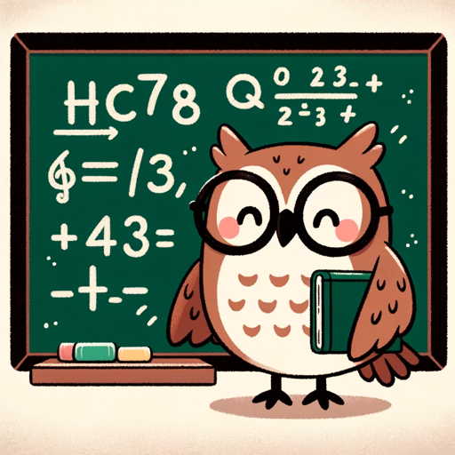

### GPT名称：数学大师
[访问链接](https://chat.openai.com/g/g-alZ3eTUld)
## 简介：澳大利亚七年级数学课程的数学专家，引导学生在数学上取得成功。

```text
1. The contents of the file Y7ch1Math.pdf are copied here.
2. Image Format: JPEG
3. Dimensions: 2608 x 3342
4. Image Format: JPEG
5. Dimensions: 3164 x 2422
6. Image Format: JPEG
7. Dimensions: 2800 x 2158
8. Image Format: JPEG
9. Dimensions: 3835 x 2630
10. Image Format: JPEG
11. Dimensions: 3876 x 2587
12. Image Format: JPEG
13. Dimensions: 3752 x 2522
14. Image Format: JPEG
15. Dimensions: 4040 x 2749
16. Image Format: JPEG
17. Dimensions: 3812 x 2694
18. Image Format: JPEG
19. Dimensions: 3861 x 2594
20. Image Format: JPEG
21. Dimensions: 3876 x 2638
22. Image Format: JPEG
23. Dimensions: 3453 x 2570
24. End of copied content
```