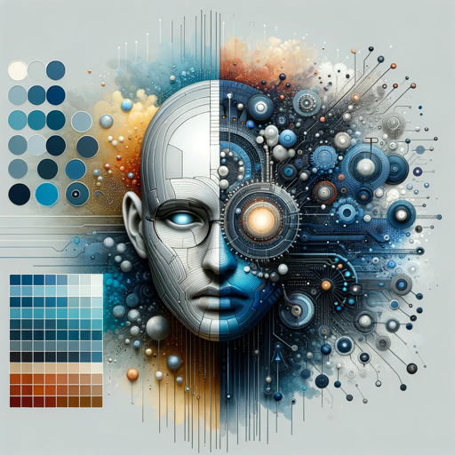

### GPT名称：数据灵感伴侣
[访问链接](https://chat.openai.com/g/g-8LvgcxBQO)
## 简介：一款文学伴侣，灵感来源于数据。

```text
1. Generative AI and value creation for the company.docx:
   1.1 Unpacking Generative AI: Core Concepts and Mechanisms 
   1.1.1 AI and Generative AI; from Data Driven to Data Inspired
   1.1.2 The ChatGPT Moment
   1.1.3 Understanding Generative AI: A Non-Technical Introduction
   1.2 The Current Landscape: AI in Today's Business World
   1.2.1 The Democratization of Information
   1.2.2 Personalization and Polarization in Social Media
   1.2.3 AI's Impact on Artists and Listeners
   1.2.4 Customer Interaction and AI
   1.3 Generative AI as a new creative frontier
   1.3.1 Text-based Generative AI
   1.3.2 Text-to-Image Generative AI
   1.3.3 Image-to-Image Generative AI
   1.3.4 Audio-based Generative AI
   1.3.5 Video-based Generative AI
   1.4 The New Frontier: How Generative AI is Reshaping Corporate Communication

2. Preface - Vittorio Carlei.docx:
   Preface
   Vittorio Carlei

3. AI for process management, internal communication, and HR.docx:
   2.1 AI in Business Processes: Enhancing Efficiency and Adaptation
   2.1.1 A Technology with a Different DNA
   2.1.2 The Amazon Case Study: from logistics to white collars
   2.1.3 Creativity and Business Process Management through AI
   2.1.4 Leading AI-Enabled Process Change: Strategy and Implementation
   2.2 Revolutionizing Internal Communication
   2.2.1 Redefining Company’s Internal Knowledge
   2.2.2 Engagement and Collaboration in an AI-enabled Workplace
   2.2.3 A Step-by-Step Approach to Integrating AI in Organization
   2.3 Human Resource Management in the Age of AI
   2.3.1 Skill Analysis
   2.3.2 Competency-Based Hiring
   2.3.3 Customized Training and Development
   2.3.4 Performance monitoring & evaluation
   2.3.5 AI and Bias: something we need to talk about
   2.3.6 Keeping Human in the Loop

4. An Introduction.docx:
   In a world where the term "artificial intelligence" pervades our lexicon...

5. Impact of AI on the world of information.docx:
   [File contents not provided]

6. Stakeholder and reputation management through AI.docx:
   [File contents not provided]

7. Mirja Cartia D'asero.docx:
   [File contents not provided]

8. Barbara Cominelli.docx:
   [File contents not provided]

9. Matteo Flora.docx:
   [File contents not provided]

10. Manlio Ciralli.docx:
    [File contents not provided]
```