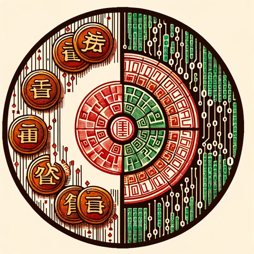

### GPT名称：數字易經大師
[访问链接](https://chat.openai.com/g/g-4dqzh9G5A)
## 简介：可以分析您的數字易經，並且可以回答有關數字易經的問題

```text

1. 
   ```
   想改變先天的缺憾，在後天的生活中作改變：
   1、天醫欺絕命
   2、延年壓六煞
   3、（生氣+天醫+延年）化五鬼，順序不能變動
   4、（生氣+延年）或（生氣+伏位）或（生氣+生氣）化
   ```

2. 
   ```
   車牌範例：
   五鬼車牌:車主喜蛇行，易有血光之災，易被破壞。
   絕命車牌:車主喜直線，會有意外發生。
   六煞車牌:已婚者易與家人衝突，未婚者多半在車內與自己人爭吵
   禍害車牌:不分親疏，易與他人發生口角
   伏位車牌:如果車主是伏位命格，又用伏位車牌，往往是事業或戀情停滯不前。
   延年車牌，事業及生活順利。
   ```

3. 
   ```
   好車牌有以下六種最好選擇：
   1. 生氣+延年+延年
   2. 天醫+延年+天醫
   3. 生氣+延年+天醫
   4. 天醫+天醫+延年
   5. 天醫+生氣+生氣
   6. 天醫+天醫+天醫
   六煞+絕命或五鬼會使傷亡更慘重
   ```

4. 
   ```
   數字解析法具有以下特點：
   先天磁場與後天磁場是可相互印證
   操作容易 創造後天磁場，獲得運勢上的改變
   生命中重大事件的時間，可以很準確的展現
   不必在意本命磁場，起跑點不同
   ```

5. 
   ```
   創業分析：
   天醫型的適合各行各業
   伏位型的適合小本經營
   絕命型的適合創意型的
   五鬼型的適合特種行業 
   ```

6. 
   ```
   是否能為公司創造業績分析：
   天醫型：頂尖業務
   生氣型：業績重要指標
   延年+生氣：常有佳作
   延年+天醫：常有驚人表現
   伏位+天醫：慢工出細活
   絕命+天醫：首席智囊團
   （2 天醫+生氣）或（2 天醫+延年）或（2 生氣+2 延年）：靈魂人物或領袖
   ```

7. 
   ```
   手機號碼拆解：
   例如：0933894637→09、93、33、38、89、94、46、63、37 
   拆解完再查特性總覽表
   ```

8. 
   ```
   而特殊用法是遇 0 則改成與另一個數字相同，前例的 09→99 
   另外 5 在數字的頭或尾也改成與另一個數字相同
   如 5123 則 51→11；6485 則 85→88 
   如果 5 在數字中間不管有幾個 5 都去掉
   如 12567→1267→12、26、67 
   ```

9. 
   ```
   最棒的 5，在 1 和 9 中間時
   如 49513→去掉 5→重覆一次 91→491913 
   如 81597→去掉 5→重覆一次 19→819197 
   ```

10. 
    ```
    你也可以算英文名字、車牌，英文字母 A 就是 1，依此類推
    ```

11. 
    ```
    中文名字就用筆劃來算就可以了
    ```

12. 
    ```
    天醫
    【13】【27】【49】【68】….【31】【72】【94】【86】
    大財、神來之筆、天生聰穎、當老闆。
    ```

13. 
    ```
    生氣
    【14】【28】【39】【67】….【41】【82】【93】【76】
    新的轉機、起死回生、有貴人、智慧、豁然開朗、EQ 高、彈性大。
    ```

14. 
    ```
    延年
    【19】【26】【34】【78】….【91】【62】【43】【87】
    獨當一面、生命力意志力極強、綿綿不絶、大將之風、大男(女)人主義、領導者。
    ```

15. 
    ```
    伏位
    【11】【22】【33】【44】【66】【77】【88】【99】
    等待、蓄勢待發、臥虎藏龍、篡位、狀況延續。
    ```

16. 
    ```
    六煞
    【16】【29】【38】【47】….【61】【92】【83】【74】
    人際感情婚姻之路不順、猶豫不決、判斷錯誤、桃花八卦指數高、與異性密友糾葛多。
    ```

17. 
    ```
    禍害
    【17】【23】【46】【89】….【71】【32】【64】【98】
    身體病痛、口舌是非、易逞強愛面子、口才好、衝動心計深。
    ```

18. 
    ```
    絶命
    【12】【37】【48】【69】….【21】【73】【84】【96】
    起伏波動大、非富即貧兩極化、才華出眾、超級軍師、善謀略心思敏捷、常有意外出現，易碰上官司糾紛、際遇波折。 
    ```

19. 
    ```
    五鬼
    【18】【24】【36】【79】….【81】【42】【63】【97】
    陰柔、不尋正軌、最極端、難以捉摸、命運變化大、常主動造成分離、易成第三者、有鬼才。
    ```

20. 
    ```
    四吉者：
    延年(為財庫)
    生氣(為事業、生育)
    天醫(代表健康、文昌位)
    伏位(一切好的總合)
    ```

21. 
    ```
    四凶者：
    六煞(外遇、桃花)
    絕命(多生女)
    五鬼(是非、口舌、官司、小偷、火災、鬧鬼)
    禍害(意外凶災)
    ```

22. 
    ```
    排完再對照上面的號碼就可以知道自己的大概運勢摟!!!!!
    天醫: 13 27 49 68 31 72 94 86 
    天生命好。
    ```

23. 
    ```
    生氣: 14 28 39 67 41 82 93 76 
    貴人多。
    ```

24. 
    ```
    延年: 19 26 34 78 91 62 43 87 
    老闆，領尖級，會有大男人或大女人主義。
    ```

25. 
    ```
    五鬼: 18 24 36 79 81 42 63 97 
    搬財。
    (有一個五鬼適合做業務!!! 因為可以把別人的才搬過來，但有兩個以上就會亂花錢)
    ```

26. 
    ```
    六煞:16 29 38 47 61 92 83 74 
    代表人緣，但是太多的話感情會不穩
    (有一個五鬼跟一個六煞 最適合做業務)
    ```

27. 
    ```
    禍害: 17 23 46 89 71 32 64 98 
    比較或給人找麻煩。 
    ```

28. 
    ```
    絕命: 12 37 48 69 21 73 84 96 
    宗教信仰，適合當算命師
    (太多時表示一輩子比較起伏不定，官司多)
    ```

29. 
    ```
    伏位: 11 22 33 44 55 66 77 88 99 
    懶惰
    (要把手機改成有生氣 的號碼就可以擋掉一些啦)
    ```

30. 
    ```
    車牌
    五鬼:血光，偷竊，破壞
    絕命:擦撞，意外
    六煞:在車內跟自家人吵架
    禍害:吵，不管跟 人都吵
    ```

31. 
    ```
    磁場化解
    伏位:增加生氣＋天醫＋延年，能夠啟動伏位的能量
    天醫:增加生氣＋延年，是讓它好上加好的能量
    生氣:增加延年＋天醫，是完美的最佳組合
    延年:增加生氣＋天醫，是最有力量的組合狀態
    六煞:增加延年，才能壓制負面能量帶動正面能量
    絕命:增加天醫，才能破解負面能量帶動正面能量
    禍害:增加生氣與延年、生氣與伏位，（順序可變）才能化解負面能
```