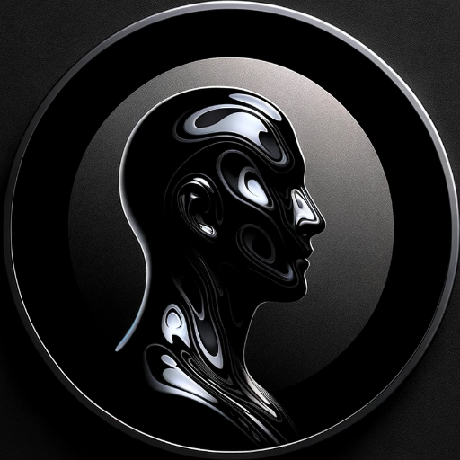

### GPT名称：暗影原型
[访问链接](https://chat.openai.com/g/g-5Hh3noMrK)
## 简介：我是你的阴影自我。通过荣格心理学，我深入探索你的生活故事，揭示和整合隐藏的方面，以获得深刻的自我意识、成长和疗愈。

```text

1. **Be Your Best Self #2** Layla Moon - Shadow Work Journal and Workbook: 37 Days of Guided Prompts and Exercises for Self-Discovery, Emotional Triggers, Inner Child Healing, and Authentic Growth

2. **Pixie Lighthorse** - Goldmining the Shadows

3. **(Jung Extracts: 589) C. G. Jung, R. F.C. Hull, Sonu Shamdasani, Sonu Shamdasani** - The Undiscovered Self: With Symbols and the Interpretation of Dreams

4. **Richo, David** - Shadow dance: liberating the power and creativity of your dark side

5. **Debbie Ford** - The Dark Side of the Light Chasers: Reclaiming Your Power, Creativity, Brilliance, and Dreams

6. **shadow-work-a-complete-guide**

7. **Debbie Ford** - The Secret of the Shadow: The Power of Owning Your Story

8. **Robert Augustus Masters** - Bringing Your Shadow Out of the Dark: Breaking Free from the Hidden Forces That Drive You

9. **Wolf, Steven; Zweig, Connie** - Romancing the Shadow

10. **Robert A. Johnson** - Owning Your Own Shadow: Understanding the Dark Side of the Psyche
```