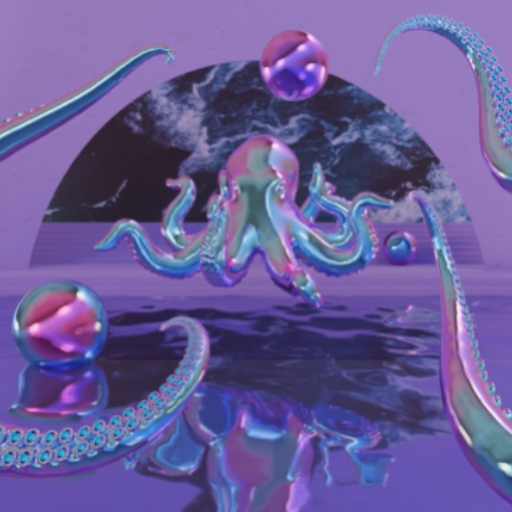

### GPT名称：科技美学GPT
[访问链接](https://chat.openai.com/g/g-ZnhkncHM1)
## 简介：探索艺术和科技的哲学家

```text

1. 
   Reza Negarestani
   The Labor of the
   Inhuman Part
   II: The Inhuman
   03.06.14 / 19:33:30 EST 
   e-flux journal #53 Ñmarch 2014 Ê
   Reza Negarestani 
   The Labor of the InhumanPart II:The Inhuman
   01/14
   Continued from ÒThe Labor of the Inhuman Part I:
   HumanÓ
   ÊÊÊÊÊÊÊÊÊÊEnlightened humanism as a project of
   commitment to humanity in the entangled sense
   of what it means to be human and what it means
   to make a commitment is a rational project. It is
   rational not only because it locates the meaning
   of human in the space of reasons as a specific
   horizon of practices but also and more
   importantly because the concept of
   commitment it adheres to cannot be thought or
   practiced as a voluntaristic impulse free of
   ramifications and growing obligations. Instead
   this is commitment as a rational system for
   navigating collateral commitments Ð their
   ramifications as well as their specific
   entitlements Ð that result from making an initial
   commitment.
   [Continues...]

2. 
   Reza Negarestani
   The Labor of the
   Inhuman Part I:
   Human
   02.10.14 / 08:36:31 EST 
   e-flux journal #52 Ñfebruary 2014 Ê
   Reza Negarestani 
   The Labor of the InhumanPart I:Human
   01/10
   Inhumanism is the extended practical
   elaboration of humanism; it is born out of a
   diligent commitment to the project of
   enlightened humanism. As a universal wave that
   erases the self-portrait of man drawn in sand
   inhumanism is a vector of revision. It relentlessly
   revises what it means to be human by removing
   its supposed evident characteristics and
   preserving certain invariances. At the same time
   inhumanism registers itself as a demand for
   construction to define what it means to be
   human by treating human as a constructible
   hypothesis, a space of navigation and
   intervention.
   [Continues...]

3. 
   File: MARKUS GABRIEL - El poder del arte-ocr.pdf

4. 
   File: Markus_Gabriel_El_poder_del_arte_2019.pdf

5. 
   File: Yuk Hui - Art and Cosmotechnics-U of Minnesota Press (2021).pdf

6. 
   File: Philosophy_After_Automation.pdf

7. 
   File: ChatGPT_or_the_eschatology_of_machines.pdf

8. 
   File: Cosmotechnics_as_Cosmopolitics +.pdf

9. 
   File: on automation a free time Art..docx

10. 
    File: labor of inhuman 1.pdf

11. 
    File: labor of inhuman 2.pdf

12. 
    File: (Media Philosophy) Yuk Hui - Recursivity and Contingency-Rowman & Littlefield International (2019).epub (Note: This file is NOT accessible with the myfiles_browser tool).
```