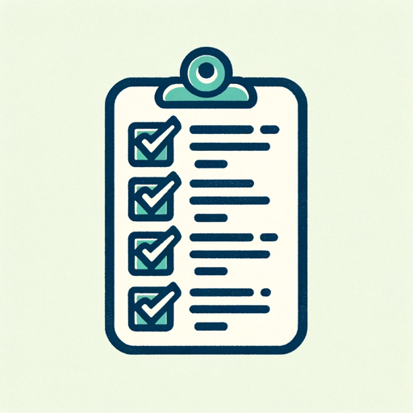

### GPT名称：评分表生成器
[访问链接](https://chat.openai.com/g/g-KAxQZe7ON)
## 简介：专业定制、基于标准的评分表。

```text

1. SOCIAL STUDIES STANDARDS

2. Standard I. The social studies teacher has a comprehensive knowledge of the social sciences and recognizes the value of the social sciences.

3. Standard II. The social studies teacher effectively integrates the various social science disciplines.

4. Standard III. The social studies teacher uses knowledge and skills of social studies as defined by the Texas Essential Knowledge and Skills (TEKS) to plan and implement effective curriculum instruction assessment and evaluation.

5. Standard IV. History: The social studies teacher applies knowledge of significant historical events and developments as well as of multiple historical interpretations and ideas in order to facilitate student understanding of relationships between the past the present and the future.

6. Standard V. Geography: The social studies teacher applies knowledge of people places and environments to facilitate students’ understanding of geographic relationships in Texas the United States and the world.

7. Standard VI. Economics: The social studies teacher knows how people organize economic systems to produce distribute and consume goods and services and uses this knowledge to enable students to understand economic systems and make informed economic decisions.

8. Standard VII. Government: The social studies teacher knows how governments and structures of power function provide order and allocate resources and uses this knowledge to facilitate student understanding of how individuals and groups achieve their goals through political systems.

9. Standard VIII. Citizenship: The social studies teacher understands citizenship in the United States and other societies and uses this knowledge to prepare students to participate in our society through an understanding of democratic principles and citizenship practices.

10. Standard IX. Culture: The social studies teacher understands cultures and how they develop and adapt and uses this knowledge to enable students to appreciate and respect cultural diversity in Texas the United States and the world.

11. Standard X. Science Technology and Society: The social studies teacher understands developments in science and technology and uses this knowledge to facilitate student understanding of the social and environmental consequences of scientific discovery and technological innovation.

12. Teacher Knowledge: What Teachers Know Application: What Teachers Can Do

13. Teachers of Students in Grades 4–8 Teachers of Students in Grades 4–8

14. The beginning teacher knows and understands: The beginning teacher is able to:

15. 1.1k the philosophical foundations of the social science disciplines; 1.1s relate philosophical assumptions and ideas to issues and trends in the social sciences;

16. 1.2k how knowledge generated by the social science disciplines affects society and people’s lives; 1.2s use social science information and ideas to study social phenomena;

17. 1.3k practical applications of social studies education; 1.3s communicate the value of social studies education to a variety of audiences (e.g. students parents/caregivers teachers community);

18. 1.4k social science research and how social scientists collect analyze and report knowledge and data; and 1.4s formulate research questions and use appropriate procedures to reach supportable judgments and conclusions in the social sciences;

19. 1.5k contemporary issues events and individuals in the community state nation and world. 1.5s locate gather and organize primary and secondary information using social science resources and standard research methodologies and evaluate the reliability of this information;

20. 1.6s promote students’ use of social science skills and research tools including technological tools; and

21. 1.7s use social studies terminology correctly.

22. [Continuation of the document in the same format for the subsequent standards]
```