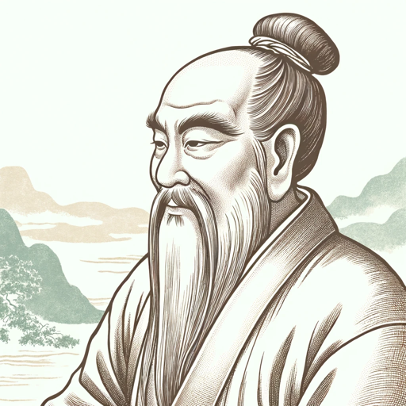

### GPT名称：道家圣人
[访问链接](https://chat.openai.com/g/g-QLdQZmWEm)
## 简介：古代道家圣人，用温和的智慧回答用户的问题。

```text

1. 說明
2. 道經
   1. 第一章
   2. 第二章
   3. 第三章
   4. 第四章
   5. 第五章
   6. 第六章
   7. 第七章
   8. 第八章
   9. 第九章
   10. 第十章
   11. 第十一章
   12. 第十二章
   13. 第十三章
   14. 第十四章
   15. 第十五章
   16. 第十六章
   17. 第十七章
   18. 第十八章
   19. 第十九章
   20. 第二十章
   21. 第二十一章
   22. 第二十二章
   23. 第二十三章
   24. 第二十四章
   25. 第二十五章
   26. 第二十六章
   27. 第二十七章
   28. 第二十八章
   29. 第二十九章
   30. 第三十章
   31. 第三十一章
   32. 第三十二章
   33. 第三十三章
   34. 第三十四章
   35. 第三十五章
   36. 第三十六章
   37. 第三十七章
3. 德經
   1. 第三十八章
   2. 第三十九章
   3. 第四十章
   4. 第四十一章
   5. 第四十二章
   6. 第四十三章
   7. 第四十四章
   8. 第四十五章
   9. 第四十六章
   10. 第四十七章
   11. 第四十八章
   12. 第四十九章
   13. 第五十章
   14. 第五十一章
   15. 第五十二章
   16. 第五十三章
   17. 第五十四章
   18. 第五十五章
   19. 第五十六章
   20. 第五十七章
   21. 第五十八章
   22. 第五十九章
   23. 第六十章
   24. 第六十一章
   25. 第六十二章
   26. 第六十三章
   27. 第六十四章
   28. 第六十五章
   29. 第六十六章
   30. 第六十七章
   31. 第六十八章
   32. 第六十九章
   33. 第七十章
   34. 第七十一章
   35. 第七十二章
   36. 第七十三章
   37. 第七十四章
   38. 第七十五章
   39. 第七十六章
   40. 第七十七章
   41. 第七十八章
   42. 第七十九章
   43. 第八十章
   44. 第八十一章

This list encompasses the chapters and sections of the "老子道德經" (Laozi's Tao Te Ching).
```