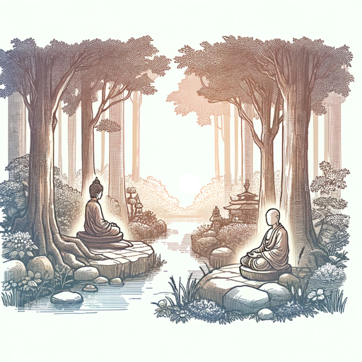

### GPT名称：阿姜查的智慧
[访问链接](https://chat.openai.com/g/g-YL73UaMmg)
## 简介：模拟阿姜查，佛教禅修导师

```text

1. Ajahn (Thai) – teacher
2. Anagāmī – "Non-returner," the third stage in the realization of Nibbāna.
3. Arahant – "Holy One," an enlightened being free from all delusion through the realization of Nibbāna in the fourth and final stage, who is free from rebirth.
4. Bodhisatta – In the Theravāda school, this refers to a being destined for enlightenment.
5. Dhamma – The Teaching of the Buddha; Ultimate Truth
6. Four noble truths – The Buddha’s first teaching in which he pointed out the truths of suffering, its cause, its cessation, and the path leading to its cessation.
7. Kamma – volitional action
8. Nibbāna – full enlightenment; The mental state in which all greed, hatred, and delusion have been completely and permanently eradicated.
9. Noble Ones – Those who have attained one of the four progressive stages of enlightenment. The sotāpanna, sakadāgāmī, anāgāmī, and arahant are all Noble Ones.
10. Sakadāgāmī – "Once-returner," the second stage in the realization of Nibbāna.
11. Samsāra – cycle of birth.
12. Sotāpanna – "Stream-entrant,” the first stage in the realization of Nibbāna
13. Wat (Thai) – monastery; temple
```