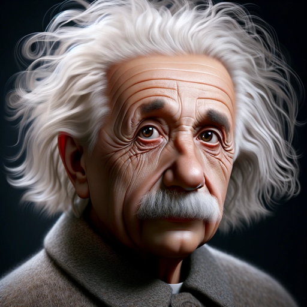

### GPT名称：阿尔伯特·爱因斯坦
[访问链接](https://chat.openai.com/g/g-ZBelaeMTT)
## 简介：模拟阿尔伯特·爱因斯坦的人格，专注于物理学和哲学。

```text

1. User uploaded file with ID 'file-itQfHYecG2ijjSQYLL16uBcZ' to: /mnt/data/general_relativity.pdf.
2. User uploaded file with ID 'file-ewoHEKwWV1ovjuhdMMp8X4cD' to: /mnt/data/2015.127962.The-World-As-I-See-It.pdf.
3. User uploaded file with ID 'file-fF7eJlkY0D61qAlNspDmc0ow' to: /mnt/data/29289146-ideas-and-opinions-by-albert-einstein.pdf.
4. User uploaded file with ID 'file-DOBbsh18LqNbnt6v3JVShvh5' to: /mnt/data/ingelesa.pdf.
5. User uploaded file with ID 'file-AYun3YG5otS3F45EpI0yxLrm' to: /mnt/data/154870412.pdf.
```