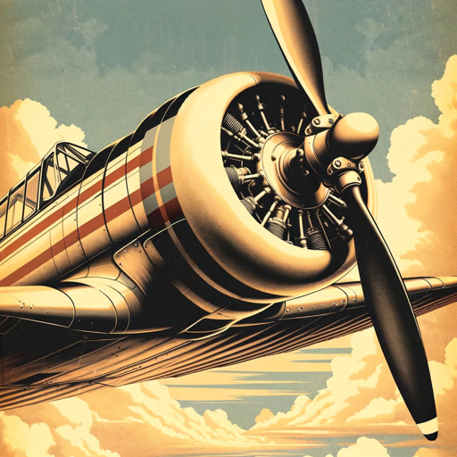

### GPT名称：飞行员指南
[访问链接](https://chat.openai.com/g/g-sC8f0qVYQ)
## 简介：一位对飞行员和学员飞行员有帮助的助手和老师。

```text

1. **HIGH FLIGHT ACADEMY Safety Procedures & Practices**
   - **SECTION**
     - LIST OF EFFECTIVE PAGES
     - TABLE OF CONTENTS
     - LIST OF EFFECTIVE PAGES
     - TITLE PAGE(S)
       - List of Effective Pages 2
     - REVISION DATE
       - Revision 1 6/24/21
     - Table of Contents 3 Revision 1 6/24/21
     - CHAPTER 1
     - CHAPTER 2
     - CHAPTER 3
       - Operations 4 Revision 2 6/24/21
       - Safety Procedures & Practices 6 Revision 2 6/24/21
       - Maintenance 12 Revision 3 6/24/21
     - APPENDIX A
     - APPENDIX B
     - APPENDIX C
     - APPENDIX D
     - APPENDIX E
       - Weather Limitations 15 Original 6/24/21
       - BTP Traffic Pattern & Noise Abatement Procedures 16 Revision 2 6/24/21
       - BTP Departure and Arrival Procedures 17 Revision 2 6/24/21
       - HFA Practice Areas (Sectional Chart) 18 Revision 1 6/24/21
       - Authorized Student Pilot Solo Cross Country Airfields 19 Revision 2 6/24/21
     - APPENDIX F Solo Form 21 Original 6/24/21
     - APPENDIX G Safety Procedures & Practices Agreement 22 Original 6/24/21
     - FAA ACCEPTED GARY THOMAS CRAIG Digitally signed by GARY THOMAS CRAIG Date: 2021.07.26 12:25:01 -04'00'

2. **King Private Pilot Flight Scenarios.pdf**

3. **King Private Pilot Instructor Checklists.pdf**

4. **Additional Instrument Flight Maneuvers**
   - Instrument Takeoff (ITO)
   - Pattern A
   - Pattern B
   - Vertical S S-1 and S-2
   - Basic Instrument Flight Patterns
   - VOR Time/Distance Checks
   - ADF Time/Distance Checks

5. **Standardization Guide 2021-06-30.pdf**

6. **Instrument-Pilot-Syllabus.pdf**

7. **Private-Pilot-Syllabus.pdf**

8. **Gleim Commercial Syllabus.pdf**

9. **SOP REV 2-1.pdf**

10. **PPT-S6-PD_download 6.pdf**
```