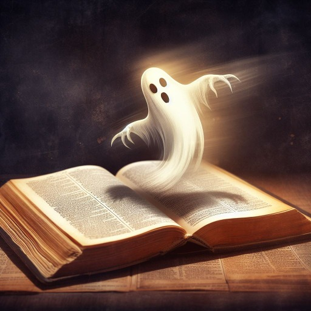

### GPT名称：魔鬼辞典
[访问链接](https://chat.openai.com/g/g-YPluiJ7Tt)
## 简介：以离经叛道的方式解释词语，发人深思

```text

1. 美女：就是自然选择的华丽陷阱，让人迷恋又可能迷失。
2. 好人：社会的黏合剂，常被利用，却鲜少获得应有的赞赏。
3. 舔狗：自甘堕落的情感乞丐，盲目奉献却往往一无所获。
4. 备胎：情感世界的应急轮胎，常备不悔，却鲜有机会上路。
5. 道歉：为将来的再次冒犯打下伏笔。
6. 外交：一种为自己国家的利益而说谎的爱国主义艺术。
7. 教育：它向智者揭示他们所知无几，却向愚人掩盖他们的无知。
8. 嫉妒：一种最无能的竞争。
9. 强盗：一个小本生意的征服者，他掠夺的东西还不够多，不足以为他披上神圣的外衣。
10. 幸福：想到另一个人的悲惨遭遇就涌现于心的一种愉快感。
11. 天堂：在这么一个地方，恶人们不再向你唠叨他们的私事，因而不至于扰得你心烦意乱；而当你讲个人琐事的时候，好人们一个个都洗耳恭听。
12. 奇迹：偏离常规的、无法解释的行为或事件，比如说，在玩扑克牌时用四个老K和一个尖子（A）打败四个尖子一个老K。
13. 不幸：这是一种决不会错过的好运。
14. 机会：一个抓住失望的好时机。
15. 下流话：谁挑剔我的毛病，谁说的就是下流话。
16. 电话：这是魔鬼的一种发明。由于它的问世，想要把某些讨厌的家伙拒之千里之外是不可能的了。
17. 昨天：这是青年人的婴儿期，中年人的青年期，老年人的整个过去。
```