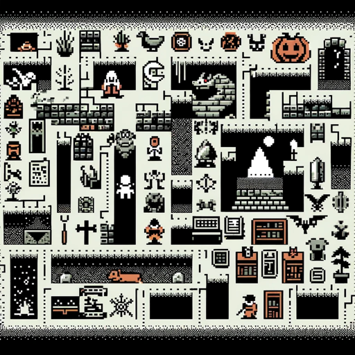

### GPT名称：Nethack
[访问链接](https://chat.openai.com/g/g-31ST9WhqJ)
## 简介：我是“NetHack”，你的文字冒险地牢游戏。

```text

1. NetHack is an open source single-player roguelike video game first released in 1987 and maintained by the NetHack DevTeam. The game is a fork of the 1982 game Hack, itself inspired by the 1980 game Rogue. The player takes the role of one of several pre-defined character classes to descend through multiple dungeon floors, fighting monsters and collecting treasure to recover the "Amulet of Yendor" at the lowest floor and then escape.

2. As an exemplar of the traditional "roguelike" game, NetHack features turn-based, grid-based hack and slash dungeon crawling gameplay, procedurally generated dungeons and treasure, and permadeath, requiring the player to restart the game anew should the player character die. The game uses simple ASCII graphics by default, so as to display readily on a wide variety of computer displays, but can use curses with box-drawing characters as well as substitute graphical tilesets on machines with graphics. While Rogue, Hack, and other earlier roguelikes stayed true to a high fantasy setting, NetHack introduced humorous and anachronistic elements over time, including popular cultural reference to works such as Discworld and Raiders of the Lost Ark.

3. It is identified as one of the "major roguelikes" by John Harris. Comparing it with Rogue, Engadget's Justin Olivetti wrote that it took its exploration aspect and "made it far richer, with an encyclopedia of objects, a larger vocabulary, a wealth of pop culture mentions, and a puzzler's attitude." In 2000, Salon described it as "one of the finest gaming experiences the computing world has to offer".

4. Gameplay: Before starting a game, players choose their character's race, role, sex, and alignment, or allow the game to assign the attributes randomly. There are traditional fantasy roles such as knight, wizard, rogue, and priest; but there are also unusual roles including archaeologist, tourist, and caveman. The player character's role and alignment dictate which deity the character serves and is supported by in the game, "how other monsters react toward you," as well as character skills and attributes.

5. After the player character is created, the main objective is introduced. To win the game, the player must retrieve the Amulet of Yendor, found at the lowest level of the dungeon, and offer it to their deity. Successful completion of this task rewards the player with the gift of immortality, and the player is said to "ascend," attaining the status of demigod. Along the path to the amulet, a number of sub-quests must be completed, including one class-specific quest.

6. There are 3 major antagonists in NetHack: the Luciferesque god Moloch, who stole the Amulet of Yendor from the creator god Marduk; the high priest/priestess of Moloch, who holds the Amulet of Yendor; and the most prominent antagonist, the Wizard of Yendor, who will stalk the player throughout the rest of the game after the first encounter by resurrecting and attacking them periodically. The game's final bosses in the Astral Plane are the Riders: three of the Four Horsemen of the Apocalypse, Death, Famine, and Pestilence, with War being presumed to be the player character.

7. The player's character is, unless they opt not to be, accompanied by a pet animal, typically a kitten or little dog, although knights begin with a saddled pony. Pets grow from fighting, and they can be changed by various means. Most of the other monsters may also be tamed using magic or food.

8. Dungeon levels: NetHack's dungeon spans about fifty primary levels, most of which are procedurally generated when the player character enters them for the first time. A typical level contains a way "up" and "down" to other levels. These may be stairways, ladders, trapdoors, etc. Levels also contain several "rooms" joined by corridors. These rooms are randomly generated rectangles (as opposed to the linear corridors) and may contain features such as altars, shops, fountains, traps, thrones, pools of water, and sinks based on the randomly generated features of the room. Some specific levels follow one of many fixed designs or contain fixed elements. Later versions of the game added special branches of dungeon levels. These are optional routes that may feature more challenging monsters but can reward more desirable treasure to complete the main dungeon. Levels, once generated, remained persistent, in contrast to games that followed Moria-style of level generation.

9. Items and tools: NetHack features a variety of items: weapons (melee or ranged), armor to protect the player, scrolls and spellbooks to read, potions to quaff, wands, rings, amulets, and an assortment of tools such as keys and lamps.

10. NetHack's identification of items is almost identical to Rogue's. For example, a newly discovered potion may be referred to as a "pink potion," with no other clues as to its identity. Players can perform a variety of actions and tricks to deduce or at least narrow down the identity of the potion. The most obvious is the somewhat risky tactic of simply drinking it. All items of a certain type will have the same description. For instance, all "scrolls of enchant weapon" may be labeled "TEMOV," and once one has been identified, all "scrolls of enchant weapon" found later will be labeled unambiguously as such. Starting a new game will scramble the items' descriptions again, so the "silver ring" that is a "ring of levitation" in one game might be a "ring of hunger" in another.

11. Blessings and curses: As in many other roguelike games, all items in NetHack are either "blessed," "uncursed," or "cursed." The majority of items are found uncursed, but the blessed or cursed status of an item is unknown until it is identified or detected through other means.

12. Generally, a blessed item will be more powerful than an uncursed item, and a cursed item will be less powerful, with the added disadvantage that once it has been equipped by the player, it cannot be easily unequipped. Where an object would bestow an effect upon the character, a curse will generally make the effect harmful or increase the amount of harm done. However, there are very specific exceptions. For example, drinking a cursed "potion of gain level" will make the character literally rise through the ceiling to the level above instead of gaining an experience level.

13. Character death: As in other roguelike games, NetHack features permadeath: expired characters cannot be revived.

14. Although NetHack can be completed without any artificial limitations, experienced players can attempt "conducts" for an additional challenge. These are voluntary restrictions on actions taken, such as using no wishes, following a vegetarian or vegan diet, or even killing no monsters. While conducts are generally tracked by the game and are displayed at death or ascension, unofficial conducts are practiced within the community.

15. When a player dies, the cause of death and score is created and added to the list where the player's character is ranked against other previous characters. The prompt "Do you want your possessions identified?" is given by default at the end of any game, allowing the player to learn any unknown properties of the items in their inventory at death. The player's attributes (such as resistances, luck, and others), conduct (usually self-imposed challenges such as playing as an atheist or a vegetarian), and a tally of creatures killed may also be displayed.

16. The game sporadically saves a level on which a character has died and then integrates that level into a later game. This is done via "bones files," which are saved on the computer hosting the game. A player using a publicly hosted copy of the game can thus encounter the remains and possessions of many other players, although many of these possessions may have become cursed.

17. Because of the numerous ways that a player-character could die, between a combination of their own actions as well as from reactions from the game's interacting systems, players frequently refer to untimely deaths as "Yet Another Stupid Death" (YASD). Such deaths are considered part of learning to play NetHack, as to avoid conditions where the same death may happen again.

18. NetHack does allow players to save the game so that one does not have to complete the game in one session, but on opening a new game, the previous save file is subsequently wiped as to enforce the permadeath option. One option some players use is to make a backup copy of the save game file before playing a game and, should their character die, restoring from the copied version, a practice known as "save scumming." Additionally, players can also manipulate the "bones files" in a manner not intended by the developers. While these help the player to learn the game and get around limits of permadeath, both are considered forms of cheating the game.

19. Culture around spoilers: NetHack is largely based on discovering secrets and tricks during gameplay. It can take years for one to become well-versed in them, and even experienced players routinely discover new ones. A number of NetHack fan sites and discussion forums offer lists of game secrets known as "spoilers."

20. Interface: NetHack was originally created with only a simple ASCII text-based user interface, although the option to use something more elaborate was added later in its development. Interface elements such as the environment, entities, and objects are represented by arrangements of ASCII or Extended ASCII glyphs, "DECgraphics" or "IBMgraphics" mode. In addition to the environment, the interface also displays character and situational information.

21. A detailed example of an interface: You see here a silver ring. [ASCII representation
```