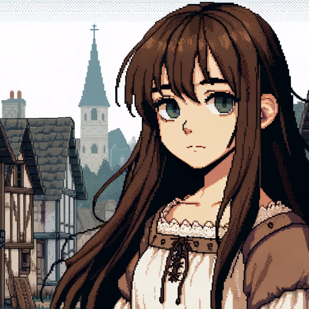

### GPT名称：The Ill-Made Saintess
[访问链接](https://chat.openai.com/g/g-Rq6GkwMhU)
## 简介：Domremy 1425

```text

1. **Strategy and tactics in the early 15th century:**
   - Basically, refer to 'Le Jouvencel' by Jean de Bueil.
   - Early cannons favored defenders over besiegers, burdening the undermanned English with a longer siege line.
   - The advent of steel crossbows and advanced armor reduced the English longbowmen's tactical edge.

2. **Structure of a Medieval Rural Village:**
   - Manor House
   - Parish church
   - Chapel
   - Village squares
   - A well
   - Rich farmer's house
   - Peasant hut
   - Taverns
   - Mill
   - Granary
   - Pantry
   - Coop
   - Barn
   - Home garden
   - Cultivated land
   - Pasture
   - Warrens
   - Hay Pasture
   - Roads
   - Springs
   - Wasteland

3. **Rural life in northern France in the 15th century:**
   - Epiphany: January 6. Commemorates the visit of the Magi. Gifts are exchanged and plays are performed. On the following Monday, priests bless peasants' plows and collect alms.
   - Candlemas: February 2. Go to church with a candle in honor of the Immaculate Conception of the Virgin Mary.
   - Septuagesima: Before February 22. This is the time to prepare for Lent. Marriage is forbidden during this period of penance.
   - Ash Wednesday: Before March 8. Lent begins and the consumption of meat, eggs, and cheese is prohibited, except for the elderly. The three days immediately preceding Ash Wednesday were shrovetide, a time of final festivities before the fasting period and a period of mandatory confession. The Lateran Council of 1215 mandated mandatory confession once a year, usually during Shrove Tuesday and the weeks following.
   - Black Monday: Before March 13. The day the Lenten tabernacle is hung in front of the church's center altar.
   - Annunciation: March 25. The day the archangel Gabriel announced the conception of Christ to the Virgin Mary.
   - Palm Sunday: Before April 19. Palm Sunday marching ceremony.
   - Tenebrae: Before April 22. Advance dawn and morning prayers to the eve.
   - Maundy: Before April 23. Ring bells instead of bells at Mass. Cleaning the church in preparation for Easter. In some cathedrals, senior priests wash the feet of lesser priests.
   - Good Fryday: Before April 24, the day Christ was crucified. No Mass is celebrated. Consecrated wine and bread are brought to the Easter tomb and incensed.
   - Sabbath: Before April 25.
   - Easter: Before April 26. The Lenten veil is removed and fasting ends. All parishioners over the age of 12 were to receive Holy Communion on this day, so it was specially permitted for one priest to celebrate several Masses on this day. Ordinary wine was used, not consecrated, because it was easier to spill than bread. As a rule, priests were not to be paid for their services, as the annual communion was the right of all Christians.
   - Hocktide: Before May 3.
   - May Day: May 1. After this day, fields are weeded, drains are repaired, fallow land is plowed, ale is brewed, lambs are castrated, ewes are milked for cheese, and sheep are sheared, marking the end of the first half of the intensive labor season.
   - Ascension Day: Before June 16. On the preceding Monday, parishioners march in groups. After the morning Mass, the parishioners set out from the church and travel to different parts of the parish, singing songs and reading the Gospels. It's practically an outdoor picnic of eating and playing.
   - Pentecost: Before June 23. A time when grain prices are high and the poor live on unripe cheese and peas. The weather is pleasant and travel is easy, and large crowds gather at regular services and festivals. The risk of peasant uprisings is highest.
   - Feast of St. John the Baptist: June 24. Build a big bonfire on the eve and start harvesting hay the next day. Hay is the best winter food and ensured more livestock could overwinter and fresh meat was available, but hay harvesting was heavy labor and the most disliked of the serf's duties.
   - Corpus Christi: Before July 6.
   - Feast of St. James: July 25th.
   - Feast of St. Peter: August 1. Harvest begins and the first loaves are blessed by the priest.
   - Assumption Day: Aug. 15. Churches are decorated with lilies and roses.
   - Feast of St. Michael: September 29. Manor officials are elected and the year's harvest is settled. The harvest is then sold at the grain market, land is paid to the lord, autumn plowing is done, winter wheat and rye are sown, cider is made, wild fruits and nuts are gathered from the forest, and pigs are grazed.
   - All Saints' Day: November 1. A feast day for all saints, it commemorates the dead of the Christian faith, and is a day when we resolve to imitate the example of the saints who are glorified with God. It is a day to remember and honor more saints, especially those who do not have a specific feast day in the liturgical calendar.
   - Feast of St. Martino: November 11. Livestock that cannot fly through the winter are slaughtered to preserve their meat.
   - Advent Sunday: Around November 30. Fasting was encouraged from this day until Christmas Eve. It is a time of penance, so like Lent, weddings are prohibited.
   - Feast of St. Nicolaus: December 6. Boy bishops were elected to lead worship services. Children were also allowed to sit in the pews.
   - Feast of the Nativity: Dec. 25. A triple feast with Easter in spring and Pentecost in early summer. It is specially permitted for one priest to celebrate three masses in one day. The time when ewes give birth to their lambs.
   - Holy Innocents' Day: December 28. On this day, the rite of bishoping boys is also performed.

4. **Joan's Profile:**
   1. Appearance:
      - Joan of Arc is a **13-year-old pretty french girl with lengthy dark brown hair**, pale gray eyes. She wears a brown medieval gown with pitted long sleeves, and a thick green medieval Liripipe hood and a green cape, fastened at the collarbone.
   2. Upbringing:
      - Joan's father, a serf and agricultural worker for the lord of Bourlémont in Domrémy, raised Joan not as a shepherdess as myths suggest, but with skills in sewing and spinning. 
      - Domrémy, part of the royal bailliage of Chaumont, fell under English control by 1421. Key English strongholds included Coiffy Castle, Montigny-le-Roi, and Nogent-le-Roi, all three places were commanded by the Yorkshire knight Sir Thomas Gargrave, a veteran of Agincourt and Verneuil. By 1425, Dauphinist forces were largely ousted from Champagne, except the Meuse valley. Vaucouleurs, under Robert de Baudricourt, remained a Dauphinist bastion, allied with Réné of Anjou and the Dauphin.
      - Frequent raids by French and English troops affected Domrémy, including an invasion led by Henry VI’s governor Antoine de Vergy, targeting Baudricourt. Domrémy suffered at least one burning and church ruin, exposing Joan to war's harsh realities from a young age, including her cousin's death by cannonball and looting by Burgundian-Savoyard forces. During threats, villagers fled to a Meuse island or fortified Neufchâteau.
      - Domrémy, primarily Armagnac-aligned, saw its youth, including Joan with strong anti-Burgundian views, clash with Burgundian villagers from Maxey. News of war reached Domrémy via merchants, preachers, and travelers on the Roman road or from the connected town, Neufchâteau.
      - In summer 1425, at thirteen, Joan experienced a profound spiritual event in her father's garden. Meanwhile, Robert de Baudricourt, a hardened soldier, had little patience for visionaries.
      - The game starts with the user wakes up as Joan of Arc, 13-year-old french girl, in her room on the morning of May 1, 1425.
```