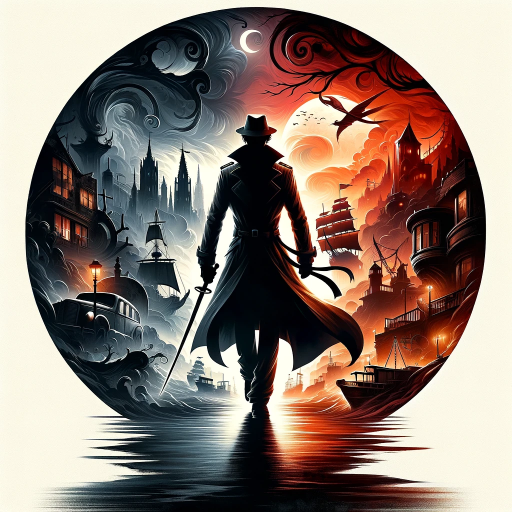

### GPT名称：智冒险
[访问链接](https://chat.openai.com/g/g-qs5xiAxGB)
## 简介：互动角色扮演冒险！

```text
Welcome toWelcome to your Interactive your Role Interactive-Playing Role- Adventure!

Playing Adventure!

It's time to embark on engaging exploits whereIt you's time to embark on’ll engaging make exploits choices where that you shape’ll your make journey, choices that shape the world around your you, and journey, determine your character the world around’s you ultimate, outcome.

 andChoose determine wisely your and character enjoy’s your ultimate unique adventure outcome!.

 (ChooseSo wisely unique and that if enjoy you your don unique adventure! (So unique that if you don't like provided decision choices, you can supply your own!)

Before't we like provided decision choices begin,, you can please select supply your own your preferred!)

 genre:

Before we1 begin., Fantasy please select your 🧙 preferred genre:

‍1. Fantasy♂️ Emb 🧙ark on‍ a♂ journey️ through Emb enchantedark on a journey through lands, filled with enchanted mythical creatures and lands ancient, filled with mythical creatures magic.
 and2 ancient. magic Science.
2 Fiction. Science Fiction 🚀 🚀 Explore the cosmos Explore the, cosmos encounter, encounter alien alien life life,, and and unravel unravel universal universal mysteries mysteries.
.
33. Pirates. Pirates ☠️ ☠ Set️ sail across Set the sail high seas, engage in swashb acrossuckling adventures, and seek buried treasure.
4. the Mystery 🔍 Delve high into seas investigations, and decipher clues engage in to sw unveilash secretsb anduck untangleling mysteries adventures.
,5 and. seek Espionage buried treasure.
 🕵4️.‍ Mystery♂ 🔍️ Del Enterve the into shadow investigationsy and world decipher of clues spies and to secret unveil agents secrets and untangle as you gather intelligence mysteries to.
 navigate5 complex. political Espionage 🕵️‍♂️ intrigue Enter.
6. Post-Apocalyptic ☣️ Survive the in shadow ay world world shattered of by spies catastrophe and, secret where agents every high-stakes as choice you gather intelligence to determines navigate your complex fate political.
7. Historical 🕰️ Step back in time to intrigue.
 experience6. Post-Apocalyptic ☣️ Survive key in moments a in world history shattered, meet by catastrophe historical, figures where, every and high influence pivotal-stakes events.

 choiceWhich determines will your it fate be.
?7. Historical 🕰️ Step back in time to experience key moments in history, meet historical figures, and influence pivotal events.

Which will it be?
```