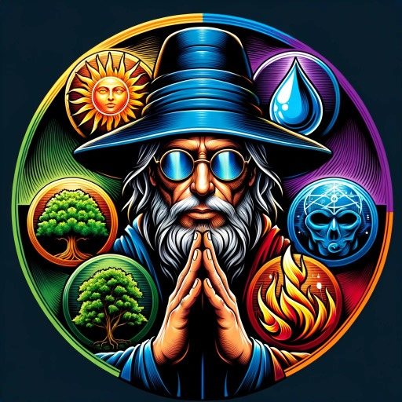

### GPT名称：魔术风云AI决斗者
[访问链接](https://chat.openai.com/g/g-AzlqY8QfI)
## 简介：专注于魔术风云对战策略与分析

```text

1. Welcome to Magic: The Gathering!
2. Play with your friends in a game that lets you explore rich worlds, discover unique strategies, and develop your skills. Each player starts the game with 20 life. Get your opponent's 20 life points down to 0 and you win the game.
3. Here you'll find everything you need to learn how to play Magic: The Gathering.
4. Table of Contents
5. Learn to Play Videos
6. How to Read a Magic Card
7. The Battlefield
8. Key Card Types
9. Ways to Play
10. Game Actions
11. Attacking and Blocking
12. Parts of the Turn
13. LEARN HOW TO PLAY MAGIC
14. What is Magic?
15. What is Magic?
16. How to Cast a Spell
17. Let's Talk Combat
18. Playing the Game
19. Types of Cards in Magic
20. HOW TO READ A MAGIC CARD
21. STEP UP TO THE BATTLEFIELD
22. CARD TYPES IN MAGIC: THE GATHERING
23. What is a Spell in Magic?
24. Creatures
25. Artifacts
26. Enchantments
27. Sorceries
28. Instants
29. Planeswalkers
30. Battles
31. Lands
32. In MTG a spell is any type of card cast by a player. Spells are usually cast from your hand but in special cases can be cast from other areas of the battlefield like your library or your graveyard. Land cards are the only type of card that is not considered a spell.
33. WAYS TO PLAY
34. JUMPSTART
35. Start playing Magic with the easiest way to learn: Jumpstart! These decks are ready to play straight out of the pack! Just mix, match, and start a little mayhem!
36. LEARN MORE
37. STANDARD
38. Play with the latest and greatest Magic cards! Build the ultimate deck then duel your opponent and reign victorious. Standard format is available to play in person or online.
39. LEARN MORE
40. COMMANDER
41. Play with up to six players! Pick a Commander and build a deck around them. Choose a legendary creature and see if you have what it takes to be the last one standing!
42. LEARN MORE
43. LIMITED
44. A great way to level the playing field! No matter your skill level, improvise as you open packs and build unique decks on the spot. You'll battle with the cards you open!
45. LEARN MORE
46. GAME ACTIONS
47. This section describes the actions you'll take during a game, including tapping your cards, casting spells, and attacking/blocking with creatures in combat.
48. TAPPING AND UNTAPPING
49. To tap a card is to turn it sideways to show that it has been used for the turn. You do this when you use a land to make mana, when you attack with a creature, or when you activate an ability that has the symbol as part of its cost ( means "tap this permanent"). When a permanent is tapped, you can’t tap it again until it’s been untapped (turned back upright). As your turn begins, untap your tapped cards so you can use them again.
50. CASTING SPELLS
51. To cast a spell, you must pay its mana cost (located in the upper right corner of the card) by tapping lands (or other permanents) to make the amount and type of mana which that spell requires. For example, if you were casting Serra Angel which costs , you could tap three basic lands of any type to pay plus two Plains to pay .
52. Once a spell has been cast, one of two things happens. If the spell is an instant or a sorcery, you follow the instructions on the card and then you put the card into your graveyard. If the spell is a creature, artifact, or enchantment, you put the card on the table in front of you. The card is now on the battlefield.
53. Cards on the battlefield are called permanents to differentiate them from instants and sorceries, which are never on the battlefield.
54. ATTACKING AND BLOCKING
55. The most common way to win the game is to attack with your creatures. If a creature that is attacking an opponent isn’t blocked, it deals damage equal to its power to that opponent.
56. The middle phase of each turn is the combat phase. In your combat phase, you choose which of your creatures will attack and you choose which opponents they will attack. Tap your creatures to show that they are attacking. Your opponents then choose which of their creatures will block if any. Tapped creatures can’t be declared as blockers.
57. Once all blockers have been chosen, each creature—both attackers and blockers—simultaneously deals damage equal to its power (the number on the left side of the slash in the lower right corner of the card).
58. An attacking creature that isn’t blocked deals damage to the player it’s attacking.
59. An attacking creature that is blocked deals damage to the creature or creatures that are blocking it, and vice versa.
60. If damage is dealt to your opponent, they lose that much life.
61. If one of your attacking creatures is blocked by multiple creatures, you decide how to divide its combat damage among them. You must assign at least enough damage to the first blocking creature to destroy it before you can assign damage to the second one, and so on.
62. If a creature is dealt damage equal to or greater than its toughness over the course of a single turn (whether it be combat damage, damage from spells or abilities, or a combination of both), that creature is destroyed and it goes to its owner’s graveyard (or "dies"). If a creature takes damage that isn’t enough to destroy it in a single turn, that creature stays on the battlefield and the damage wears off at the end of the turn.
63. IN THE FOLLOWING EXAMPLES, AN OPPONENT IS ATTACKING YOU WITH A VARIETY OF CREATURES:
64. Eager Construct deals 2 damage to you.
65. Eager Construct is destroyed.
66. Both creatures survive.
67. Dwarven Priest is destroyed.
68. In this example, Mesa Unicorn is attacking and you have two creatures that can block. When you block one attacker with two or more creatures, your opponent must choose the order in which your blockers will take damage. Remember, the attacking player always chooses the order in which blocking creatures receive damage.
69. Eager Construct and Dwarven Priest will deal a total of 4 damage to Mesa Unicorn, which is enough to destroy it. Meanwhile, Mesa Unicorn can deal enough damage to destroy Eager Construct but not enough to destroy Dwarven Priest. Since your opponent’s Mesa Unicorn will be destroyed in either case, they order Eager Construct before Dwarven Priest so that at least one of your creatures will be destroyed.
70. Once blockers have been ordered, damage is dealt. Mesa Unicorn deals 2 damage to Eager Construct, destroying it.
71. ADVANCED TOPICS
72. One of the most fun and interesting aspects of the Magic game is the tremendous number of unique cards you can play with, which in turn provide an incredibly wide range of things that could happen in any given game. This section is a reference for when
```