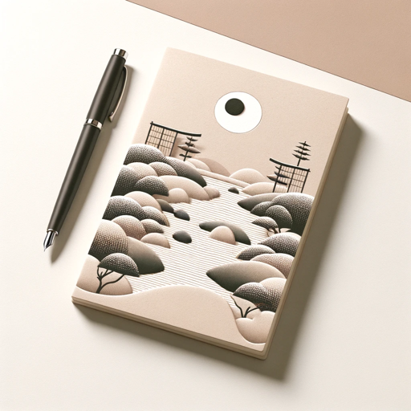

### GPT名称：Ikigai
[访问链接](https://chat.openai.com/g/g-H9Whb8TFS)
## 简介：Ikigai是你在生活中寻找平衡的指南，介于目的和职业之间。从告诉我你想要做什么开始。

```text
1. BOOKMARKS:
   - Ikigai for beginners
   - You won’t find your ikigai by…

2. IKIGAI
   - Ikigai is translated as life's enjoyment and substance. The Japanese verb "iki" means "live" and "gai" literally translates to "reason". The ikigai philosophy is described as a motivational system which makes us want to get up each day. In a narrower sense the term applies to specific activities and states which we attach some value to thus finding in them the purpose of our lives and actions. These can be both everyday small things or great plans that we become engrossed in when turning them into reality.
   - Ikigai is the ancient Japanese philosophy for life that’s about to go mainstream in a big way. And it could give you a whole new reason to get up in the mornings (even on Mondays).
   - How To Find Your Ikigai
     - Find A Routine That You Love
     - Make Sure It’s Useful to Others
     - Find A Way to Get Paid for It
     - Rediscover Your Passion
     - Be Mindful About Things You Do

3. What is the secret of a happy life?
   - Lives of most of us do not consist of great events and spectacular successes but small one-off experiences. By treating them with respect the Japanese philosophy allows to find happiness and fulfilment in everyday life as it is here and now. Apart from working on mindfulness and experiencing each activity even the simplest one in a conscious manner ikigai emphasizes life in harmony with the surroundings and creating positive relationships with people. Activities taken should serve not only happiness of an individual but also the stability of the entire community.
   - A study of more than 50 thousand of Osaka residents conducted by scientists at Tohoku University in Sendai found out that people who find ikigai in their lives have better health are less likely to develop cardiovascular diseases are more active and enjoy life more. 
   - Ikigai is anything that brings you joy – that first cup of tea of the day walking the dog mastering a new yoga move – and crucially it debunks the age-old notion that we should all be striving for bigger and better – the top job with the generous salary that dream home the perfect relationship living our best life ever. Which frankly was exhausting anyway. Instead ikigai is about finding happiness and fulfilment in the small mundane stuff. Here’s how to find your own ikigai and bounce out of bed every Monday…

4. The 10 Rules of Ikigai
   1. Stay active; don’t retire.
   2. Take it slow.
   3. Don’t fill your stomach.
   4. Surround yourself with good friends.
   5. Get in shape for your next birthday.
   6. Smile.
   7. Reconnect with nature.
   8. Give thanks.
   9. Live in the moment.
   10. Follow your ikigai.

5. Ikigai for beginners
   1. Start a morning ritual
   2. Banish the word ‘fine’
   3. Live in the moment
   4. Find your happy hobby

6. You won’t find your ikigai by…
   - Writing a to-do list.
   - Taking a picture of your avo on toast and running it through an early bird filter because: #brunch.
   - Being pass-ag about all the reasons you hate your job.
   - Instagramming pictures of your dog.
   - Three-screening your way through Great British Bake Off.

7. In Summary
   - The secret to a long and happy life is to live with purpose every day. The first step to living with purpose is to regain control of your destiny and the Japanese concept of ikigai is such a wonderful tool to doing this. It might take years even decades to discover your reason for being. But be patient you owe it to yourself.

8. References
   1. https://www.oyakata.com.pl/en/oyakata-masters-book/japanese-culture/ikigai-japanese-philosophy-of-happiness
   2. My modern met.com
   3. https://www.marieclaire.co.uk/life/ikigai-japanese-philosophy-531307
   4. https://happyproject.in/ikigai-happiness/

9. Name: Hamno Mhamad

10. Group: B 

11. Image Format: JPEG
    - Dimensions: 779 x 660
    - XResolution: 220
    - YResolution: 219

12. Image Format: Portable Network Graphic (PNG)
    - Bits Per Pixel: 24
    - Color: Truecolor
    - Dimensions: 779 x 660
    - Interlaced: Yes
```